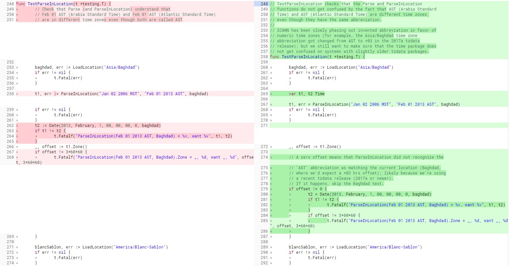
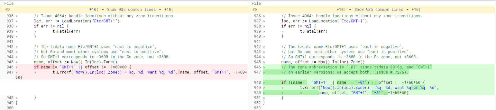

## 1. Prefix

- 需要下载的文件: **[Download](https://golang.org/dl/)**
      
  - go1.12.src.tar.gz
  - go1.4.3.src.tar.gz
  - gcc glibc-devel

 - go1.4以上版本安装 **依赖** ***go1.4*** 需要先编译安装go1.4, 否则会报错 (这个设定 很奇怪 不过 never mind just do it)
	报错提示信息如下:

    ```bash
    Building Go cmd/dist using /root/go1.4.
    ERROR: Cannot find /root/go1.4/bin/go.
    Set $GOROOT_BOOTSTRAP to a working Go tree >= Go 1.4.
    ```
  - 安装 gcc 用于编译 go 1.4
	```bash
	yum install -y gcc glibc-devel
	```

## 2. Install go1.4.3.src.tar.gz

### 2.1 安装 go1.4.3

```bash
mkdir /root/go1.4
tar -xvf go1.4.3.src.tar.gz -C /root/go1.4
cd /root/go1.4/src
./all.bash
```

### 2.2 install error

```bash
--- FAIL: TestParseInLocation (0.00s)
	format_test.go:202: ParseInLocation(Feb 01 2013 AST, Baghdad) = 2013-02-01 00:00:00 +0000 AST, want 2013-02-01 00:00:00 +0300 +03
--- FAIL: TestLoadFixed (0.00s)
	time_test.go:929: Now().In(loc).Zone() = "-01", -3600, want "GMT+1", -3600
```

这两个错误其实是测试文件的报错 与工程编译基本没什么关系 也不太影响 可以跳过 怎么跳过 请看下面

1. **TestParseInLocation 错误**

	- _这个错误是因为_:

		```bash
		The tzdata 2017a update (2017-02-28) changed the abbreviation of the
		Asia/Baghdad time zone (used in TestParseInLocation) from 'AST' to the
		numeric '+03'.
		```

		请参考 `Red Hat Enterprise Linux Timezone Data` 的声明:
		- **[Red Hat Enterprise Linux Timezone Data (tzdata) - Development Status Page](https://access.redhat.com/articles/1187353)**
		- **[2017a release of tz code and data available](https://mm.icann.org/pipermail/tz-announce/2017-February/000045.html)**

	- _解决_

		这是 `src/time/format_test.go` 文件 202 行的报错 
		(不同1.4 go 的版本 行数可能不一样 请根据 函数 `TestParseInLocation` 查找)

		

		这个 golang github 源码提过的一个 **[issue](https://github.com/golang/go/issues/19457)** 已经解决的

		`gopherbot` comment 了修改 issue 的 **[链接](https://go-review.googlesource.com/c/go/+/37964/)** 我就是从那里截图过来的 如果访问不到这个链接 按照截图改就行

2. **TestLoadFixed 错误**

	- _错误原因_

		```bash
		The tzdata 2017a update (2016-09-18) changed the time zone abbreviation from a long English-language string
		(such as: "GMT+1") to "-01".
		```

		请参考 `Red Hat Enterprise Linux Timezone Data` 的声明 :
		- **[Red Hat Enterprise Linux Timezone Data (tzdata) - Development Status Page](https://access.redhat.com/articles/1187353)**
		- **[2016g release of tz code and data available](https://mm.icann.org/pipermail/tz-announce/2016-September/000041.html)**

	- _Fix_

		这是 `src/time/time_test.go` 文件 929 行的报错

		

		issue 修改 **[链接](https://go-review.googlesource.com/c/go/+/29995/3/src/time/time_test.go#b951)** 如果访问不到这个链接 按照截图改就行

### 2.3 install success

- 安装成功提示
	```bash
	ALL TESTS PASSED

	---
	Installed Go for linux/amd64 in /home/you/go.
	Installed commands in /root/go1.4/bin.
	*** You need to add /home/go1.4/bin to your $PATH. ***
	```

- 看到这个安装成功的提示以后 设置一下 `go1.4` 的环境变量(待会儿再把它改回 `go1.12`)

	```bash
	echo "export PATH=$PATH:/root/go1.4/bin" >> /etc/profile
	echo "export GOROOT=/root/go1.4" >> /etc/profile
	source /etc/profile
	```

- 运行 `go version` 查看版本号

	```bash
	go version go1.4.3 linux/amd64
	```

## 3. Install go1.12.src.tar.gz

- 安装 go1.12

	```bash
		mkdir /root/go1.12
		tar -xvf go1.12.src.tar.gz -C /root/go1.12
		cd /root/go1.12/src
		./all.bash
	```

- 安装成功以后 清掉原来 `go1.4` 的环境变量 添加如下环境变量

	```bash
	export PATH=$PATH:/root/go1.12/bin
	export GOROOT=/root/go1.12
	export GOPATH=/root/go1.12/go-projects
	source /etc/profile
	```

- 运行 `go version` 查看版本号

	```bash
	go version go1.12 linux/amd64
	```