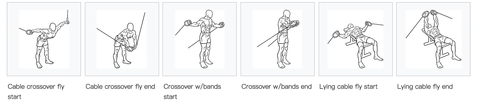
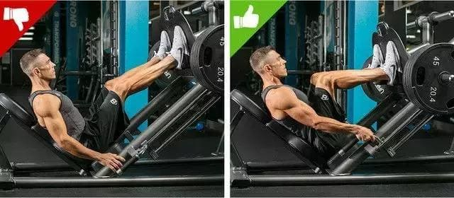
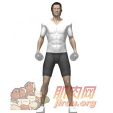
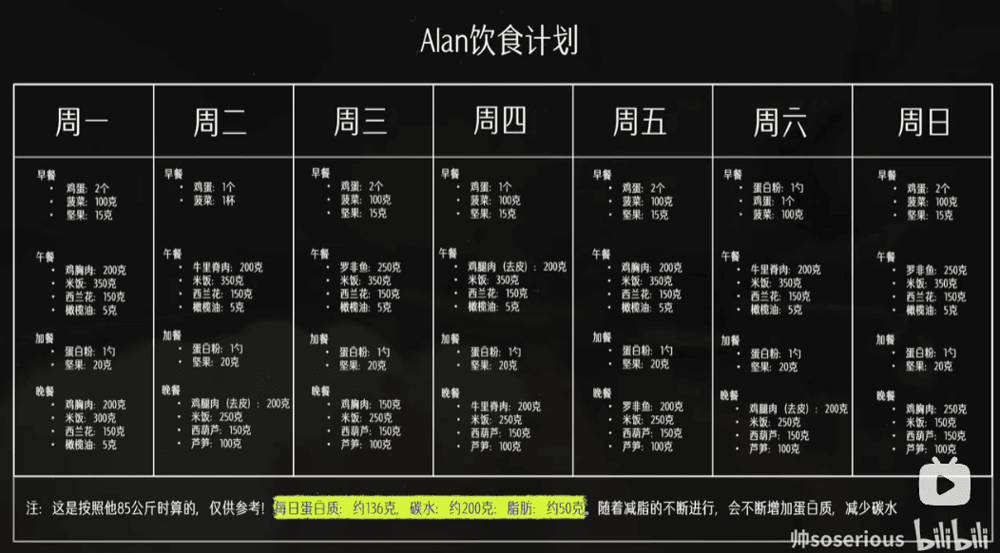
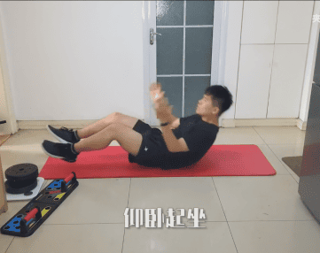

## 健身案例

### 案例 1
#### 案例 力量训练动作图片展示

胸： 飞鸟 推举 俯卧撑 
背： 哑铃单臂划船 引体向上 悬挂带反向划船 俯卧撑 让背部两块肌肉夹紧的动作 
肩： 肩推 侧平举 面拉 耸肩
腿： 只能深蹲 高位臀桥
臂：臂屈伸 二头弯举 三头拉伸(扶墙拿水瓶向后拉伸)

单个水瓶1.1kg 不力竭换 大水瓶或者哑铃

| 胸 | 背 | 肩 | 腿 | 手臂 |
| --- | --- | --- | --- | --- |
|      |      |      |      |      
|    |       |  |     |  

---
| 居家哑铃训练全身 | 居家哑铃训练全身 |
| --- | --- |
|  |  |

<!-- 
{ flink }
- class_name: 胸
  class_desc:
  link_list:
    - name: 上斜哑铃推举
      link: https://zirpon.github.io/2021/01/06/%E5%81%A5%E8%BA%AB%E7%AC%94%E8%AE%B0/
      avatar: https://zirpon.github.io/img/健身笔记/上斜哑铃推举.gif
      descr:   胸
    - name: 哑铃上斜握推
      link: https://zirpon.github.io/2021/01/06/%E5%81%A5%E8%BA%AB%E7%AC%94%E8%AE%B0/
      avatar: https://zirpon.github.io/img/健身笔记/哑铃上斜握推.jpg
      descr:   胸
    - name: 平板杠铃卧推
      link: https://zirpon.github.io/2021/01/06/%E5%81%A5%E8%BA%AB%E7%AC%94%E8%AE%B0/
      avatar: https://zirpon.github.io/img/健身笔记/平板杠铃卧推.gif
      descr: 胸
    - name: 绳索飞鸟
      link: https://zirpon.github.io/2021/01/06/%E5%81%A5%E8%BA%AB%E7%AC%94%E8%AE%B0/
      avatar: https://zirpon.github.io/img/健身笔记/绳索飞鸟.png
      descr: 胸
    - name: 绳索直杆下压
      link: https://zirpon.github.io/2021/01/06/%E5%81%A5%E8%BA%AB%E7%AC%94%E8%AE%B0/
      avatar: https://zirpon.github.io/img/健身笔记/绳索直杆下压.png
      descr: 胸
    - name: 俯卧撑
      link: https://zirpon.github.io/2021/01/06/%E5%81%A5%E8%BA%AB%E7%AC%94%E8%AE%B0/
      avatar: https://zirpon.github.io/img/健身笔记/俯卧撑.gif
      descr:    胸   
{ endflink %}
-->

---

#### 案例动作大图展示


 
 
 

 
 

 
 
 



--- 



 
 

 
 

 

 

 

 
 

 
 

 
 



---

#### 案例动作 详细教程 网址

[上斜哑铃推举]
[平板杠铃卧推]
[哑铃上斜握推]
[哑铃飞鸟]
[绳索飞鸟]
[俯卧撑]
[绳索下压]
[坐姿下拉]
[器械划船]
[绳索划船]
[哑铃正握弯举]
[哑铃锤式弯举]
[哑铃肩推]
[哑铃侧平举]
[绳索侧平举]
[绳索面拉]
[哑铃耸肩]
[腿举]
[深蹲]
[腿屈伸]
[腿弯举]
[绳索臂屈伸]
[绳索二头弯举]
[垂式弯举]
[锤式弯举]
[俯身哑铃划船]

#### 案例饮食计划表⌚️

### 案例2 某个博主的分享
#### 1.1 一开始

- 6:30 (全麦面包 + 2 egg + 脱脂牛奶)
    - 跑步 3公里
    - 4组开合跳
    - 4组 高抬腿
- 中午 白水煮鸡胸 + 蔬菜沙拉 + 全麦面包
- 晚上 (1 egg +  1 piece 面包 + 牛奶)
    - 5 公里
    - 4 组开合跳

#### 1.2 两周后完全停止跑步 开始力量训练 3周

- 负重深蹲

- 仰卧起坐

### 案例3 另一个博主的分享

- 有氧 (持续慢跑 or 走跑间歇)
- HIT (每周进行1~2次 高强度hit)
    - 快跑45秒(12.5公里/秒)
    - 放松慢跑30秒
    - 重复8-12组
- 腹肌训练
    - 卷腹          15次
    - 俄罗斯转体    40次
    - 卷腹15次
    - 刺拳仰卧起坐  20次
    - 动态平板支撑  10次
    - 卷腹举腿      15次
    - 90度卷腹      15次

## 3. 评论区普通人的建议

- 热身
- 深蹲10分钟
- 力量训练10分钟
- 平板支撑1分钟两次
- 跳绳40分钟(3000个左右)   

深蹲跟力量训练每天必做 ，其他可以换   可以跑两天步跳三天绳
控制饮食，每天6点后除了水跟一点水果不再进食，多喝水，多补充蛋白质，

亲身经历四个月瘦50斤。
贵在坚持难在保持，你跑步可以跑的很慢，但你必须跑下去，你跳绳可以跳一个绊一次但请坚持下去

## 4. 哑铃负重深蹲的标准动作讲解
- 自重深蹲
- 负重深蹲

> 3-4组*10-20次

深蹲被誉为“力量训练之王”，很多的健身动作都会结合深蹲的动作。
深蹲看似锻炼下半身，实则能够锻炼全身的力量。
深蹲时，能够有效刺激**大臀肌**，同时刺激了**骨骼肌**发力。
深蹲的标准动作为：
    1. 背部呈弓形。
    2. 臀部向后坐，重量落在脚后跟。
    3. 把握蹲的深度，一般要超过水平面以下。
    4. 两腿打开与肩膀同宽。
    5. 蹲起的速度不宜过快。

### 4.1 拿中间

标准动作:
1. 双手捧着哑铃，将哑铃摆在胸前，两手内收，肩胛下压放松。双脚与髋关节同宽，脚尖朝前（或微微外八），重点应是下蹲时，`膝盖与脚尖同方向`。
 
2. 收臀，保持大腿部位与地面平行或根据自己的灵活程度和柔韧性尽量保持与地面平行。身体重心居中。挺胸、抬头、收腹，深吸一口气。
 
3. 感受髋关节向后移动（往后、往下坐），过程中胸、被都是维持挺直。身体`下蹲并稍向前倾`。
 
4. 最后，保持躯干稳定，脚部向下用力**蹬地**。中心落在脚掌中部，伸膝伸髋向上直直蹲起。回到起始动作。

 4.2 拿两边

- 热身
- 接下来站立之后把哑铃握起来，并且放在身体两侧，在跟随着大家做深蹲的时候，我们的`手臂始终要保持不动`的姿势

## 5. 力量训练

- 肌肉训练：健美运动员增加肌肉的一种训练，目的是最大限度地增长肌肉
- 力量训练：能刺激身体分泌激素，增加你的基础代谢

> 力量训练可分为器械训练、自由重量训练、自身徒手重量训练。

### 5.1 器械训练

就是健身中心里最常见的重训机械，最好在使用时咨询现场教练，器械使用前可能需要微调。

### 5.2 自由重量训练

是指没有机械的辅助，靠**哑铃**、**杠铃**、**壶铃**或者其他能够负重的器械，如**大轮胎**，**长柄锤**等就可以独立完成的训练。建议有人在旁辅助，重量的选择注意循序渐进。

### 5.3 自身徒手重量训练

顾名思义，不用器械，利用自己身体的重量来训练
    - 深蹲
    - 仰卧起坐等
    - 优点大家都知道，简单、省钱
    - 缺点是缺乏渐进的阻力，但对于新手足够了，可有效减脂、锻炼心肺和塑形

- 四点跪撑：

    

    - ☆注意膝盖不能接触地面

    - 四点是指两只手和两个脚尖

    - 身体要成“N型”

    - 头、身处于一条直线

    - 臂、身垂直，髋、膝垂直。

    - 腹部收紧，下巴内收

    - 保持**30**秒

- 猎鸟狗式：
    
    - 伸直右手、左腿然后手、膝相碰

    - 以此往复

    - 头、身处于一条直线

    - 保持腹部、臀部收紧

    - 左右各10组
        - 初级：每组6个，3组；
        - 中级：每组10个，3组；
        - 高级：每组15个，4组。

- 俄罗斯转体
- 旋腿臀桥

## 6. 平板支撑

> 3-6组*60s-90s

**每组保持60秒，每次训练4组，组与组之间间歇不超过20秒。**

## 7. 站姿哑铃平举

- 前平举
- 侧平举

一开始我们站好在地面上，双手握住哑铃自然放松在我们的身体两侧。
调整好后，让双手发力，让双手能够向上平举，直到手臂与地面平行，并且双手伸直。然后再放下手臂，重新开始动作。

> 3-4组*10-20次

## 8. 俯卧撑

**初练者**来说，**每天20-30个**

> 3-4组*10-20次

## 9. 10 At-Home Exercises to Get Rid of Belly Fat In a Month

- five jumping jacks 1 burpee

- 4 mountain climbers 2 sit-throughs

- plyo step-ups

- push-ups

- 2 split squat jumps 1 burpee

- toe taps

- plank walks

- sprinter sit-ups

- squat thrusts

- sumo goblet && squat pulse

- 每周慢跑3--4次 每次40分钟

## 10. 健身劳累伤痛问题

### 1. 脚底板外侧肌肉疼痛可能由多种原因引起
常见原因和应对建议如下：

可能原因
过度使用或劳损

长时间行走、跑步、站立或突然增加运动量可能导致外侧肌肉疲劳。

鞋子不合适（如鞋底太硬、支撑不足）也可能加重负担。

足底筋膜炎

虽然典型疼痛在足跟或足弓，但炎症可能扩散至外侧。

晨起第一步疼痛明显，活动后减轻。

腓骨肌肌腱炎

外侧脚踝至足底的腓骨肌腱过度使用或扭伤可能引发炎症，疼痛可放射至足底外侧。

跖骨应力性损伤

第五跖骨（小趾根部）的应力性骨折或骨膜炎可能导致外侧疼痛，常见于跑步或跳跃后。

足部结构问题

高足弓或扁平足可能导致外侧压力异常。

步态异常（如内翻不足）也可能引发外侧肌肉代偿性疼痛。

神经压迫

外侧足底神经受压（如穿紧鞋、局部肿胀）可能导致刺痛或麻木。

自我缓解方法
休息与冰敷

减少活动，避免加重疼痛的动作。

每天冰敷疼痛部位（每次15分钟，2-3次/日）。

拉伸与放松

足底筋膜拉伸：坐位，用手将脚趾向后扳，感受足底拉伸，保持20秒，重复3次。

腓骨肌拉伸：坐位，腿伸直，用毛巾绕住前脚掌，将脚向内翻（如图），保持20秒。

用网球或筋膜球滚压足底放松肌肉。

更换鞋子

选择有足弓支撑、缓冲良好的鞋子，避免平底鞋或磨损严重的旧鞋。

抗炎止痛

可短期使用布洛芬等非甾体抗炎药（遵医嘱或说明书）。

何时就医？
疼痛持续超过1-2周，休息后无缓解。

出现明显肿胀、发红或发热。

无法正常行走，或疼痛夜间加重。

怀疑骨折（如外伤后剧痛、局部压痛明显）。

医生可能通过X光、超声或MRI检查，并根据结果建议物理治疗、定制鞋垫或药物治疗。

预防建议
运动前充分热身，逐步增加运动强度。

选择适合足型的鞋子，必要时使用矫形鞋垫。

避免长时间穿高跟鞋或硬底鞋。

定期进行足部肌肉强化训练（如用脚趾抓毛巾）。

如果疼痛持续或加重，及时就医明确诊断，避免延误治疗！

### 2. 免疫力下降 发炎

免疫力下降与炎症反复发作之间存在密切关联。当免疫力降低时，身体对抗感染和修复损伤的能力减弱，可能导致炎症难以控制或反复出现。以下是可能的原因、应对建议和改善方向：

免疫力下降与炎症关联的常见原因
慢性压力

长期压力会导致皮质醇升高，抑制免疫细胞活性，增加炎症因子（如IL-6）释放。

营养不良

缺乏蛋白质、维生素C、D、锌、硒等关键营养素，影响免疫细胞生成和抗炎能力。

睡眠不足

睡眠是免疫系统修复的关键期，长期熬夜会减少抗病毒蛋白（如干扰素）的分泌。

肠道菌群失衡

70%免疫细胞在肠道，菌群失调（如益生菌减少）会削弱免疫屏障，促发慢性炎症。

慢性疾病

糖尿病、自身免疫病（如类风湿关节炎）等会持续消耗免疫资源，导致炎症失控。

药物或治疗影响

长期使用抗生素、激素或化疗可能抑制免疫功能。

应对炎症与提升免疫力的关键措施
1. 调整饮食
抗炎食物：深海鱼（Omega-3）、姜黄、绿茶、深色蔬菜（富含抗氧化剂）、坚果。

增强免疫：优质蛋白（鸡蛋、豆类）、维生素C（柑橘、西兰花）、锌（牡蛎、南瓜子）。

避免促炎食物：精制糖、反式脂肪（油炸食品）、加工肉类。

2. 生活方式干预
规律睡眠：保证每天7-9小时，尽量在23点前入睡。

适度运动：每周150分钟中等强度运动（如快走、游泳），过度运动反而抑制免疫。

减压管理：冥想、深呼吸、瑜伽或心理咨询，降低皮质醇水平。

3. 针对性营养补充
维生素D：血液浓度建议维持在40-60 ng/mL，缺乏者需补充（每日1000-2000 IU）。

益生菌：选择含乳酸杆菌、双歧杆菌的补充剂，调节肠道免疫。

抗氧化剂：如NAC（N-乙酰半胱氨酸）、谷胱甘肽，帮助清除炎症自由基。

4. 控制感染与炎症
急性感染：细菌感染需遵医嘱用抗生素，病毒感染以对症治疗为主。

慢性炎症：在医生指导下使用抗炎药物（如低剂量激素、NSAIDs），或尝试天然抗炎剂（姜黄素、乳香提取物）。

何时需要就医？
炎症反复发作（如口腔溃疡、皮肤感染、尿路感染等超过每月1次）。

伴随不明原因发热、体重下降、持续疲劳。

出现自身免疫症状：关节肿痛、皮疹、脱发等。

常规措施无效，需排查潜在疾病（如HIV、肿瘤、免疫缺陷病）。

重点排查的医学检查
血液检查

血常规（看白细胞、淋巴细胞计数）

C反应蛋白（CRP）、血沉（ESR）评估炎症水平

免疫球蛋白（IgG/IgA/IgM）、补体水平

维生素D、锌等微量元素检测

其他检查

肠道菌群分析（针对慢性腹泻/便秘者）

自身抗体筛查（如ANA、RF）

预防与长期管理
戒烟限酒：吸烟直接损伤呼吸道免疫屏障，酒精抑制骨髓造血功能。

接种疫苗：流感疫苗、肺炎疫苗等可减少感染风险。

环境控制：避免长期接触污染空气或化学毒素（如甲醛）。

免疫力下降和炎症反应是身体发出的警示信号，需从生活方式、营养、医学干预多维度调整。若调整后仍无改善，建议尽早到风湿免疫科或内科就诊，避免延误潜在疾病的治疗。

### 3. ejaculation 免疫力 与健身

ejaculation后是否会导致免疫力下降，目前医学研究尚无明确一致的结论，但可以从生理机制和现有研究角度分析可能的影响及应对建议：

一、ejaculation后可能的生理变化
短暂免疫波动

部分研究表明，性高潮后体内 催乳素（Prolactin） 水平升高，可能短暂抑制免疫细胞（如自然杀伤细胞NK细胞）活性，但这种影响通常是暂时性的（数小时内恢复），不会显著削弱长期免疫力。

营养物质流失

精液中含有锌、蛋白质、维生素C等成分，频繁ejaculation可能导致这些营养素的流失。例如：

锌：每次ejaculation约损失3-5mg锌（成年男性每日推荐摄入量11mg），缺锌可能影响免疫细胞功能。

硒、维生素C：参与抗氧化和免疫调节，过度流失可能增加感染风险。

激素变化与应激反应

性活动后，皮质醇（压力激素）短暂升高可能抑制免疫功能，但适度性行为反而通过释放内啡肽减轻压力，长期看可能对免疫有益。

二、现有研究结论
短期影响：

有研究观察到男性在性高潮后2小时内，唾液中的IgA（免疫球蛋白A，黏膜免疫关键成分）水平下降，但24小时内恢复。

另一项研究发现，适度性行为（每周1-2次）可提升IgA水平，降低感冒风险；但过度频繁（如每天）可能适得其反。

长期影响：

目前无证据表明规律ejaculation会直接导致免疫力持续下降。相反，适度性生活可能通过减轻压力、改善睡眠间接增强免疫力。

三、如何减少潜在负面影响
控制频率

根据自身状态调整，避免过度频繁ejaculation（如每天多次），尤其是已感到疲劳或营养摄入不足时。

补充关键营养素

锌：牡蛎、红肉、南瓜子、坚果（如每日补充不超过40mg）。

硒：巴西坚果、鱼类、鸡蛋。

维生素C：柑橘类水果、西兰花、彩椒。

蛋白质：鸡蛋、豆类、瘦肉，维持免疫细胞合成。

注重恢复

ejaculation后保证充足睡眠（7-9小时），避免熬夜或剧烈运动后立即进行性活动。

避免极端行为

禁欲或过度纵欲均可能影响免疫平衡，找到适合自身的节奏（如每周1-3次）。

四、需要警惕的情况
若ejaculation后出现以下症状，可能与免疫力下降或其他健康问题相关，建议就医排查：

反复感冒、口腔溃疡、伤口愈合缓慢。

持续疲劳、体重下降、夜间盗汗。

伴随睾丸疼痛、排尿异常（需排除前列腺炎或性传播感染）。

总结
适度ejaculation本身不会显著降低免疫力，但过度频繁可能导致营养消耗或短期免疫波动。

关键是通过均衡饮食、规律作息和适度运动维持整体免疫健康。

若怀疑免疫力异常，可检测血常规、免疫球蛋白、微量元素（如锌）等指标，针对性调整。

如有其他症状或担忧，建议咨询泌尿外科或免疫科医生进一步评估！

### 4. 补镁锌硒 
补锌是维持免疫、生殖、代谢功能的重要措施，尤其对男性健康、伤口愈合和抗感染能力至关重要。以下是科学补锌的详细建议：

一、为什么需要补锌？
生理功能

免疫支持：锌参与T淋巴细胞分化，缺锌易导致反复感染（如感冒、腹泻）。

生殖健康：精子生成需要锌，缺锌可能降低精子质量和睾酮水平。

代谢与修复：参与300多种酶活性，促进伤口愈合、皮肤健康及DNA合成。

缺锌的高风险人群

素食者（植物性食物锌吸收率低）

孕妇/哺乳期女性（需求量增加）

慢性腹泻或肠道疾病患者（吸收障碍）

频繁ejaculation或高强度运动者（锌流失增加）

二、补锌的科学方法
1. 优先食补：高锌食物清单
食物类别	推荐食物（每100g含锌量）	每日建议摄入量
贝类	牡蛎（16-40mg）	每周1-2次
红肉	牛肉（4.8mg）、羊肉（3.9mg）	每日50-100g
坚果种子	南瓜子（7.6mg）、腰果（5.6mg）	每日一小把（20-30g）
豆类	鹰嘴豆（3.4mg）、黑豆（2.5mg）	每周3-4次
乳制品	奶酪（3.1mg）、酸奶（0.5mg）	每日1-2份
谷物	全麦面包（1.8mg）、燕麦（2.3mg）	选择未精加工产品
注意：动物性食物中的锌（如红肉、贝类）吸收率（约30-40%）高于植物性食物（约10-20%）。

2. 锌补充剂选择
适用情况：

血锌检测显示缺乏（血清锌＜70μg/dL）

饮食无法满足需求（如素食者、孕妇）

存在缺锌症状（脱发、味觉减退、反复感染）。

常见类型：

类型	特点	适合人群
葡萄糖酸锌	吸收率较高，胃肠道刺激小	儿童、普通成人
柠檬酸锌	吸收率最佳，适合空腹服用	胃肠功能正常者
锌镁合剂	含镁，协同缓解疲劳	运动人群、压力大者
螯合锌（如吡啶甲酸锌）	生物利用率高，价格较贵	严重缺锌或吸收障碍者
剂量建议：

普通成人：每日额外补充不超过 15-25mg（中国营养学会推荐成人每日摄入量：男12.5mg，女7.5mg）。

治疗缺锌：遵医嘱短期服用（可高达30-50mg/天），疗程通常1-3个月。

服用时间：

餐后1小时服用，减少胃部不适。

避免与钙、铁补充剂同服（间隔至少2小时）。

三、补锌注意事项
避免过量

长期超量（＞40mg/天）可能抑制铜吸收，引发贫血、神经系统问题。

典型过量症状：恶心、呕吐、头痛。

特殊人群

孕妇：每日需锌9.5-12mg，优先通过食物补充，如需用补充剂需医生指导。

老年人：胃酸分泌减少可能影响吸收，可选择螯合锌或与维生素C同服促进吸收。

药物相互作用

抗生素（如四环素、喹诺酮类）与锌结合降低药效，需间隔2小时服用。

利尿剂（如氢氯噻嗪）可能增加锌排泄，需监测锌水平。

四、缺锌自测与就医建议
自测信号：

频繁感冒、口腔溃疡

脱发、指甲白斑

味觉/嗅觉减退

儿童发育迟缓、注意力下降。

何时就医：

疑似缺锌且调整饮食后无改善。

伴随慢性腹泻、消瘦或皮肤病变。

需通过 血清锌检测 或 发锌检测 确诊。

五、补锌的协同营养素
维生素C：增强锌吸收（如餐后吃橙子）。

维生素A：与锌协同维持黏膜免疫（如胡萝卜、动物肝脏）。

硒：联合补充可提升抗氧化能力（巴西坚果、鱼类）。

总结：补锌应优先通过饮食调整，必要时选择合适补充剂并控制剂量。长期或大剂量补锌需在医生指导下进行，避免盲目补充导致失衡。

### 5. L-精氨酸片

L-精氨酸（L-Arginine）是一种条件必需氨基酸，在人体中具有多种生理功能。它通过转化为一氧化氮（NO），参与血管舒张、免疫调节和激素分泌等过程。以下是关于L-精氨酸片的详细解析，包括作用、适用人群、服用建议及注意事项：

一、L-精氨酸的主要作用
改善心血管健康

促进一氧化氮生成，扩张血管，改善血液循环。

可能有助于降低血压，缓解心绞痛症状。

增强运动表现

增加肌肉血流量，延缓疲劳，促进运动后恢复。

部分研究显示对耐力运动有益，但效果因人而异。

支持男性生殖健康

改善勃起功能（通过增加阴茎血流）。

可能提高精子质量（需结合其他营养素如锌）。

免疫调节

促进免疫细胞（如T细胞）功能，增强抗感染能力。

其他潜在益处

促进伤口愈合（精氨酸是胶原蛋白合成的原料）。

可能改善胰岛素敏感性（对糖尿病患者有一定帮助）。

二、适用人群
心血管疾病患者

高血压、动脉硬化、心绞痛患者（需医生指导下使用）。

运动爱好者

希望提升耐力、加速恢复的健身或跑步爱好者。

男性健康需求者

轻度勃起功能障碍（ED）或精子质量不佳者。

免疫力低下者

反复感染、术后恢复期人群。

其他

皮肤伤口愈合缓慢者。

老年人（改善血管功能，延缓衰老）。

三、服用建议
剂量

一般保健：每日500-2000mg，分次服用。

运动表现：运动前30-60分钟服用3000-6000mg。

男性健康：每日3000-5000mg，持续4-12周。

疾病辅助治疗：遵医嘱，可能需要更高剂量（如5000-9000mg/天）。

服用时间

空腹服用吸收最佳（餐前1小时或餐后2小时）。

避免与高脂肪食物同服，可能影响吸收。

搭配建议

与瓜氨酸（Citrulline）合用：瓜氨酸可转化为精氨酸，延长作用时间。

与抗氧化剂（如维生素C、E）合用：保护一氧化氮不被氧化。

四、注意事项
副作用

常见：胃肠道不适（腹胀、腹泻），多见于高剂量（＞10g/天）。

罕见：低血压、电解质失衡（长期高剂量使用）。

禁忌人群

疱疹病毒感染者：精氨酸可能促进病毒复制。

严重肝肾功能不全者：需医生评估。

低血压患者：可能进一步降低血压。

药物相互作用

降压药：可能增强降压效果，需监测血压。

硝酸酯类药物（如硝酸甘油）：合用可能导致血压过低。

抗凝血药：可能增加出血风险。

长期使用

长期高剂量补充可能干扰其他氨基酸代谢，建议周期性使用（如用2-3个月，停1个月）。

五、L-精氨酸的食物来源
肉类：牛肉、鸡肉、猪肉。

海鲜：三文鱼、虾、金枪鱼。

坚果种子：核桃、杏仁、南瓜子。

豆类：大豆、鹰嘴豆、扁豆。

乳制品：牛奶、奶酪。

六、常见问题
L-精氨酸与精氨酸的区别？

L-精氨酸是精氨酸的天然活性形式，补充剂通常使用L-精氨酸。

L-精氨酸对所有人都有效吗？

效果因人而异，尤其是运动表现和勃起功能改善，部分人可能无明显感受。

可以长期服用吗？

一般保健剂量（＜3g/天）可长期使用，但建议定期停用以避免耐受性。

总结
L-精氨酸片是一种多功能补充剂，适合心血管健康、运动表现、男性健康及免疫力提升等需求。但需根据个人情况选择合适剂量，并注意禁忌和副作用。如有基础疾病或正在服药，建议咨询医生后再使用。
***

## 99. 总结的TIPS

### 99.1 小白刚开始进健身房练30-40分钟器械再练有氧（**力量训练**耗尽`糖原`后**有氧**燃脂效率高）

**高强度间歇训练（high-intensity interval training，HIIT）**：指练习者在极量的运动强度下全力持续运动数十秒，然后短暂休息，再重复短时间全力运动的训练方法，这是一种有氧和无氧运动相结合的锻炼方式，且可以不需要借助任何器械或是工具，能快速燃烧热量，达到减肥的目的

 99.2 无氧运动: anaerobic exercise

 99.2.2 概念:
无氧运动是指人体肌肉在无氧供能代谢状态下进行的运动。

 99.2.3 特征:
无氧运动大部分是负荷强度高、瞬间性强的运动，所以很难持续长时间，而且疲劳消除的时间也慢。

在运动过程中，身体的新陈代谢是加速的，加速的代谢需要消耗更多的能量。
人体的能量是通过身体内的糖、蛋白质和脂肪分解代谢得来的。

无氧运动的最大特征是：运动时氧气的摄取量非常低。
由于速度过快及爆发力过猛，人体内的糖分来不及经过氧气分解，而不得不依靠“无氧供能”。

这种运动会在体内产生过多的**乳酸**，导致肌肉疲劳不能持久，运动后感到肌肉酸痛，呼吸急促。

其实是`酵解`时产生大量**丙酮酸**、**乳酸**等**中间代谢产物**，不能通过呼吸排除。

这些酸性产物堆积在**细胞**和**血液**中，就成了“疲劳毒素”，会让人感到疲乏无力、肌肉酸痛，还会出现呼吸、心跳加快和心律失常，严重时会出现酸中毒和增加肝肾负担。

人体**预存**的ATP能量只能维持极限强度运动大约**2秒**，随后由CP合成ATP，大约能维持6秒，合计**8秒**左右。
也就是说，全速跑不到一百米即告罄，跑二百米时后面的一百米，必须由**血糖**在无氧状态下，迅速合成新的热能物质ATP来提供能量，其副产品是乳酸。

跑二百米或四百米、一百米游泳、网球和足球等运动，是利用**肌糖原**无氧分解所提供的能量，故运动后肌肉里累积大量**乳酸**，乳酸堆积是运动后引起肌肉痛的原因之一。

 99.2.4 供能系统:

参与无氧运动的供能系统为ATP-CP系统、糖酵解系统、氧化能系统，

例如，10秒内即可完成的百米跑，ATP-CP系统为主要供能系统，但糖酵解和氧化能系统也同时供应少部分能量。

### 99.2.4.1 ATP-CP
细胞可通过分解**磷酸肌酸**提供能量和**无机磷酸**，使ADP重新合成ATP，从而维持ATP水平的稳定，此过程非常迅速，而且不需要细胞内的特定结构即可完成，并且此过程不需要氧即可进行，但也可在有氧条件下进行。

像无氧运动这样的大强度、剧烈运动，在最初的几秒内，ATP含量维持在一个相对不变的水平，但磷酸肌酸含量却不断下降，因为要补充消耗的ATP。

力竭时，ATP和磷酸肌酸的含量显著下降，以至于不能继续提供能量来维持肌肉的收缩和舒张。

因此，分解磷酸肌酸来维持ATP含量的作用是有限的。

体内储存的ATP和磷酸肌酸，既能提供无氧运动（例如全速奔跑）3-15秒的能量供应，超过这个时间以后，肌肉将通过**糖酵解**和有氧氧化产生ATP供能。

 99.2.4.2 糖酵解
糖酵解即通过一系列**糖酵解酶**引起**葡萄糖分解**的过程。
糖酵解系统远比ATP-CP系统复杂得多，在**糖原**分解成乳酸的过程中需要10-12个**酶促反应**，所有的酶促反应都是在**细胞质**中进行的。

1分子**糖原**在糖酵解过程中会净产3分子的ATP，1分子**葡萄糖**糖酵解过程中会净产2分子ATP。
糖酵解系统不能产生大量ATP，但ATP-CP系统和糖酵解系统仍可在氧气不足的情况下提供能量，供肌肉收缩，这两大系统主要为大强度运动的前几分钟供能。

在完整的无氧运动中，这两个系统**只能维持不到2分钟**，长时间的运动需要第三个能量系统——**氧化能系统**。

### 99.2.4.3 氧化能
机体在有氧条件下分解底物产生能量的过程，称为细胞内呼吸，此过程需要氧的参与，因此成为有氧过程。
在长时间运动中，骨骼肌需要一个稳定的供能系统来维持**肌纤维**的收缩。
相对于无氧产生ATP，有氧代谢系统的动员速度慢，但其**具有强大的产能能力**，因此有氧代谢是耐力运动的主要供能方式，但在无氧运动中，虽然产能速率不能跟上机体的运动速度，但其在无氧运动后程供能不可小觑。

研究发现，通过无氧运动可以提高机体的肌肉力量、爆发力、增加肌肉体积，提高运动速度。
常见的无氧运动项目有：`短跑`、`举重`、`投掷`、`跳高`、`跳远`、`拔河`、`俯卧撑`、`潜水`、`肌力训练`（长时间的肌肉收缩）等。

 ## 99.2.5 无氧运动与有氧运动的区别 

有氧运动也叫做有氧代谢运动，是指人体在氧气充分供应的情况下进行的体育锻炼。

有氧运动的好处是：可以提升氧气的摄取量，能更好地消耗体内多余的热量。

特点是强度低、有节奏、持续时间较长。要求每次锻炼的时间不少于1小时，每周坚持3到5次。

通过这种锻炼，氧气能充分酵解体内的糖分，还可消耗体内脂肪，增强和改善心肺功能，预防骨质疏松，调节心理和精神状态，是健身的主要运动方式。

有氧运动的主要供能方式为**氧化能系统**。

常见的有氧运动项目有：瑜伽、步行、`慢跑`、滑冰、`游泳`、`骑自行车`、打太极拳、跳健身舞、做韵律操等。

人体运动是需要能量的，如果能量来自细胞内的有氧代谢（氧化反应），就是有氧运动；但若能量来自**无氧酵解**，就是无氧运动。

有氧代谢时，充分氧化1个分子葡萄糖，能产生38个ATP的能量；
而在无氧酵解时，1个分子的葡萄糖仅产生2个ATP。

有氧运动时葡萄糖代谢后生成水和二氧化碳，可以通过呼吸很容易被排出体外，对人体无害。
然而在酵解时产生大量乳酸等中间代谢产物。

两者区别：在增加肌肉力量方面，无氧运动的贡献较大。

一项最新研究显示,握力不够的人更有可能罹患心脏病或者中风,且握力损失越大,风 险越高。

某国一项研究人员花了4年时间跟踪调查了17个国家年龄在35~70岁的14万人,并采用手持设备对受试者的握力进行了衡量。

结果表明,握力每下降5公 斤,跟运动密切相关的 [2]  心血管疾病风险或由其他原因导致的循环系统疾病就相应增加17%。

人体预存的ATP能量只能维持极限强度运动大约2秒，随后由CP合成ATP，大约能维持6秒，合计8秒左右。
也就是说，全速跑不到一百米即告罄，跑二百米时后面的一百米，必须由血糖在无氧状态下，迅速合成新的热能物质ATP来提供能量，其副产品是乳酸。
跑二百米或四百米、一百米游泳、网球和足球等运动，是利用肌糖原无氧分解所提供的能量，故运动后肌肉里累积大量乳酸，乳酸堆积是运动后引起肌肉痛的原因之一。

肌糖原无氧分解所提供的能量，只能维持一分钟左右，跑完四百米后就全部用完。

跑八百米时，后面的四百米，必须由糖、脂肪酸和氨基酸在有氧状态下，合成新的热能物质ATP来提供能量，而糖由糖原分解后供应，脂肪酸由脂肪分解后供应，氨基酸由蛋白质分解后供应，这整个过程需要氧气，也就是靠氧气燃烧糖、脂肪和蛋白质来生产热能物质ATP，供应后段运动所需的热量，这后段的运动就是有氧运动。

跑八百米或一千五百米、二百和四百米游泳、拳击等运动，都需要开始利用氧气燃烧糖原、脂肪和蛋白质，故此类运动的后段都是有氧运动，作为有氧运动，心率一般在**130次/分**为最佳。

运动的前段大约五分钟先烧**糖原**，运动持续越久会烧掉越多的脂肪，只要持续**半小时至一小时**，所消耗热量的五成，就由燃烧**脂肪**来供应。

两者选择：至于选择有氧运动还是无氧运动，首先要看自己的锻炼目的是什么和个人的实际情况。
有氧运动的强度相对较低，比较安全，机体各器官的负荷也相对较小，不易出现伤害事故；
而无氧运动强度相对高，机体各器官的承受的负荷也是相对较大，可以更好地提高机体的工作能力。

例如，想要**提高自己的心肺机能**，选择有氧运动就比较好。
而如果你现在只能举起60斤的重物，你想要提高您的力量，举起70斤的重物，那么你就要选择无氧运动了。
无氧运动对于塑造肌肉的线条，增加肌肉力量而言是首选的。

### 99.3 有氧运动：Aerobic exercise

是不是“有氧运动”，衡量的标准是心率。心率保持在**150次/分钟**的运动量为有氧运动，因为此时血液可以供给心肌足够的氧气；
因此，它的特点是强度低、有节奏、持续时间较长。
要求每次锻炼的时间不少于30分钟，每周坚持3到5次。

这种锻炼，氧气能充分燃烧（即氧化）体内的糖分，还可消耗体内脂肪，增强和改善心肺功能，预防骨质疏松，调节心理和精神状态，是健身的主要运动方式。

健身价值

通过有规律的有氧运动锻炼，人体**心脏功能**更强，**脉搏输出量**更多，则**供氧能力**更强，**脉搏数**会适当减少。
一个心肺功能好的人可以参加较长时间的有氧运动，且运动恢复也较快。

排行榜
NO1、游泳
运动优点：游泳需克服水的阻力而非重力，肌肉和关节不易受损，能有效保护膝关节;冷水环境下游泳热量消耗大，属于减肥效果显著的运动；当配合节食时，效果更加显著。
适宜人群：膝关节受损；体重严重超标；减肥；增强体质的族群。
运动周期：每周**3～4次**，每次**30～60分钟**。
热量消耗：约650千卡/小时

NO2、慢跑
运动优点：提高睡眠质量，通过跑步，大脑的供血、供氧量可以提升20%，这样夜晚的睡眠质量也会跟着提高；“通风”作用，在跑步的过程中，肺部的容量平均从5.8L上升到6.2L，同时，血液中氧气的携带量也会大大增加；提高心脏功能，长期慢跑可使安静**心率减慢**、**血管壁的弹性增加**；解压，慢跑可以缓解紧张和焦虑，有益健康。
适宜人群：减肥，需要缓解压力，缓解亚健康，以及预防心血管疾病的族群。
运动周期：每周**3～4次**，每次**40～60分钟**。
热量消耗：约650千卡/小时

健身观点

库珀可谓美国知名的预防医学大腕，他长期担任美国总统的私人医生，曾是“有氧健身运动”的首创者。
他认为每个人生命的长短和质量完全取决于个人对疾病的预防，而不是医生和其他什么人所能左右得了的；与预防相比，任何挽救生命的医疗措施都显得为时已晚。

库珀凭自己的实践经验，向人们亮明了自己对健身运动的观点。
1.适度锻炼。
大运动量的健身运动有可能会慢慢损伤你的身体，比如，每周跑步超过15英里就有些过量了。
建议每周锻炼4至5次，每次30分钟。
库珀认为，只要适量运动，就可以有效降低患心血管病和癌症的可能性。

减肥

!
7.应该怎样安排力量练习和有氧锻炼呢？
有氧运动比起力量训练消耗的热量要多，力量训练只是为了锻炼肌肉、增加肌肉，热量消耗要少，
所以应该把**有氧运动**放在**力量训练**`后`进行，这样安排，就可以保证既有体力进行有氧运动，又能进行力量训练。

有氧运动(3张)
有氧运动需要大量呼吸空气，对心、肺是很好的锻炼，可以增强肺活量和心脏功能。
长期坚持有氧运动能`增加体内血红蛋白的数量`，`提高机体抵抗力`，`抗衰老`，`增强大脑皮层`的工作效率和`心肺功能`，增加脂肪消耗，`防止动脉硬化`，降低心脑血管疾病的发病率。

`Ⅱ型糖尿病患者`、`肥胖症患`者以及`脂肪肝患者`，一定要做有氧运动，
患有`心律不齐`、`心脑动脉血管硬化`的人，以及年龄大的人，也都应该做有氧运动。

如果是为了强壮肌肉、健美体形，预防椎间盘突出症、颈椎病以及骨质疏松、骨质软化的人，应当做无氧运动。

如果心率达到**150～160次/分钟**，此时血液对心肌供氧已不充分，便为半有氧运动。

如果心率达到**160次/分钟**以上，便为无氧运动了，即血液中的氧气对心肌已是供不应求了。

新陈代谢需要氧气的参与，有氧运动由于氧气充足，可使体内营养物质代谢彻底，即达到最终代谢——营养物质分解为二氧化碳和水。

有氧运动能够达到瘦身减肥的效果，晚饭后进行**半小时**的散步，就能很好地将晚饭中的脂肪进而蛋白质进行调节消耗。

减肥

1、心率
**脂肪**的**分解代谢**是一系列复杂的生化反应，而心率反映的是**交感神经**的兴奋度，交感神经的兴奋促进了一系列**脂解激素**的分泌，从而活化**脂解酶**，使储存在**脂肪细胞组织**里的脂肪分解为游离**脂酸和甘油**，而脂酸在氧供给充足的条件下，可分解成二氧化碳和水并释放大量的能量。

最大心率：MHR为220－你的年龄，最低心率，一般在早晨测试。

保留心率就是最大心率－最低心率。

减肥心率也就是有氧运动的心率范围应该是最低心率+保留心率×50%～60%：124

锻炼耐力的心率范围是最低心率+保留心率×60%～70%：136.8

2、时间
根据美国运动医学的研究，有氧运动**前15分钟**，由**肝糖元**作为主要能源供应，**脂肪**供能在运动后**15～20分钟**才开始启动，

有氧运动

2、接近而不超过“靶心率”一般来说，靶心率为170－年龄的数值。
如果你60岁，靶心率就是170－60=110（次/分）。：138
3、自我感觉是掌握运动量和运动强度的重要指标，

包括轻度呼吸急促、感到有点心跳、周身微热、面色微红、津津小汗，这表明运动适量；
如果有明显的心慌、**气短**、心口发热、**头晕**、大汗、疲惫不堪，表明运动超限。

5、放松与热身有同样的作用，
在运动中，血液循环加快，血液的量也增加了，特别是四肢部分。
如果马上停止运动，**血液**会**囤积**在**下肢**而给心脏造成多余的负担。
严重时会影响到大脑供血，甚至出现眩晕和头昏。所以运动目的达到后应该有5～10分钟的放松，也就是逐步减小运动强度，慢慢地恢复到安静状态。
一周量

关于运动的频率，美国运动医学会推荐**正常人**应该**每周运动2～5次**

一般人慢跑一分钟消耗15千卡左右热量（体重越大消耗越多），而一公斤（1000克）的脂肪是4500千卡。
如果每天慢跑30分钟，在饮食没有变化的情况下10天可减一公斤。

研究发现，**两小时**中量的**有氧**锻炼可耗尽体内90%的**白氨酸**——对肌肉生长非常重要的一种氨基酸。

要改变脂肪与肌肉比率，应该采用相对重些的力量练习发展并保持肌肉总量。力量练习之后，进行中到高强度的有氧锻炼。

有利心脏
事实：美国心脏协会指出，每周3～4次、每次至少30分钟，以最大心率的50%～75%锻炼的有氧运动对心脏最有利。
它将对心血管系统和心肺功能有积极的改善作用，并显著减少相关疾病的危险。
美国心脏协会建议，初练者的运动心率以最大心率的50%为宜，几周后，强度逐渐增加到最大心率的75%
。总之，训练强度越大。你的体型保持得越好。因为心脏与其他部位一样，也是一块肌肉，它同样需要大强度的练习！

有氧运动方法

3、匀速跑心率控制在每分钟150次左右，负荷时间保持在30分钟以上。
5、跳绳3分钟，休息1分钟，再进行下一组的练习。每次训练做3组即可。当受训者觉得适应此运动量时，可去掉中间的休息时间，连续跳3分钟。
6、空击3分钟为一组，做3～5组。

综述
有氧运动是增强人体吸入与使用氧气的耐久运动。它的运动特点是负荷量轻、有节律感、持续时间长。运动医学测定，有氧运动适宜的运动负荷为
**每周4～5次**，每次持续**20～30分钟**，运动时心率为**120～135次/分**

[上斜哑铃推举]: <https://www.sohu.com/a/26775982_115763> "上斜哑铃推举"

[平板杠铃卧推]: <https://www.jianshen8.com/xiangmu/gangling/3797.html> "平板杠铃卧推"

[哑铃上斜握推]: <https://zhuanlan.zhihu.com/p/47741743> "哑铃上斜握推"

[俯卧撑]: <https://dxy.com/article/28105> "俯卧撑"

[绳索下压]: <https://baijiahao.baidu.com/s?id=1801172181200687791> "绳索下压"

[坐姿下拉]: <https://www.jianshen8.com/jirou/beibu/3877.html> "坐姿下拉"

[器械划船]: <https://zhuanlan.zhihu.com/p/166001324> "器械划船"

[绳索划船]: <https://www.jianshen8.com/jirou/beibu/3880.html> "绳索划船"

[哑铃锤式弯举]: <https://zhuanlan.zhihu.com/p/405219168> "哑铃锤式弯举"

[哑铃肩推]: <https://www.jianshen8.com/xiangmu/yaling/3817.html> "哑铃肩推"

[哑铃侧平举]: <https://baijiahao.baidu.com/s?id=1804979026950277400> "哑铃侧平举"

[绳索侧平举]: <https://www.jianshen8.com/jirou/jianbu/13094.html> "绳索侧平举"

[绳索面拉]: <https://www.zhihu.com/tardis/zm/art/53242447?source_id=1005> "绳索面拉"

[腿举]: <https://www.sohu.com/a/194508544_99954444> "腿举"

[深蹲]: <https://zhuanlan.zhihu.com/p/65685567> "深蹲"

[腿屈伸]: <https://www.jianshen8.com/jirou/tuibu/3902.html> "腿屈伸"

[腿弯举]: <https://www.jianshen8.com/jirou/tuibu/3904.html> "腿弯举"

[锤式弯举]: <https://www.sohu.com/a/821921754_121124676> "锤式弯举"

[俯身哑铃划船]: <https://www.sohu.com/a/271140419_482779> "俯身哑铃划船"