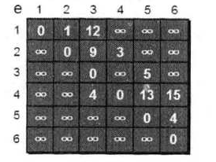
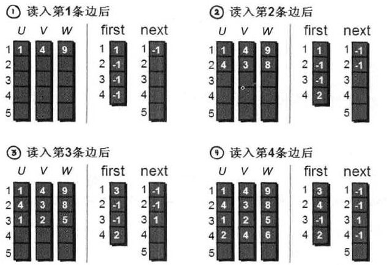
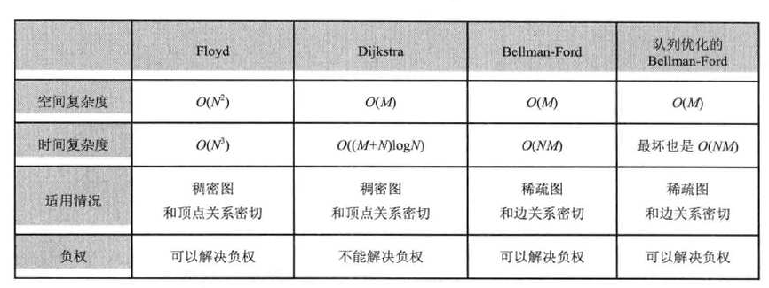
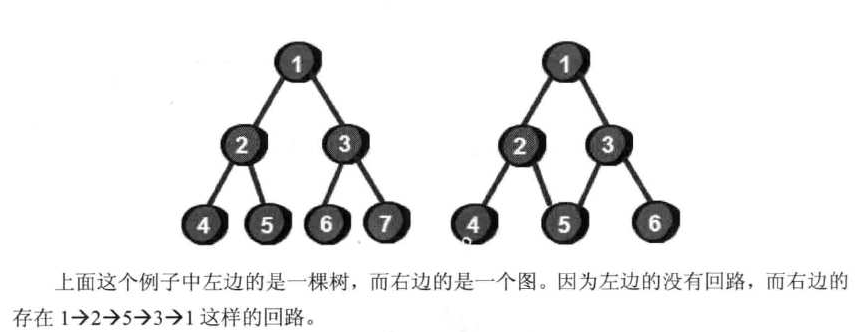

# 啊哈算法 读书笔记

> [《啊哈算法》源码](https://github.com/chenchen-cs/Aha-algorithm/) > [啊哈算法》第八章源码](https://github.com/OctopusLian/AhaAlgorithms/)







## 第 1 章 一大波数正在靠近——排序 1

### 第 1 节 最帛最简单的排序——桶排序 2

```C
#include <stdio.h>

void bucketSort(int arr[], int n) {
    int i, j;
    int max = arr[0];
    for (i = 1; i < n; i++) {
        if (arr[i] > max) {
            max = arr[i];
        }
    }

    int bucket[max + 1];
    for (i = 0; i <= max; i++) {
        bucket[i] = 0;
    }

    for (i = 0; i < n; i++) {
        bucket[arr[i]]++;
    }

    for (i = 0, j = 0; i <= max; i++) {
        while (bucket[i] > 0) {
            arr[j++] = i;
            bucket[i]--;
        }
    }
}

int main() {
    int arr[] = {5, 3, 8, 6, 4, 2, 7, 1, 9};
    int n = sizeof(arr) / sizeof(arr[0]);

    bucketSort(arr, n);

    for (int i = 0; i < n; i++) {
        printf("%d ", arr[i]);
    }

    return 0;
}
```

### 第 2 节 邻居好说话——冒泡排序 7

```C
#include <stdio.h>

void bubbleSort(int arr[], int n) {
    int i, j, temp;
    for (i = 0; i < n - 1; i++) {
        for (j = 0; j < n - 1 - i; j++) {
            if (arr[j] > arr[j + 1]) {
                // 交换 arr[j] 和 arr[j + 1]
                temp = arr[j];
                arr[j] = arr[j + 1];
                arr[j + 1] = temp;
            }
        }
    }
}

int main() {
    int arr[] = {5, 3, 8, 6, 4, 2, 7, 1, 9};
    int n = sizeof(arr) / sizeof(arr[0]);

    bubbleSort(arr, n);

    for (int i = 0; i < n; i++) {
        printf("%d ", arr[i]);
    }

    return 0;
}
```

### 第 3 节 最常用的排序——快速排序

|基准->   mid   <-|
|mid->   基准|   <-|

```C
#include <stdio.h>

int a[101], n;

void quicksort(int left, int right) {
    int i, j, t, temp;
    if (left > right) return;
    temp = a[left];
    i = left;
    j = right;
    while (i != j) {
        while (a[j] >= temp && i < j)
            j--;
        while (a[i] <= temp && i < j)
            i++;
        if (i < j) {
            t = a[i];
            a[i] = a[j];
            a[j] = t;
        }
    }
    a[left] = a[i];
    a[i] = temp;

    quicksort(left, i - 1);
    quicksort(i + 1, right);
}

int main() {
    int i;
    printf("请输入数组的大小：");
    scanf("%d", &n);
    printf("请输入数组元素：");
    for (i = 0; i < n; i++) {
        scanf("%d", &a[i]);
    }

    quicksort(0, n - 1);

    printf("排序后的数组：");
    for (i = 0; i < n; i++) {
        printf("%d ", a[i]);
    }

    return 0;
}
```

### 第 4 节 小哼买书 20

> 在粗略计算时间复杂度的时候，我们通常认为计算机每秒钟大约运行 10 亿次（当然实际情况要更快）。
> 桶排序是昀快的，它的时间复杂度是 O(N+M)；冒泡排序是 O(N 2 )；快速排序是 O(NlogN)

## 第 2 章 栈、队列、链表

### 第 1 节 解密 QQ 号——队列

```C
#include <stdio.h>
struct queue
{
    int data[100]; // 队列的主体，用来存储内容
    int head;      // 队首
    int tail;      // 队尾
};
int main()
{
    struct queue q;
    int i;
    // 初始刖队列
    q.head = 1;
    q.tail = 1;
    for (i = 1; i <= 9; i++)
    {
        // 依次向队列插入9个数
        scanf("%d", &q.data[q.tail]);
        q.tail++;
    }
    while (q.head < q.tail) // 当队列不为空的时候执行循环
    {
        // 打印队首并将队首出队
        printf("%d ", q.data[q.head]);
        q.head++;
        // 先将新队首的数添加到队尾
        q.data[q.tail] = q.data[q.head];
        q.tail++;
        // 再将队首出队
        q.head++;
    }
    getchar();
    getchar();
    return 0;
}
```

### 第 2 节 解密回文——栈

### 第 3 节 纸牌游戏——小猫钓鱼 35

### 第 4 节 链表

### 第 5 节 模拟链表 54

## 第 3 章 枚举！廱暴力 57

### 第 1 节 坑爹的奥数 58

```c
#include <stdio.h>
int a[10];
book[10], total = 0;
// 定义深度优先搜索函数，用于生成符合加法运算规则的数字组合
void dfs(int step) {
    int i;

    // 如果递归到了第10步，即生成了一个完整的数字序列
    if (step == 10) {
        // 判断前六个数字组成的数加上第七个数字是否等于后三个数字组成的数
        if (a[1] * 100 + a[2] * 10 + a[3] + a[4] * 100 + a[5] * 10 + a[6] == a[7] * 100 + a[8] * 10 + a[9]) {
            total++; // 满足条件的组合数加一
            // 输出当前满足条件的组合
            printf("%d%d%d+%d%d%d=%d%d%d\n", a[1], a[2], a[3], a[4], a[5], a[6], a[7], a[8], a[9]);
        }

        return; // 返回上一层递归
    }

    // 遍历所有数字（1-9）
    for (i = 1; i < 10; i++) {
        if (book[i] == 0) { // 判断当前数字是否可用
            a[step] = i; // 将当前数字放入数组的当前位置
            book[i] = 1; // 标记当前数字已使用

            // 进入下一层递归，生成下一个数字序列
            dfs(step + 1);

            book[i] = 0; // 回溯：重置当前数字状态，以便下次使用
        }
    }
    return; // 返回上一层递归
}

int main()
{
    dfs(1);
    printf("total=%d", total / 2);
    getchar();
    getchar();
    return 0;
}
```

### 第 2 节 炸廐人

### 第 3 节 火柴棍等庿 67

### 第 4 节 数的全排列 70

## 第 4 章 万能的搜索

```C
#include <stdio.h>
int a[10], book[10], n;
// 定义dfs函数，用于递归地生成序列
void dfs(int step) {
    int i;
    // 如果已经递归到第n+1步，意味着生成了一个完整的序列
    if (step == n + 1) {
        // 打印序列中的每个元素
        for (i = 1; i <= n; i++) {
            printf("%d", a[i]);
        }
        // 打印换行符
        printf("\n");
        // 返回上一层递归
        return;
    }
    // 遍历1到n个数
    for (i = 1; i <= n; i++) {
        // 如果当前数未被使用过
        if (book[i] == 0) {
            // 将当前数放入序列中
            a[step] = i;
            // 标记当前数已被使用
            book[i] = 1;
            // 递归进入下一层，继续生成序列
            dfs(step + 1);
            // 重置当前数的使用标记，以用于生成其他序列
            book[i] = 0;
        }
    }
    // 返回上一层递归
    return;
}


int main()
{
    scanf("%d", &n);
    dfs(1);
    getchar();
    getchar();
    return 0;
}
```

### 第 1 节 不撞南墙不回头——深庞优先搜索 73

> [编 号 为 1-9 的 九 张 扑 克 牌 , 然 后 将 这 九 张 扑 克牌 放 到 九 个 盒 子 中 ,并 使 得 口 口 口 + 口 口 口 = 口 口 口 成 立](#第-1-节-坑爹的奥数-58)

### 第 2 节 解救小哈 81

```C
#define  _CRT_SECURE_NO_WARNINGS
/*	算法：深度优先搜索(DFS)
	时间：2021.10.28
	目的：找出小哼解救小哈的最短路径
*/
#include<stdio.h>
int n, m, p, q, min = 99999999;
int a[51][51], book[51][51];
void dfs(int x, int y, int step)
{
	int next[4][2] = {
		{0,1},//向右走
		{1,0},//向下走
		{0,-1},//向左走
		{-1,0}//向上走
	};
	int tx, ty, k;
	//判断是否到达小哈的位置
	if (x == p && y == q)
	{
		//更新最小值
		if (step < min)
			min = step;
		return;//请注意这里的返回很重要
	}

	//枚举4种走法
	for (k = 0; k <= 3; k++)
	{
		//计算下一个点坐标
		tx = x + next[k][0];
		ty = y + next[k][1];
		//判断是否越界
		if (tx<1 || tx>n || ty<1 || ty>m)
			continue;
		//判断该点是否为障碍物或者已经在路径里
		if (a[tx][ty] == 0 && book[tx][ty] == 0)
		{
			book[tx][ty] = 1;//标记这个点已经被走过
			dfs(tx, ty, step + 1);
			book[tx][ty] = 0;//尝试结束，取消这个点的标记
		}
	}
	return;

}
int main()
{
	int i, j, startx, starty;
	//读入n和m，n为行m为列
	scanf("%d %d", &n, &m);
	//读入迷宫
	for (i = 1; i <= n; i++)
		for (j = 1; j <= m; j++)
			scanf("%d", &a[i][j]);

	//读入起点和终点坐标
	scanf("%d %d %d %d", &startx, &starty, &p, &q);

	//从起点开始搜索
	book[startx][startx] = 1;//标记起点已经在路径中，防止后面重复走
	//第一个参数是起点的x坐标，第二个参数是起点的y坐标，第三个参数是初始步数为0
	dfs(startx, starty, 0);

	//输出最短步数
	printf("%d", min);
	getchar(); getchar();
}
```

### 第 3 节 层层递进——广庞优先搜索

> 广 度 优 先 搜 索 (Breadth First Search,BFS), 也 称 为 宽 度 优 先 搜 索

```C
#define _CRT_SECURE_NO_WARNINGS
/*	算法：广度优先搜索（BFS)
	时间：2021.10.28
	目的：找出小哼解救小哈的最短路径
*/
#include<stdio.h>
struct note
{
	int x;//横坐标
	int y;//纵坐标
	int f;//父亲在队列中的编号，本题不要求输出路径，可以不需要f
	int s;//步数
};
int main()
{
	struct note que[2501];//因为地图大小不超过50*50，因此队列扩展不会超过2500个

	int a[51][51] = { 0 }, book[51][51] = { 0 };
	//定义一个用于表示走的方向的数组
	int next[4][2] = {
		{0,1},//向右走
		{1,0},//向下走
		{0,-1},//向左走
		{-1,0}//向上走
	};
	int head, tail;
	int i, j, k, n, m, startx, starty, p, q, tx, ty, flag;

	scanf("%d %d", &n, &m);
	for (i =1; i <= n; i++)
		for (j = 1; j <= m; j++)
			scanf("%d", &a[i][j]);
	scanf("%d %d %d %d", &startx, &starty, &p, &q);

	//队列初始化
	head = 1;
	tail = 1;
	//往队列输入迷宫入口坐标
	que[tail].x = startx;
	que[tail].y = starty;
	que[tail].f = 0;
	que[tail].s = 0;
	tail++;
	book[startx][starty]=1;

	flag = 0;//用来标记是否到达目标点，0表示暂时还没有到达，1表示到达
	while (head < tail)
	{
		//枚举四个方向
		for (k = 0; k <= 3; k++)
		{
			//计算下一个点的坐标
			tx = que[head].x + next[k][0];
			ty = que[head].y + next[k][1];
			//判断是否越界
			if (tx<1 || tx>n || ty<1 || ty>m)
				continue;
			//判断是否是障碍物或者已经在路径中
			if (a[tx][ty] == 0 && book[tx][ty] == 0)
			{
				//把这个点标记为已经走过
				//注意宽搜每个点只入队一次，所以和深搜不同，不需要将book数组还原
				book[tx][ty] = 1;
				//插入新的点到队列中
				que[tail].x = tx;
				que[tail].y = ty;
				que[tail].f = head;//因为这个点是从head扩展出来的，所以他的父亲是
				//head，本题目不需要求路径，因此本句可省略
				que[tail].s = que[head].s + 1;//步数是父亲的步数+1
				tail++;
			}
			//如果到目标点了，停止扩展，任务结束，退出循环
			if (tx == p && ty == q)
			{
				//注意下面两句话的位置千万不要写反了
				flag = 1;
				break;
			}
		}
		if (flag == 1)
			break;
		head++;//注意这地方千万不要忘记，当一个点扩展结束后，head++才能对后面的点在进行扩展
	}
	//打印队列中末尾最后一个点（目标点）的步数
	//注意tail是指向队列队尾（即最后一位）的下一个位置，所以这需要-1
	printf("%d", que[tail - 1].s);

	getchar(); getchar();
	return 0;
}
```

### 第 4 节 再解炸廐人 95

#### 广度优先搜索 解法

```C
#define  _CRT_SECURE_NO_WARNINGS
/*	算法：广度优先搜索（BFS)
	时间：2021.10.28
	目的：优化3.2炸弹人的代码
*/
#include<stdio.h>
struct node
{
	int x;//横坐标
	int y;//纵坐标
};
char a[20][21];//用来存储地图
int getnum(int i, int j)
{
	int sum, x, y;
	sum = 0;//sum用来计数（可以消灭的敌人数），所以初始化为0
	//将坐标i,j复制到两个新变量x,y中，以便以后向上下左右四个方向统计可以消灭的敌人数

	//向上统计可以消灭的敌人数
	x = i; y = j;
	while (a[x][y] != '#')//判断的点不是墙，如果不是墙就继续
	{
		//如果当前的点是敌人，则进行计数
		if (a[x][y] == 'G')
			sum++;
		//x--的作用是继续向上统计
		x--;
	}

	//向下统计可以消灭的敌人数
	x = i; y = j;
	while (a[x][y] != '#')
	{
		if (a[x][y] == 'G')
			sum++;
		//x++的作用是继续向下统计
		x++;
	}

	//向左统计可以消灭的敌人数
	x = i; y = j;
	while (a[x][y] != '#')
	{
		if (a[x][y] == 'G')
			sum++;
		//y--的作用是继续向左统计
		y--;
	}

	//向右统计可以消灭的敌人数
	x = i; y = j;
	while (a[x][y] != '#')
	{
		if (a[x][y] == 'G')
			sum++;
		//y++的作用是继续向右统计
		y++;
	}
	return sum;
}
int main()
{
	struct node que[401];//假设地图大小不超过20*20，因此队列扩展不会超过400个
	int head, tail;
	int book[20][20] = { 0 };//定义一个标记数组并全部初始化为0
	int i, j, k, sum, max = 0, mx, my, n, m, startx, starty, tx, ty;

	//定义一个用于表达走的方向的数组
	int next[4][2] = {
		{0,1},//向右走
		{1,0},//向下走
		{0,-1},//向左走
		{-1,0}//向上走
	};

	//读入n和m,n表示有多少行字符，m表示每行有多少列
	scanf("%d %d %d %d", &n, &m, &startx, &starty);

	//读入n行字符
	for (i = 0; i <= n - 1; i++)
		scanf("%s", &a[i]);

	//队列初始化
	head = 1;
	tail = 1;
	//往队列插入小人的起始坐标
	que[tail].x = startx;
	que[tail].y = starty;
	tail++;
	book[startx][starty] = 1;
	max = getnum(startx, starty);
	mx = startx;
	my = starty;
	//当队列不为空的时候循环
	while (head < tail)
	{
		//枚举4个方向
		for (k = 0; k <= 3; k++)
		{
			//尝试走的下一个点的坐标
			tx = que[head].x + next[k][0];
			ty = que[head].y + next[k][1];

			//判断是否越界
			if (tx<0 || tx>n - 1 || ty<0 || ty>m - 1)
				continue;
			//判断是否为平地或者曾经走过
			if (a[tx][ty] == '.' && book[tx][ty] == 0)
			{
				//每个点只入队一次，所以需要标记这个点已经走过
				book[tx][ty] = 1;
				//插入新扩展的点到队列中
				que[tail].x = tx;
				que[tail].y = ty;
				tail++;

				//统计当前新扩展的点可以消灭的敌人总数
				sum = getnum(tx, ty);
				//更新max的值
				if (sum > max)
				{
					//如果当前统计出的所能消灭敌人数大于max,则更新max
					//并用mx和my记录该点坐标
					max = sum;
					mx = tx;
					my = ty;
				}
			}
		}
		head++;//注意这地方千万不要忘记，当一个点扩展结束后，必须要head++才能对后面的点进行扩展

	}
	//最后输出这个点和最多可以消灭的敌人数
	printf("将炸弹放置在（%d,%d)处，可以消灭%d个敌人\n", mx, my, max);
	getchar(); getchar();
}
```

#### 深度优先搜索 解法

```C
#define  _CRT_SECURE_NO_WARNINGS
/*	算法：深度优先搜索（DFS)
	时间：2021.10.29
	目的：优化3.2炸弹人的代码
*/
#include<stdio.h>
char a[20][21];
int book[20][20], max, mx, my, n, m;
int getnum(int i, int j)
{
	int sum, x, y;
	sum = 0;//sum用来计数（可以消灭的敌人数），所以初始化为0
	//将坐标i,j复制到两个新变量x,y中，以便以后向上下左右四个方向统计可以消灭的敌人数

	//向上统计可以消灭的敌人数
	x = i; y = j;
	while (a[x][y] != '#')//判断的点不是墙，如果不是墙就继续
	{
		//如果当前的点是敌人，则进行计数
		if (a[x][y] == 'G')
			sum++;
		//x--的作用是继续向上统计
		x--;
	}

	//向下统计可以消灭的敌人数
	x = i; y = j;
	while (a[x][y] != '#')
	{
		if (a[x][y] == 'G')
			sum++;
		//x++的作用是继续向下统计
		x++;
	}

	//向左统计可以消灭的敌人数
	x = i; y = j;
	while (a[x][y] != '#')
	{
		if (a[x][y] == 'G')
			sum++;
		//y--的作用是继续向左统计
		y--;
	}

	//向右统计可以消灭的敌人数
	x = i; y = j;
	while (a[x][y] != '#')
	{
		if (a[x][y] == 'G')
			sum++;
		//y++的作用是继续向上统计
		y++;
	}
	return sum;
}
void dfs(int x, int y)
{
	//定义一个用于表示走的方向的数组
	int next[4][2] = {
		{0,1},//向右走
		{1,0},//向下走
		{0,-1},//向左走
		{-1,0}//向上走
	};
	int k, sum, tx, ty;
	//计算这个点当前可以消灭的敌人总数
	sum = getnum(x, y);

	//更新max的值
	if (sum > max)
	{
		//如果当前的点统计出的所能消灭的敌人数大于max,
		//则更新max，并用mx和my记录当前点的坐标
		max = sum;
		mx = x;
		my = y;
	}
	//枚举四个方向
	for (k = 0; k <= 3; k++)
	{
		//下个点的坐标
		tx = x + next[k][0];
		ty = y + next[k][1];
		//判断是否越界
		if (tx<0 || tx>n - 1 || ty<0 || ty>m - 1)
			continue;
		//判断是否围墙或者已经走过
		if (a[tx][ty] == '.' && book[tx][ty] == 0)
		{
			book[tx][ty] = 1;//标记这个点已走过
			dfs(tx, ty);//开始尝试下一个点
			//book[tx][ty]=0
//此处不用收回，与路径或者步数有关的深搜，需要收回标记，无关则不需要回收
		}
	}
	return;
}
int main()
{
	int i, startx, starty;
	//读入n和m，n表示有多少行字符，m表示每行有多少字符
	scanf("%d %d %d %d", &n, &m, &startx, &starty);

	//读入n行字符
	for (i = 0; i <= n - 1; i++)
		scanf("%s", a[i]);
	//从小人站的位置开始尝试
	book[startx][starty] = 1;
	max = getnum(startx, starty);
	mx = startx;
	my = starty;
	dfs(startx, starty);

	printf("将炸弹放置在（%d %d),最多可以下消灭%d个敌人\n", mx, my, max);
	getchar(); getchar();
	return 0;
}
```

### 第 5 节 宝岛探险

#### 广度搜索

```C
#define  _CRT_SECURE_NO_WARNINGS
//	算法：BFS
//	时间：2021.10.29

#include<stdio.h>
struct node
{
	int x;//横坐标
	int y;//纵坐标
};
int main()
{
	struct node que[2501];
	int head, tail;
	int a[51][51];
	int book[51][51] = { 0 };
	int i, j, k, sum, max = 0, mx, my, n, m, startx, starty, tx, ty;
	//定义一个方向数组
	int next[4][2] = {
		{0,1},//向右走
		{1,0},//向下走
		{0,-1},//向左走
		{-1,0}//向上走
	};
	//读入n行m列以及小哼降落的坐标
	scanf("%d %d %d %d", &n, &m, &startx, &starty);

	//读入地图
	for (i = 1; i <= n; i++)
		for (j = 1; j <= n; j++)
			scanf("%d", &a[i][j]);
	//队列初始化
	head = 1;
	tail = 1;
	//往队列插入降落的起始坐标
	que[tail].x = startx;
	que[tail].y = starty;
	tail++;
	book[startx][starty] = 1;
	sum = 1;

	//当队列不为空的时候循环
	while (head < tail)
	{
		//枚举4个方向
		for (k = 0; k <= 3; k++)
		{
			//计算下一步的坐标
			tx = que[head].x + next[k][0];
			ty = que[head].y + next[k][1];

			//判断是否越界
			if (tx<1 || tx>n || ty<1 || ty>m)
				continue;
			//判断是否是陆地或者曾经是否走过
			if (a[tx][ty] > 0 && book[tx][ty] == 0)
			{
				sum++;
				//每个点只入队一次，所以需要标记这个点已经走过
				book[tx][ty] = 1;
				//将新扩展的点加入队列
				que[tail].x = tx;
				que[tail].y = ty;
				tail++;
			}
		}
		head++;//注意这地方千万不能忘记
		//当一个点扩展结束后，head++才能继续往下扩展
	}
	//最后输出岛屿的大小
	printf("%d\n", sum);
	getchar(); getchar();
}
```

#### 深度探索

```C
#define  _CRT_SECURE_NO_WARNINGS
//	算法：DFS
//	时间：2021.10.29
#include<stdio.h>
int a[51][51];
int book[51][51], n, m, sum;
void dfs(int x, int y)
{
	//定义一个方向数组
	int next[4][2] = {
		{0,1},//向右走
		{1,0},//向下走
		{0,-1},//向左走
		{-1,0}//向上走
	};
	int k, tx, ty;

	//枚举4个方向
	for (k = 0; k <= 3; k++)
	{
		//计算下一步坐标
		tx = x + next[k][0];
		ty = y + next[k][1];
		//判断是否越界
		if (tx<1 || tx>n || ty<1 || ty>m)
			continue;
		//判断是否是陆地
		if (a[tx][ty] > 0 && book[tx][ty] == 0)
		{
			sum++;
			book[tx][ty] = 1;//标记这个点已走过
			dfs(tx, ty);//开始尝试下一个点
		}
	}
	return;
}
int main()
{
	int i, j, startx, starty;
	scanf("%d %d %d %d", &n, &m, &startx, &starty);
	//读入地图
	for (i = 1; i <= n; i++)
		for (j = 1; j <= n; j++)
			scanf("%d", &a[i][j]);

	book[startx][starty] = 1;
	sum = 1;
	//从降落的位置开始
	dfs(startx, starty);
	//最后输出岛屿的大小
	printf("%d\n", sum);
	getchar(); getchar();
	return 0;
}
```

其 实 这 就 是 求 一 个 图 中 独 立 子 图 的 个 数 . 这 个 算 法 就 是 鼎 鼎 大 名 的 Floodfill 漫水填 充 法
( 也 称 种 子 填 充 法 ),Floodfill 在 计 算 昺 图 形 学 中 昉 着 非 常 广 泛 的 运 用 , 比 如 图 像 分 割 、 物 体
识 别 等 等 。 古 外 我 们 熟 知 的 Windows 下 “ 画 图“ 软 件 的 油 漆 桶 工 具 就 是 基 于 这 个 算 法 的 。
当 你 需 要 给 棠 个 密 闭 区 域 涂 色 或 者 更 改 标 个 密 闭 区 域的 颜 色 时 , 程 序 自 动 选 中 与 种 子 点 ( 鼠
标 左 键 单 击 的 位 置 ) 周 边 颜 色 相 同 的 区 域 , 拳 着 将 该 区 域 替 扢 成 戇 定 的 颜 色 。Photoshop 的
魔 是 桐 选 择 工 具 也 可 以 基 于 这 个 算 法 实 现 。 具 体 的 算 法 是 : 曥 找 种 子 点 周 边 的 点 , 将 与 种 子
点 颜 色 相 近 的 点 ( 可 以 设 置 一 个 闹 值 ) 入 队 作 为 新 种 子 , 并 对 新 入 队 的 种 子 也 迹 行 同 样 的 扩
展 操 作 , 这 样 就 选 取 了 和 昀 初 种 子 相 近 颜 色 的 区 域

### 第 6 节 水管工游戏 117

[github 0joe1 水管工游戏 源码](https://github.com/0joe1/algorithm/)

```C
#include <stdio.h>
int a[51][51];
int book[51][51],n,m,flag=0;

struct pos{
    int x;
    int y;
}s[100];
int top=0;

_Bool isvalid(int x,int y){
    if (x>=0 && x<n && y>=0 && y<m && a[x][y]){
        return 1;
    }
    return 0;
}
void dfs(int x,int y,int front)
{
    if (x==n-1 && y==m){
        flag=1;
        for (int i=0;i<top;i++)
            printf("(%d,%d) ",s[i].x,s[i].y);
        return;
    }


    if (!isvalid(x,y) || book[x][y]){
       // printf("(%d,%d)",x,y);
        return;
    }

    book[x][y]=1;
    s[top].x=x;
    s[top].y=y;
    top++;

    if (a[x][y]>0 && a[x][y]<=4)
    {
        switch (front)
        {
        case 1:
            dfs(x-1,y,4);
            dfs(x+1,y,2);
            break;
        case 2:
            dfs(x,y-1,3);
            dfs(x,y+1,1);
            break;
        case 3:
            dfs(x-1,y,4);
            dfs(x+1,y,2);
            break;
        case 4:
            dfs(x,y-1,3);
            dfs(x,y+1,1);
            break;
        }
    }
    if (a[x][y]>4 && a[x][y]<=6)
    {
        switch (front)
        {
        case 1:
            dfs(x,y+1,1);
            break;
        case 2:
            dfs(x+1,y,2);
            break;
        case 3:
            dfs(x,y-1,3);
            break;
        case 4:
            dfs(x-1,y,4);
            break;
        }
    }
    book[x][y]=0;
    top--;
}

int main()
{
    int i,j,num=0;
    scanf("%d %d",&n,&m);
    for (int i=0;i<n;i++)
        for (int j=0;j<m;j++)
            scanf("%d",&a[i][j]);
    dfs(0,0,1);
    if (flag)
        printf("找到铺设方案");
    else
        printf("impossible\n");
    return 0;
}
/*5 4
5 3 5 3
1 5 3 0
2 3 5 1
6 1 1 5
1 5 5 4*/
```

## 第 5 章 图的遍历 128

### 第 1 节 深庞和广庞优先究竟是指啥 129

#### 深度优先搜索遍历图

```C
#define  _CRT_SECURE_NO_WARNINGS
//	时间：2021.10.30
//  目的：用深度优先搜索遍历图（无向）
#include<stdio.h>
int book[101], sum, n, e[101][101];
//这里的图是用一个二维数组e来存储，二维数组中第i行第j列表示的就是顶点i到'
//顶点j是否有边，1表示有边，无穷表示没有边。这里我们将自己到自己（即i等于j)
//设为0.我们将这种存储图的方法称为图的邻接矩阵存储法。
void dfs(int cur)//cur是当前所在的顶点编号
{
	int i;
	printf("%d ", cur);
	sum++;//每访问一个顶点，sum就加1
	if (sum == n)   return;//所有的顶点都已经访问过则直接退出
	for (i = 1; i <= n; i++)//从1号顶点到n号顶点依次尝试，看哪些顶点与当前顶点cur有边相连
	{
		//判断当前顶点cur到顶点i是否有边，并判断顶点i是否已访问过
		if (e[cur][i] == 1 && book[i] == 0)
		{
			book[i] = 1;
			dfs(i);
		}
	}
	return;
}
int main()
{
	int i, j, m, a, b;
	scanf("%d %d", &n, &m);
	//初始化二维矩阵
	for (i = 1; i <= n; i++)
		for (j = 1; j <= n; j++)
			if (i == j) e[i][j] = 0;
			else e[i][j] = 99999999;//我们这里假设99999999为正无穷

	//读入顶点之间的边
	for (i = 1; i <= m; i++)
	{
		scanf("%d %d", &a, &b);
		e[a][b] = 1;
		e[b][a] = 1;//这里是无向图，所以需要将e[b][a]也赋为1
	}

	//从1号城市出发
	book[1] = 1;//标记1号顶点已访问
	dfs(1);//从1号顶点开始遍历
	getchar(); getchar();
}
```

#### 广度优先搜索遍历图

```C
#define  _CRT_SECURE_NO_WARNINGS
//	时间：2021.10.30
//  目的：用广度优先搜索遍历图(无向）
#include<stdio.h>
int main()
{
	int i, j, n, m, a, b, cur, book[101] = { 0 }, e[101][101];
	int que[10001], head, tail;
	scanf("%d %d", &n, &m);
	//初始化二维矩阵
	for (i = 1; i <= n; i++)
		for (j = 1; j <= n; j++)
			if (i == j) e[i][j] = 0;
			else e[i][j] = 99999999;//假设99999999为无穷大

	//读入顶点之间的边
	for (i = 1; i <= m; i++)
	{
		scanf("%d %d", &a, &b);
		e[a][b] = 1;
		e[b][a] = 1;//因为这里是无向图
	}
	//队列初始化
	head = 1;
	tail = 1;

	//从1号顶点出发，将1号顶点加入队列
	que[tail] = 1;
	tail++;
	book[1] = 1;//标记1号顶点已访问

	//当队列不为空的时候循环
	while (head < tail)
	{
		cur = que[head];//当前正在访问的顶点编号
		for (i = 1; i <= n; i++)//从1-n依次尝试
		{
			//判断从顶点cur到顶点i是否有边，并判断顶点i是否已经访问过
			if (e[cur][i] == 1 && book[i] == 0)
			{
				//如果从顶点cur到顶点i有边，并且顶点i没有被访问过，则将顶点i入队
				que[tail] = i;
				tail++;
				book[i] = 1;//标记顶点i已访问
			}
			//如果tail大于n，则表明所有顶点都已经被访问过了
			if (tail > n)
				break;
		}
		head++;//注意这个地方，千万不要忘记当一个顶点扩展结束后，head++，然后才能继续向下扩展
	}
	for (i = 1; i < tail; i++)
		printf("%d ", que[i]);
	getchar(); getchar();
	return 0;
}
```

### 第 2 节 城市地图——图的深庞优先遍历

```C
#define  _CRT_SECURE_NO_WARNINGS
//	时间：2021.11.1
//	算法：用深度优先搜索遍历图（有向）
//	目的：找出两个地点的最短路径
#include<stdio.h>
int min = 99999999, book[101], n, e[101][101];//我们这里假设99999999为正无穷

//cur是当前所在的城市编号，dis是当前已经走过的路程
void dfs(int cur, int dis)
{
	int j;
	//如果当前走过的路程已经大于之前找到的最短路，则没有必要再往下尝试了，立即返回
	if (dis > min) return;
	if (cur == n)//判断是否到达了目标城市
	{
		if (dis < min) min = dis;//更新最小值
		return;
	}
	for (j = 1; j <= n; j++)//从1号城市到n号城市依次尝试
	{
		//判断当前城市cur到城市j是否有路，并判断城市j是否在已走过的路径中
		if (e[cur][j] != 99999999 && book[j] == 0)
		{
			book[j] = 1;//标记城市j已经在路径中
			dfs(j, dis + e[cur][j]);//从城市j再出发，继续寻找目标城市
			book[j] = 0;//之前一步探索完毕之后，取消对城市j的标记
		}
	}
	return;
}
int main()
{
	int i, j, m, a, b, c;
	scanf("%d %d", &n, &m);
	//初始化二维矩阵
	for (i = 1; i <= n; i++)
		for (j = 1; j <= n; j++)
			if (i == j) e[i][j] = 0;
			else   e[i][j] = 99999999;

	//读入城市之间的道路
	for (i = 1; i <= m; i++)
	{
		scanf("%d %d %d", &a, &b, &c);
		e[a][b] = c;
	}

	//从1号城市出发
	book[1] = 1;//标记1号城市已经在路径中
	dfs(1, 0);//1表示当前所在的城市编号，0表示当前已经走过的路程
	printf("%d", min);//打印1号城市到5号城市的最短路径

	return 0;
}
```

### 第 3 节 最少转机——图的广庞优先遍历

广 度 优 先 搜 索 更加 适 用 于 所 有边的权 值 相 同的 情 况
图 的 邻接 矩 阵 存 傅 法 。

```C
#define  _CRT_SECURE_NO_WARNINGS
//   时间：2021.11.3
#include<stdio.h>
struct node
{
	int x;//城市编号
	int s;//转机次数
};

int main()
{
	struct node que[2501];
	int e[51][51] = { 0 }, book[51] = { 0 };
	int head, tail;
	int i, j, n, m, a, b, cur, start, end, flag = 0;
	scanf("%d %d %d %d", &n, &m, &start, &end);
	//初始化二维矩阵
	for (i = 1; i <= n; i++)
		for (j = 1; j <= n; j++)
			if (i == j)  e[i][j] = 0;
			else  e[i][j] = 99999999;
	//读入城市之间的航班
	for (i = 1; i <= m; i++)
	{
		scanf("%d %d", &a, &b);
		//注意这里是无向图
		e[a][b] = 1;
		e[b][a] = 1;
	}
	//队列初始化
	head = 1;
	tail = 1;

	//从start号城市出发，将start号城市加入队列
	que[tail].x = start;
	que[tail].s = 0;
	tail++;
	book[1] = start;//标记start号城市已在队列中

	//当队列不为空的时候循环
	while (head < tail)
	{
		cur = que[head].x;//当前队列中首城市的编号
		for (j = 1; j <= n; j++)//从1到n依次尝试
		{
			//从城市cur到城市j是否有航班并且判断城市j是否已经在队列中
			if (e[cur][j] != 99999999 && book[j] == 0)
			{
				//如果从城市cur到城市j有航班并且城市j不在队列中，则将j号城市入队
				que[tail].x = j;
				que[tail].s = que[head].s + 1;//转机次数+1
				tail++;
				//标记城市j已经在队列中
				book[j] = 1;
			}
			//如果到达目标城市，停止扩展，任务结束，退出循环
			if (que[tail].x == end)
			{
				//注意下面两句话的位置千万不要写颠倒了
				flag = 1;
				break;
			}
		}
		if (flag == 1)
			break;
		head++;//注意这地方，千万不要忘记当一个点扩展结束后，head++才能继续扩展
	}

	//打印队列中末尾最后一个（目标城市）的转机次数
	//注意tail是指向队列队尾（即最后一位）的下一个位置，所以需要-1
	printf("%d", que[tail - 1].s);

	getchar(); getchar();
	return 0;
}
```

## 第 6 章 最短路廮

### 第 1 节 只有五行的算法——Floyd-Warshall

多 源 最 短 路 径

如果要让任意两点(例如从顶点 a 到顶点 b)之间的路程变短，
只能引入第三个点(顶点 k)，并通过这个顶点 k 中转即 a→k→b，才可能缩短原来从顶点 a 到顶点 b 的路程。那么这个中转的顶点 k 是 1~n 中的哪个点呢?
甚至有时候不只通过一个点，而是经过两个点或者更多点中转会更短，
即 a→k1→k2→b 或者 a→k1→k2→…ki…→b。

比如上图中
从 4 号城市到 3 号城市(4-3)的路程 e[4][3]原本是 12,
如果只通过 1 号城市中转(4→1→3)，路程将缩短为 11(e[4][1]+e[1][3]=5+6=11)。
其实 1 号城市到 3 号城市也可以通过 2 号城市中转,使得 1 号到 3 号城市的路程缩短为 5
(e[1][2]+e[2][3]=2+3=5)。
所以如果同时经过 1 号和 2 号两个城市中转的话，从 4 号城市到 3 号城市的路程会进一步缩短为 10。

```C
#define  _CRT_SECURE_NO_WARNINGS
//	算法：Floyd-Warshall
//	时间：2021.11.3 22点41分
//  目的：求解多源路最短路径问题（任意两个点之间的最短路径）
#include<stdio.h>
int main()
{
	int e[10][10], k, i, j, n, m, t1, t2, t3;
	int inf = 99999999;//用inf(infinity的缩写)存储一个我们认为的正无穷值
	//读入n和m,n表示顶点个数，m表示边的条数
	scanf("%d %d", &n, &m);

	//初始化
	for (i = 1; i <= n; i++)
		for (j = 1; j <= n; j++)
			if (i == j) e[i][j] = 0;
			else e[i][j] = inf;

	//读入边
	for (i = 1; i <= m; i++)
	{
		scanf("%d %d %d", &t1, &t2, &t3);
		e[t1][t2] = t3;
	}

	//Floyd-Warshall算法核心语句
	for (k = 1; k <= n; k++)
		for (i = 1; i <= n; i++)
			for (j = 1; j <= n; j++)
				if (e[i][j] > e[i][k] + e[k][j])
					e[i][j] = e[i][k] + e[k][j];
	//输出最终的结果
	for (i = 1; i <= n; i++)
	{
		for (j = 1; j <= n; j++)
		{
			printf("%10d", e[i][j]);
		}
		printf("\n");
	}
	return 0;
}
```

### 第 2 节 Dijkstra 算法——通过边实现松廅 155

单 源 最 短 路 径 迪杰斯特拉

```C
#define  _CRT_SECURE_NO_WARNINGS
//	时间：2021.11.3 23点11分
//	算法：Dijkstra算法
//	目的：求解单源最短路径（指定一个点（源点）到其余各个顶点的最短路径）
#include<stdio.h>
int main()
{
	int e[10][10], dis[10], book[10], i, j, n, m, t1, t2, t3, u, v, min;
	int inf = 99999999;//用inf(infinity的缩写)存储一个我们认为的正无穷值
	//读入n和m,n表示顶点个数，m表示边的条数
	scanf("%d %d", &n, &m);

	//初始化
	for (i = 1; i <= n; i++)
		for (j = 1; j <= n; j++)
			if (i == j) e[i][j] = 0;
			else e[i][j] = inf;
	//读入边
	for (i = 1; i <= m; i++)
	{
		scanf("%d %d %d", &t1, &t2, &t3);
		e[t1][t2] = t3;
	}

	//初始化dis数组
	for (i = 1; i <= n; i++)
		dis[i] = e[1][i];

	//book数组初始化
	for (i = 1; i <= n; i++)
		book[i] = 0;
	book[1] = 1;

	//Dijkstra算法核心语句
	for (i = 1; i <= n - 1; i++)//一共n个顶点，1号本身已经在p集合里面了，所以
	{						//只需要循环n-1次即可
		//找到离1号顶点最近的顶点
		min = inf;
		for (j = 1; j <= n; j++)
		{
			if (book[j] == 0 && dis[j] < min)
			{
				min = dis[j];
				u = j;
			}
		}
		book[u] = 1;
		for (v = 1; v <= n; v++)
		{
			if (e[u][v] < inf)
			{
				if (dis[v] > dis[u] + e[u][v])
					dis[v] = dis[u] + e[u][v];
			}
		}
	}

	//输出最后的结果
	for (i = 1; i <= n; i++)
		printf("%d ", dis[i]);

	getchar(); getchar();
	return 0;
}
```

通 过 上 面 的 代 码 我 们 可 以 看 出 , 这 个 算 法 的 时 间 复 時 度 是 O 吉 。 其 中 每 次 找 到 离 1 号
项 点 昀 近 的 顶 点 的 时 间 复 時 度 是 O (9J, 这 里 我 们 可 以 用 “ 堆 “( 将 在 下 一 章 学 到 〕 晥 优 化 ,
使 得 这一部分的时 间 复 時 度 降 低 到 O(logW。 另 外 对 于 边 数 M 少 于 A 的 稀 疏 图 晥 说 ( 我 们
把 M 远 小 于 F 的 图 称 为 稀 疏 图 , 而 M 相 对 较 大 的 图 称 为 稠 密 图 ), 我 们 可以 用 邰 接 表 ( 这
是 个 神 马 东 西 ? 不 要 着 急 , 待 会 再 仔 细 讲 解) 晥 代 替 邻 接 矩 阵 , 使 得 整 个 时 间 复 時 度 优 化 到
O(M+N)logN. 请 注 意 ! 在 昀 坏 的 情 况 下 M 就 是 , 这 朷 的 话 (M+WilogW 要 比 P 还 要 大 。
但 是 大 多 数 情 况 下 并 不 会 昉 那 么 多 边 , 因 此 (M+WiogN 要 比 F 小 很 多 。
这 里 我 们 主 要 晥 讲 解 如 何 使 用 邻 接 表 晥 存 储 一 个 图 , 先 上 数

不 过 朹 据
这 个 原 理 , 用 昬 算 法 求 昀 短 路 径 的 囹 是 不 能 昉 负 晃 边 的 , 因 为 扩 展 到 负 晃 边 的 时 候 会 产 生 更
短 的 路 程 , 昉 可 能 就 破 坏 了 已 经 更 新 的 点 路 程 不 会 改 变 的 性 质

#### 数据结构：邻接矩阵



#### 数据结构：邻接表



### 第 3 节 Bellman-Ford——解决负权边

```C
#define  _CRT_SECURE_NO_WARNINGS
//	时间：2021.11.14  22点08分
//	算法：Bellman-Ford
//	目的：解决负权边得问题
#include<stdio.h>
int main()
{
	int dis[10], bak[10], i, k, n, m, u[10], v[10], w[10], check, flag;
	int inf = 99999999;//用inf存储一个我们认为得正无穷值
	//读入n和m，n表示顶点个数，m表示边的个数
	scanf("%d %d", &n, &m);

	//读入边
	for (i = 1; i <= m; i++)
		scanf("%d %d %d", &u[i], &v[i], &w[i]);

	//初始化dis数组，这里是1号顶点到其余各个顶点得初始路程
	for (i = 1; i <= n; i++)
		dis[i] = inf;
	dis[1] = 0;

	//Bellman-Ford算法核心语句
	for (k = 1; k <= n - 1; k++)
	{
		//将dis数组备份到bak数组中
		for (i = 1; i <= n; i++) bak[i] = dis[i];
		//进行一轮松弛
		for (i = 1; i <= m; i++)
			if (dis[v[i]] > dis[u[i]] + w[i])
				dis[v[i]] = dis[u[i]] + w[i];
		//松弛完毕后检测dis是否有更新
		check = 0;
		for (i = 1; i <= n; i++) if (bak[i] != dis[i]) { check = 1; break; }
		if (check == 0) break;//如果dis数组没有更新，提前退出循环结束算法
	}
	//检测负权回路
	flag = 0;
	for (i = 1; i <= m; i++)
		if (dis[v[i]] > dis[u[i]] + w[i]) flag = 1;

	if (flag == 1) printf("此图含有负权回路");
	else
	{
		//输出最终的结果
		for (i = 1; i <= n; i++)
			printf("%d ", dis[i]);
	}
	getchar(); getchar();
	return 0;
}
```

### 第 4 节 Bellman-Ford 的队列优化

```C
#define  _CRT_SECURE_NO_WARNINGS
//	时间：2021.11.14  22点44分
//	算法：Bellman-Ford 算法队列优化
#include<stdio.h>
int main()
{
	int n, m, i, j, k;
	//u,v和w的数组大小要根据实际情况来设置，要比m的最大值要大一
	int u[8], v[8], w[8];
	//first要比n的最大值大1，next要比m的最大值要大一
	int first[6], next[8];
	int dis[6] = { 0 }, book[6] = { 0 };//book数组用来记录那些顶点已经在队列中了
	int que[101] = { 0 }, head = 1, tail = 1;//定义一个队列，并初始化队列
	int inf = 99999999;//用inf来存储一个我们认为的正无穷值
	//读入n,m
	scanf("%d %d", &n, &m);

	//初始化dis数组，这里是1号顶点到其余各个顶点的初始化路程
	for (i = 1; i <= n; i++)
		dis[i] = inf;
	dis[1] = 0;

	//初始化book数组，初始化为0，刚开始都不在队列中
	for (i = 1; i <= n; i++) book[i] = 0;

	//初始化first数组下标1~n的值为-1，表示1~n顶点暂时都没有边
	for (i = 1; i <= n; i++) first[i] = -1;

	for (i = 1; i <= m; i++)
	{
		//读入每一条边
		scanf("%d %d %d", &u[i], &v[i], &w[i]);
		//下面两句是建立邻接表的关键
		next[i] = first[u[i]];
		first[u[i]] = i;
	}
	//1号顶点入队
	que[tail] = 1; tail++;
	book[1] = 1;//标记1号顶点已经入队
	while (head < tail)//队列不为空的时候循环
	{
		k = first[que[head]];//当前需要处理的队首顶点
		while (k != -1)//扫描当前顶点所有的边
		{
			if (dis[v[k]] > dis[u[k]] + w[k])//判断是否松弛成功
			{
				dis[v[k]] = dis[u[k]] + w[k];//更新顶点1到顶点v[k]的路程
				//这里的book数组用来判断顶点v[k]是否在队列中
				//如果不使用一个数组来标记的话，判断一个顶点是否在队列中每次都需要
				//从队列的head到tail扫一遍，很浪费时间
				if (book[v[k]] == 0)//0表示不在队列中，将顶点v[k]加入队列中
				{
					//下面两句是入队操作
					que[tail] = v[k];
					tail++;
					book[v[k]] = 1;//同时标记顶点v[k]已经入队
				}
			}
			k = next[k];
		}
		//出队
		book[que[head]] = 0;
		head++;
	}

	//输出1号顶点到其余各点的最短路径
	for(i = 1; i <= n; i++)
		printf("%d ", dis[i]);

	getchar(); getchar();
}
```

### 第 5 节 最短路廮算法对比分析



如 暜 要 求 的 是 所 昉 点 对 间 的 昀 短 路 径 , 或 者 如 暜 数 据 范 围 较 小 , 则 Floyd 算 法 比 较 适 合 。
Dijkstra 算 法 昀 大 的 弊 端 是 它 无 法 适 应 昉 负 晃 边 的 图 . 但 是 Dijkstra 具 昉 良 好的 可 扩 展 性 , 扩展 后 可以 适 应 很 多 问 顾 。 古 外 用 堆 优 化 的 Dijkstra 算 法 的 时 间 复 時 度 可 以 达 到 O(MlogN).
当边 昉负 晃 时 , 需 要 使 用 Bellman-Ford 算 法 或 者 队 列 优 化 的 Bellman-Ford 算 法 .

## 第 7 章 神奇的树

### 第 1 节 康启“树”之旅



### 第 2 节 二叉树

### 第 3 节 堆——神奇的优先队列

#### 最小堆

```C
#define  _CRT_SECURE_NO_WARNINGS
//	算法：堆排序（建立最小堆实现从小到大排序）
//	时间：2021.11.15 16点02分
#include<stdio.h>
int h[101];//用来存放堆的数组
int n;//用来存放堆中元素的个数，也就是堆的大小

//交换函数，用来交换队中两个元素的值
void swap(int x, int y)
{
	int t;
	t = h[x];
	h[x] = h[y];
	h[y] = t;
}

//向下调整的函数
void siftdown(int i)//传入一个需要向下调整的结点编号i,即从堆的顶点开始向下调整
{
	int t, flag = 0;//flag用来标记是否需要继续向下调整
	//当i结点有儿子（其实是至少有左儿子）并且有需要继续调整的时候循环就执行
	while (i * 2 <= n && flag == 0)
	{
		//首先判断它和左儿子的关系，并用t记录值较小的结点编号
		if (h[i] > h[i * 2])
			t = i * 2;
		else
			t = i;
		//如果它有右儿子，再对右儿子进行讨论
		if (i * 2 + 1 <= n)
		{
			//如果右儿子的值更小，更新较小的结点编号
			if (h[t] > h[i * 2 + 1])
				t = i * 2 + 1;
		}
		//如果发现最小的结点编号不是自己，说明子结点中有比父结点更小的
		if (t != i)
		{
			swap(t, i);//交换它们
			i = t;
		}
		else
			flag = 1;//否则说明当前的父结点已经比两个子结点都要小了，不需要在进行调整
	}
}

//建立堆的函数
void creat()
{
	int i;
	//从最后一个非叶结点到第一个结点依次进行向上调整
	for (i = n / 2; i >= 1; i--)
	{
		siftdown(i);
	}
}
//删除最大的元素
int deletemax()
{
	int t;
	t = h[1];//用一个临时变量记录堆顶点的值
	h[1] = h[n];//将堆的最后一个点赋值到堆顶
	n--;//堆的元素减少1
	siftdown(1);//向下调整
	return t;//返回之前记录的堆的顶点的最大值
}

int main()
{
	int i, num;
	//读入要排序的数字个数
	scanf("%d", &num);

	for (i = 1; i <= num; i++)
		scanf("%d", &h[i]);
	n = num;

	//建堆
	creat();

	//删除顶部元素,连续删除n次，其实也就是从大到小把数输出出来
	for (i = 1; i <= num; i++)
		printf("%d ", deletemax());

	getchar(); getchar();
	return 0;
}
```

#### 最大堆

```C
#define  _CRT_SECURE_NO_WARNINGS
//	算法：堆排序（建立最大堆实现从小到大排序）
//	时间：2021.11.15 16点44分
#include<stdio.h>
int h[101];//用来存放堆的数组
int n;//用来存储堆中元素的个数，也就是堆的大小

//交换函数，用来交换堆中的两个元素的值
void swap(int x, int y)
{
	int t;
	t = h[x];
	h[x] = h[y];
	h[y] = t;
}
//向下调整函数
void siftdown(int i)//传入一个需要向下调整的结点编号i，这里传入1，即从堆的顶点开始向下调整
{
	int t, flag = 0;//flag用来标记是否需要继续向下调整
	//当结点有儿子（其实是至少有左儿子）并且有需要继续调整的时候循环就执行
	while (i * 2 <= n && flag == 0)
	{
		//首先判断它和左儿子的关系，并且用t记录较大的结点编号
		if (h[i] < h[i * 2])
			t = i * 2;
		else
			t = i;
		//如果它有右儿子，再对右儿子进行讨论
		if (i * 2 + 1 <= n)
		{
			//如果右儿子的值更大，更新较小的结点编号
			if (h[t] < h[i * 2 + 1])
				t = i * 2 + 1;
		}
		//如果发现最大的结点编号不是自己，说明子结点有比父结点更大的
		if (t != i)
		{
			swap(t, i);//交换它们
			i = t;//更新i为刚才与它交换的儿子结点的编号，便于接下来继续向下调整
		}
		else
			flag = 1;//否则说明当前的父结点已经比两个子结点都要大了，不需要再进行调整了
	}
}

//建立堆的函数
void creat()
{
	int i;
	//从最后一个非叶结点到第一个结点依次进行向上调整
	for (i = n / 2; i >= 1; i--)
	{
		siftdown(i);
	}
}

//堆排序
void heapsort()
{
	while (n > 1)
	{
		swap(1, n);
		n--;
		siftdown(1);
	}
}
int main()
{
	int i, num;
	//读入n个数
	scanf("%d", &num);

	for (i = 1; i <= num; i++)
		scanf("%d", &h[i]);
	n = num;

	//建堆
	creat();

	//堆排序
	heapsort();

	//输出
	for (i = 1; i <= num; i++)
		printf("%d ", h[i]);

	getchar();
	getchar();

	return 0;
}
```

支 持 插 入 元 素 和 寻 找 昀 大 〔 小 ) 值 元 素 的 数 据 结 暄称 为 优 先 队 列

使 用 普 通 队 列 晥 实 现 这 两 个 功 能 , 那 么 寻 找 昀 大 元 素 需 要 暚 举 整 个 队 列 ,这 朷 的 时 间 复 時 度 比 较高
如 暜 是 已 排 序 好 的 数 组 , 那 么 插 入 一 个 元 素 则 需 要 移 动 很 多 元 素 ,时 间 复 時 度 依 旧 很 高 。
而 堆 就 是 一 种 优 先 队 列 的 实 现 , 可 以 很 好 地 解 冯 这 两 种 操 作 。

堆 还 经 常 被 用 晥 求 一 个 数 列 中 第 K 大 的 数 ,
只 需 要 建 立 一 个 大 小为 人 的 昀 小 堆 , 堆 项 就 是 第 人 大的 数 。
假 设 昉 10 个 数 , 要 求 第 3 大 的 数 。
第一 步 选 取 任 意 3 个 数 , 比 如 说 是 前 3 个 , 将 这 3 个 数 建 成 昀 小 堆 ,
然 后 从 第 4 个 数 开 始 ,与堆 顶 的 数 比 较 , 如 暜 比 堆 顺 的 数 要 小 , 那 么 这 个 数 就 不 要 , 如 暜 比 堆 项 的 数 要 大 , 则 史 弃
当前 堆 顶 而 将 这 个 数 做 为 新 的 堆 顶 , 并 再 去 维 护 堆 , 用 同 朷 的 方 法 去 处理 第 5-~10

### 第 4 节 擒贼先擒王——并查集

```C

#define  _CRT_SECURE_NO_WARNINGS
//	算法：并查集
//	时间：2021.11.15 19点30分
//  目的：找出一共多少个犯罪团伙，其实就是找出多少个“祖宗”
#include<stdio.h>
int f[1000] = { 0 }, n, m, k, sum = 0;
//这里初始化，非常的重要，数组里面存的是自己数组下标的编号就好了
void init()
{
	int i;
	for (i = 1; i <= n; i++)
		f[i] = i;
}
//这是找爹的递归函数，不停地去找爹，直到找到祖宗为止，其实就是去找犯罪团伙的最高领导人
//“擒贼先擒王”原则
int getf(int v)
{
	if (f[v] == v)
		return v;
	else
	{
		//这里是路径压缩，每次在函数返回的时候，顺带把路上遇到的人的“BOSS”
		//改为最后找到的祖宗编号，也就是犯罪团伙的最高领导人编号。这样可以提高
		//今后找到犯罪团伙的最高领导人（其实是数的祖先）的速度
		f[v] = getf(f[v]);
		return f[v];
	}
}
//这里是合并两集合的函数
void merge(int v, int u)
{
	int t1, t2;
	t1 = getf(v);
	t2 = getf(u);
	if (t1 != t2)//判断两个结点是否在一个集合中，即是否为一个祖先
	{
		f[t2] = t1;
		//靠左原则，左边变成右边的BOSS，即把右边的集合，作为左边集合的子集合
		//经过路径压缩以后，将f[u]的根的值也赋值为v的祖先f[t1]
	}
}

int main()
{
	int i, x, y;
	scanf("%d %d", &n, &m);
	//初始化是必须的
	init();
	for (i = 1; i <= m; i++)
	{
		//开始合并犯罪团伙
		scanf("%d %d", &x, &y);
		merge(x, y);
	}
	//最后扫描有多少个独立的犯罪团伙
	for (i = 1; i <= n; i++)
	{
		if (f[i] == i)
			sum++;
	}
	printf("%d\n", sum);
	return 0;
}

```

实 树还昉 很 多 神 奇的 用 法 , 比 如 :

-   线 段 树、
-   数 状数 组、
-   Trie 树( 字 典 树)、
-   二 叉 搜 索 树、
-   红 黑 树( 是一 种 平 衡 二 叉 搜 索 树) 等 等

## 第 8 章 更多精廠算法

### 第 1 节 镖局运镖——图的最小生成树

#### kruskal 最小生成树 并查集连通运用
```C
#define  _CRT_SECURE_NO_WARNINGS
//	算法：图的最小生成树
//	时间：2021.11.15 20点23分
#include<stdio.h>
struct edge
{
	int u;
	int v;
	int w;
};//为了方便排序，这里创建了一个结构体用来存储边的关系
struct edge e[10];//数组大小根据实际情况来设置，要比m的最大值大1
int n, m;
int f[7] = { 0 }, sum = 0, count = 0;//并查集需要用到的一些变量
//f数组大小根据实际情况来设置，要比n的最大值大1
void quicksort(int left, int right)
{
	int i, j;
	struct edge t;
	if (left > right)
		return;

	i = left;
	j = right;
	while (i != j)
	{
		//顺序很重要，要从右边开始找
		while (e[j].w >= e[left].w && i < j)
			j--;
		//再从左边开始找
		while (e[i].w <= e[left].w && i < j)
			i++;
		//交换
		if (i < j)
		{
			t = e[i];
			e[i] = e[j];
			e[j] = t;
		}
	}
	//最终将基准数归位，将left和i互换
	t = e[left];
	e[left] = e[i];
	e[i] = t;

	quicksort(left, i - 1);//继续处理左边的，这里是一个递归的过程
	quicksort(i+1, right);//继续处理右边的，这里是一个递归的过程
	return;
}

//并查集寻找祖先的函数
int getf(int v)
{
	if (f[v] == v)
		return v;
	else
	{
		//这里是路径压缩
		f[v] = getf(f[v]);
		return f[v];
	}
}
//并查集合并两子集合的函数
int merge(int v, int u)
{
	int t1, t2;
	t1 = getf(v);
	t2 = getf(u);
	if (t1 != t2)//判断两个点是否在同一个集合中
	{
		f[t2] = t1;
		return 1;
	}
	return 0;
}

int main()
{
	int i;
	//读入n和m，n表示顶点个数，m表示边的条数
	scanf("%d %d", &n, &m);
	//读入边，这里用一个结构体来存储边的关系
	for (i = 1; i <= m; i++)
		scanf("%d %d %d", &e[i].u, &e[i].v, &e[i].w);

	quicksort(1, m);//按照权值从小到大对边进行快速排序

	//并查集初始化
	for (i = 1; i <= n; i++)
		f[i] = i;
	//Kruskal算法核心部分
	for (i = 1; i <= m; i++)//开始从小到大枚举每一条边
	{
		//判断一条边的两个顶点是否已经联通，即判断是否在一个集合中
		if (merge(e[i].u, e[i].v))//如果目前尚未不连通，则选用这条边
		{
			count++;
			sum = sum + e[i].w;
		}
		if (count == n - 1)//直到选用了n-1条边之后退出循环
			break;
	}

	printf("%d", sum);//打印结果
	getchar();
	getchar();
	return 0;
}

```

### 第 2 节 再谈最小生成树

[Prim 最小生成树 可视化算法(Prim Minimum Cost Spanning Treeh)](https://www.cs.usfca.edu/~galles/visualization/Prim.html)
[Prim Minimum Cost Spanning Treeh](https://algorithm-visualizer.org/greedy/prims-minimum-spanning-tree)

#### Prim 最小生成树 距离树最短路径的顶点搜索 时间复杂度 *O(N²)*
```C
#include<stdio.h>
int main()
{
	int n,m,i,j,k,min,t1,t2,t3;
	int e[7][7],dis[7],book[7]={0};
	int inf=99999999;
	int count=0,sum=0;
	scanf("%d %d",&n,&m);

	//初始化
	for(i=1;i<=n;i++)
		for(j=1;j<=n;j++)
			if(i==j) e[i][j]=0;
				else e[i][j]=inf;

	//开始读入边
	for(i=1;i<=m;i++)
	{
		scanf("%d %d %d",&t1,&t2,&t3);
		e[t1][t2]=t3;
		e[t2][t1]=t3;
	}

	//初始化dis数组
	for(i=1;i<=n;i++)
		dis[i]=e[1][i];

	book[1]=1;
	count++;
	while(count<n)
	{
		min=inf;
		for(i=1;i<=n;i++)
		{
			if(book[i]==0 && dis[i]<min)
			{
				min=dis[i];
				j=i;
			}
		}
		book[j]=1;
		count++;
		sum=sum+dis[j];

		for(k=1;k<=n;k++)
		{
			if(book[k]==0 && dis[k]>e[j][k])
				dis[k]=e[j][k];
		}
	}

	printf("%d",sum);

	getchar();getchar();
	return 0;
 }
```

#### prim 最小生成树 堆优化+邻接表 *O*(*M*log*N*)
把6个点放进堆中 扫描一个点的 边邻接表以后 就pop出直到所有点pop出

稀疏图：边的数量远小于顶点数量的平方（|E| << |V|^2）的图称为稀疏图。这里的“远小于”是一个相对的概念，没有绝对的数值界限。

稠密图：边的数量接近顶点数量的平方（|E| ≈ |V|^2）的图称为稠密图。

```C
#include <stdio.h>
int dis[7], book[7] = {0}; // bookB A aR MET BA BOA RAE
int h[7], pos[7], size;    // b 用 晥 保 存 堆 ,pos 用 晥 存 傅 每 个 顶 点 在 堆 中 的 位 繮 ,size 为 堆 的 大 小
// 交 换函数 , 用 米 交 换 堆 中 的 两 个 元 素 的 值
void swap(int x, int y)
{
    int t;
    t = h[x];
    h[x] = h[y];
    h[y] = t;
    // 同 步 更 新 pos
    t = pos[h[x]];
    pos[h[x]] = pos[h[y]];
    pos[h[y]] = t;
}
// 向 下 调 整 函 数
void siftdown(int i) // 优 入 一 个 霁 要 向 下 调 整 的 结 点 縖 号
{
    int t, flag = 0; // 5lag 用 晥 朇 记 是 否 需 要 继 续 向 下 调 整
    while (i * 2 <= size && flag == 0)
    {
        // 比 较 i 和 它 左 儿 于 i42 在 ais 中 的 值 , 干 用 t 记 录 值 轼 小 的 结 点 縖 号
        if (dis[h[i]] > dis[h[[i * 2]]])
            t = i * 2;
        else
            t = i;
        // 加 暜 它 昉 右 儿 子 , 再 对 昉 儿 二 进 行 讨 论
        if (i * 2 + 1 <= size)
        {
            // 加 昨 昉 儿 子 的 值 更 小 , 更 新 较 小 的 结 点 縖号
            if (dis[h[[t]]] > dis[h[i * 2 + 1]])
                t = i * 2 + 1;
        }
        // 如 概 发 现 昀 小 的 结 点 縖 号 不 是 自 己 , 说 明 子 结 点 中 昉 比 父 结 点 更 尔 的
        if (t != i)
        {
            swap(t, i) // 交 换 它 们
                i = t; // 更 新 ; 为 刚 才 与 它 交 换 的 儿 孔 结 点 的 縖 号 , 便 于 接 下 米 继 续 向 下 调 整
        }
        else
            flag = 1; // 则 说 明 当 前 的 文 结 点 已 经 比 两 个 孔 结 点 都 要 小 了 , 不 霜 要 彷 进 行 调 孤 了
    }
}
void siftup(int i) // 传 入 一 个 需 要 向 上 调 整 的 结 点 縖 号
{
    int flag = 0; // 用 江朇 记 是 否 需 要 继 续 吊 上 调 整
    if (i == 1)
        return; // 如 暜 是 堆 顶 , 就 返 回 , 不 霜 要 调 驹 了
    // 不 在 堆 顶 , 并 东 当 前 结 点 3 的 值 比 文 结 点 小 的 时 候 继 续 向 上 调 整
    while (i != 1 && flag == 0)
    {

        // 判 断 是 否 比 父 结 点 的 小
        if (dis[h[i]] < dis[h[i / 2]])
            swap(i, i / 2); // RREME EEE
        else
            flag = 1; // RAGA Hi SRE TAYE SC EEK
        i = i / 2;    // 这 句 话 很 重 要 , 更 新 縖 号 { 为 它 父 结 点 的 縖 号 , 从 而 便 于 下 一 次 继 续 吊 上 调 整
    }
}
// 从 堆 顶 取 出 一 个 元 素
int pop()
{
    int t;
    t = h[1];       // 用 一 个 临 时 变 量 记 录 堆 顶 点 的 值
    pos[t] = 0;     // 其 实 这 句 要 不 要 无 所 谓
    h[1] = h[size]; // 将 堆 的 昀 后 一 个 点 赔 值 到 绳 项
    pos[h[1]] = 1;
    size--;      // 堆 的 元 素 凑 少 1
    siftdown(1); // 向 下 调 整
    return t;    // 返 回 之 前 记 录 的 蜡 项 点
}

int main()
{
    int n, m, i, j, k;
    // Vs w 和 next 的 数 组 大 小 要 朹 据 实 际 情 况 晥 设 繮 , 此 图 是 无 向 图 , 要 比 2 *m 的 昀 大 值 要 大 1
    // #izst 要 比 n 的 昀 大 值 要 大 1, 要 比 24m 的 昀 大 值 要 大 1
    int u[19] v[19], w[19], sizet[7], next[19];
    int inf = 99999999;     // 用 inf 《infini y 的 縩 冗 》 存 傅 一 个 我 们 认 为 的 正 无 穷 值
    int count = 0, sum = 0; // count 用 朗 记 录 生 成 朑 中 顶 点 的 个 数 ,sum 用 晥 存 借 路 往 之 和
    // 读 入 nm,n 表 示 顶 店 个 数 ,m 表 示 边 的 晡 数
    scanf("%d %d", &n, &m);

    // 读 入 边
    for (i = 1; i <= m; i++)
        scanf("%d %d %d", &u[i], &v[i], &w[i]);
    // 这 里 是 无 向 图 , 所 以 需 要 将 所 昉 的 边 再 反 向 存 倩 一 次
    for (i = m + 1; i <= 2 * m; i++)
    {
        u[i] = v[i - m];
        v[i] = u[i - m];
        w[i] = w[i - m];
    }
    // 开 始使 用 邻 接 表 存 傅 边
    for (i = l; i <= n; i++)
        first[i] = -1;
    for (i = 1; i <= 2 * m; i++)
    {
        next[i] = first[u[i]];
        first[u[i]] = i;
    }
    // 2rim 朸 心部分 开 始
    //  将 2 号 顶 点 加 入 生 或 朑
    book[1] = 1; // 这 里 用 book 暗 朇 记 一 个 项 点 已 经 加 入 生 成 朑
    count++;
    // 初 始 化 ais 数 组 , 这 里 是 1 号 顶 点 到 其 余 各 个 顶 点 的 初 始 跌 高
    dis[1] = 0;
    for (i = 2; i <= n; i++)
        dis[i] = inf;
    k = first[1];
    while (k != -1)
    {
        dis[v[k]] = w[k];
        k = next[k];
    }
    // 初 始 化 堆
    size = n;
    for (i = l; i <= size; i++)
        {h[i] = i; pos[i]=i}
    for (i = size / 2; i >= 1; i--)
        siftdown(i);

    pop(); // 先 弹 出 一 个 堆 顶 元 素 , 因 为 此 时 堆 顶 是 1 号 顶 点
    while (count < n)
    {
        j = pop();
        book[j] = 1;
        count++;
        sum = sum + dis[j];
        k = first[j];
        while (k != -1)
        {
            if (book[v[k]] == 0 && dis[v[k]] > w[k])
            {
                dis[v[k]] = w[k];
                siftup(pos[v[k]]);
            }
            k = next[k];
        }
    }
    printf("%d", sum);
    getchar();
    getchar();
    return 0;
}
```

### 第 3 节 重要城市——图的割点

<iframe src="https://player.bilibili.com/player.html?isOutside=true&aid=883492649&bvid=BV1ZK4y1x7dm&cid=198468710&p=1&autoplay=0" scrolling="no" border="0" frameborder="no" framespacing="0" allowfullscreen="true"></iframe>

```C
#include <stdio.h>
#include <stdlib.h>
#include <string.h>

#define MAXN 1000

int graph[MAXN][MAXN];
int dfn[MAXN], low[MAXN], parent[MAXN];
int isCut[MAXN];
int timeCounter;

void tarjan(int u, int n) {
    dfn[u] = low[u] = ++timeCounter;
    int children = 0;
    for (int v = 0; v < n; v++) {
        if (graph[u][v]) {
            if (!dfn[v]) {
                children++;
                parent[v] = u;
                tarjan(v, n);
                low[u] = (low[u] < low[v]) ? low[u] : low[v];
                if (parent[u] == -1 && children > 1) {
                    isCut[u] = 1;
                }
                if (parent[u] != -1 && low[v] >= dfn[u]) {
                    isCut[u] = 1;
                }
            } else if (v != parent[u]) {
                low[u] = (low[u] < dfn[v]) ? low[u] : dfn[v];
            }
        }
    }
}

int main() {
    int n, m;
    scanf("%d %d", &n, &m);
    memset(graph, 0, sizeof(graph));
    memset(dfn, 0, sizeof(dfn));
    memset(low, 0, sizeof(low));
    memset(parent, -1, sizeof(parent));
    memset(isCut, 0, sizeof(isCut));
    timeCounter = 0;

    for (int i = 0; i < m; i++) {
        int u, v;
        scanf("%d %d", &u, &v);
        graph[u][v] = 1;
        graph[v][u] = 1;
    }

    for (int i = 0; i < n; i++) {
        if (!dfn[i]) {
            tarjan(i, n);
        }
    }

    for (int i = 0; i < n; i++) {
        if (isCut[i]) {
            printf("Cut vertex: %d\n", i);
        }
    }

    return 0;
}
```

### 第 4 节 关键道路——图的割边

```C
#include <stdio.h>
#include <stdlib.h>
#include <string.h>

#define MAXN 1000

int graph[MAXN][MAXN];
int dfn[MAXN], low[MAXN], parent[MAXN];
int timeCounter;

void tarjan(int u, int n) {
    dfn[u] = low[u] = ++timeCounter;
    for (int v = 0; v < n; v++) {
        if (graph[u][v]) {
            if (!dfn[v]) {
                parent[v] = u;
                tarjan(v, n);
                low[u] = (low[u] < low[v]) ? low[u] : low[v];
                if (low[v] > dfn[u]) {
                    printf("Bridge: %d - %d\n", u, v);
                }
            } else if (v != parent[u]) {
                low[u] = (low[u] < dfn[v]) ? low[u] : dfn[v];
            }
        }
    }
}

int main() {
    int n, m;
    scanf("%d %d", &n, &m);
    memset(graph, 0, sizeof(graph));
    memset(dfn, 0, sizeof(dfn));
    memset(low, 0, sizeof(low));
    memset(parent, -1, sizeof(parent));
    timeCounter = 0;

    for (int i = 0; i < m; i++) {
        int u, v;
        scanf("%d %d", &u, &v);
        graph[u][v] = 1;
        graph[v][u] = 1;
    }

    for (int i = 0; i < n; i++) {
        if (!dfn[i]) {
            tarjan(i, n);
        }
    }

    return 0;
}
```

### 第 5 节 我要做月老——二分图最大匹配

#### 概念性的东西 二分图 匈牙利算法 增广路算法

## 第 9 章 还能更好吗——币软亚洲研究院面试


#### 我的第一本算法书

序章算法的基本知识001
0-1什么是算法002
0-2运行时间的计算方法007
第1章数据结构009
1-1什么是数据结构010
1-2链表013
1-3数组016
1-4栈020
1-5队列022
1-6哈希表024
1-7堆032
1-8二叉查找树036
第2章排序043
2-1什么是排序044
2-2冒泡排序046
2-3选择排序050
2-4插入排序052
2-5堆排序056
2-6归并排序060
2-7快速排序064
第3章数组的查找071
3-1线性查找072
3-2二分查找074
第4章图的搜索077
4-1什么是图078
4-2广度优先搜索082
4-3深度优先搜索086
4-4贝尔曼-福特算法090
4-5狄克斯特拉算法096
4-6A算法103
第5章安全算法107
5-1安全和算法108
5-2加密的基础知识112
5-3哈希函数116
5-4共享密钥加密120
5-5公开密钥加密124
5-6混合加密132
5-7迪菲-赫尔曼密钥交换136
5-8消息认证码144
5-9数字签名152
5-10数字证书158
第6章聚类165
6-1什么是聚类166
6-2k-means算法168
第7章其他算法173
7-1欧几里得算法174
7-2素性测试178
7-3网页排名182
7-4汉诺塔190