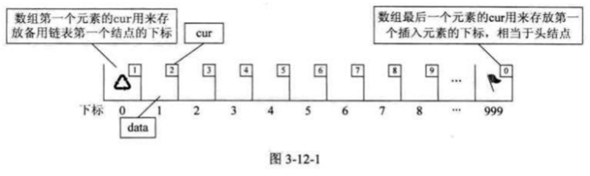
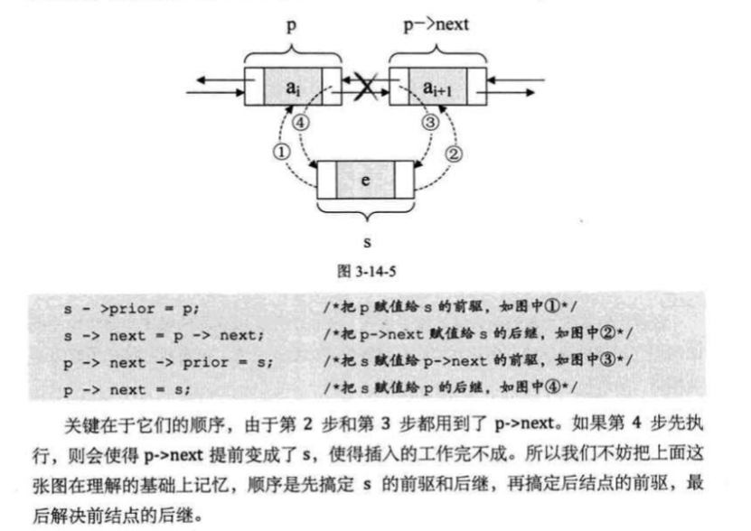

# 大话数据结构 读书笔记

## 1. 绪论

### 逻辑结构

- 集合结构
- 线性结构
- 树形结构
- 图形结构


### 物理结构

- 顺序存储结构
- 链接存储结构

## 2. 算法

### 算法特征

- 输入输出
- 有穷性
- 确定性
- 可行性

### 算法时间复杂度

#### 常数阶 O(1)
#### 线性阶 O(n)
#### 对数阶 O(logn)

```C++
int count =1;
while(count < n)
{
    count = count * 2;
}
```
${2^x} = n => x = log_2n$

#### 平方阶 $O({n^2})$
```c++
int i,j;
for (i = 0; i < m; i++)
{
    for (j= 0; j < n; j++)
    {
    /* 时 间 复 杂 度 为 0(1) 的 程序 步骤 序 列 */
    }
}

int i,j;
for(i = 0; i <n; i++)
{
for (j =i; j <n; j++) /* 注意j = i 而不 是0 */
{
/* 时间 复 杂 度为0(1) HBRP RAR */
}
}
```

$n+(n-1)+(n-2)+{\cdots}+1 =\frac{n(n+1)}{2}=\frac{n^2}{2}+\frac{n}{2}$

$O(n^2)$

#### 常见时间复杂度

$O(1) < O(logn) < O(n) < O(nlogn) < O(n^2) < O(n^3) < O(2^n)< O(n!) < O(n^n)$

## 3. 线性表

### 随机存取结构
 那 么 我们 对 每个线性 表 位 置 的 存入或者取出 数据,对于计算机 来说 都是相等的时间,
 也 就 是 一 个 常数,它 的存取 时间人性能为O(1)。 
 我们 通常 把具有 这 一 特点 的 存储 结构 称为随机存取结构


线性 表 的 顺序 存储 结构,在 存、读 数据 时,不 管 是 哪个 位 置 ,时间
复杂度 都是 O(1); 而 插入 或 删除 时,时间 复 杂 度 都是 O(n)。

### 线性 表 链 式 存储 结构  单 链表


在 单链表 的 第一个 结点前 附设 个 结 点,称 为头结 点 。\头 结 点 的 数据 域可以 不 存储 任何信息,
也可以 存储如 线性 表 的 长 度 等附加 信息,头 结 点 的 指针 域存储 指向 第 一 个结 点 的指针

```c
#include <stdio.h>
#include <stdlib.h>

typedef int ElemType; // 定义数据元素类型
typedef int Status;   // 定义状态类型
#define OK 1
#define ERROR 0

// 定义单链表的节点结构
typedef struct Node {
    ElemType data;       // 数据域
    struct Node *next;   // 指针域，指向下一个节点
} Node, *LinkList;

// 单链表插入操作
Status ListInsert(LinkList *L, int i, ElemType e) {
    int j = 1; // 计数器，表示当前节点的位置
    LinkList p, s;
    p = *L; // p指向链表的头节点

    // 寻找第i-1个节点
    while (p && j < i) {
        p = p->next;
        j++;
    }

    // 如果第i-1个节点不存在，则返回错误
    if (!p || j > i) {
        return ERROR;
    }

    // 创建新节点
    s = (LinkList)malloc(sizeof(Node));
    if (!s) {
        return ERROR; // 内存分配失败
    }

    s->data = e;       // 将数据赋值给新节点
    s->next = p->next; // 将p的后继节点赋值给新节点的后继
    p->next = s;       // 将新节点插入到p之后

    return OK;
}

// 测试单链表插入操作
int main() {
    LinkList L = (LinkList)malloc(sizeof(Node)); // 创建头节点
    L->next = NULL;                              // 初始化为空链表

    // 插入元素
    ListInsert(&L, 1, 10);
    ListInsert(&L, 2, 20);
    ListInsert(&L, 3, 30);

    // 遍历链表
    LinkList p = L->next;
    while (p) {
        printf("%d ", p->data);
        p = p->next;
    }

    return 0;
}
```

```c
#include <stdio.h>
#include <stdlib.h>

typedef int ElemType; // 定义数据元素类型
typedef int Status;   // 定义状态类型
#define OK 1
#define ERROR 0

// 定义单链表的节点结构
typedef struct Node {
    ElemType data;       // 数据域
    struct Node *next;   // 指针域，指向下一个节点
} Node, *LinkList;

// 单链表删除操作
Status ListDelete(LinkList *L, int i, ElemType *e) {
    int j = 1; // 计数器，表示当前节点的位置
    LinkList p, q;
    p = *L; // p指向链表的头节点

    // 寻找第i-1个节点
    while (p && j < i) {
        p = p->next;
        j++;
    }

    // 如果第i-1个节点不存在或i无效，则返回错误
    if (!p || !(p->next)) {
        return ERROR;
    }

    q = p->next;       // q指向要删除的节点
    *e = q->data;      // 将删除节点的数据赋值给e
    p->next = q->next; // 将q的后继节点赋值给p的后继
    free(q);           // 释放q节点的内存

    return OK;
}

// 测试单链表删除操作
int main() {
    LinkList L = (LinkList)malloc(sizeof(Node)); // 创建头节点
    L->next = NULL;                              // 初始化为空链表

    // 插入一些元素
    LinkList p = L;
    for (int i = 1; i <= 5; i++) {
        LinkList newNode = (LinkList)malloc(sizeof(Node));
        newNode->data = i * 10;
        newNode->next = NULL;
        p->next = newNode;
        p = newNode;
    }

    // 删除第3个节点
    ElemType e;
    if (ListDelete(&L, 3, &e) == OK) {
        printf("删除成功，删除的元素是: %d\n", e);
    } else {
        printf("删除失败\n");
    }

    // 遍历链表
    p = L->next;
    printf("链表中的元素: ");
    while (p) {
        printf("%d ", p->data);
        p = p->next;
    }

    return 0;
}
```

时间 复 杂 度 都是 O(n)

```C
#include <stdio.h>
#include <stdlib.h>

typedef int ElemType; // 定义数据元素类型
typedef int Status;   // 定义状态类型
#define OK 1
#define ERROR 0

// 定义单链表的节点结构
typedef struct Node {
    ElemType data;       // 数据域
    struct Node *next;   // 指针域，指向下一个节点
} Node, *LinkList;

// 尾插法创建单链表
Status CreateList(LinkList *L, int n) {
    *L = (LinkList)malloc(sizeof(Node)); // 创建头节点
    if (!(*L)) return ERROR;             // 内存分配失败
    (*L)->next = NULL;                   // 初始化为空链表

    LinkList tail = *L; // 尾指针，初始指向头节点
    for (int i = 1; i <= n; i++) {
        LinkList newNode = (LinkList)malloc(sizeof(Node)); // 创建新节点
        if (!newNode) return ERROR;                       // 内存分配失败
        printf("请输入第 %d 个元素的值: ", i);
        scanf("%d", &newNode->data); // 输入数据
        newNode->next = NULL;        // 新节点的指针域置为空
        tail->next = newNode;        // 将新节点链接到链表尾部
        tail = newNode;              // 更新尾指针
    }
    return OK;
}

// 遍历单链表
void TraverseList(LinkList L) {
    LinkList p = L->next; // 跳过头节点
    while (p) {
        printf("%d ", p->data);
        p = p->next;
    }
    printf("\n");
}

// 测试整表创建
int main() {
    LinkList L;
    int n;

    printf("请输入链表的长度: ");
    scanf("%d", &n);

    if (CreateList(&L, n) == OK) {
        printf("链表创建成功，链表中的元素为: ");
        TraverseList(L);
    } else {
        printf("链表创建失败\n");
    }

    return 0;
}
```

```c
#include <stdio.h>
#include <stdlib.h>

typedef int ElemType; // 定义数据元素类型
typedef int Status;   // 定义状态类型
#define OK 1
#define ERROR 0

// 定义单链表的节点结构
typedef struct Node {
    ElemType data;       // 数据域
    struct Node *next;   // 指针域，指向下一个节点
} Node, *LinkList;

// 整表删除操作
Status ClearList(LinkList *L) {
    LinkList p, q;
    p = (*L)->next; // 指向头节点的下一个节点
    while (p) {
        q = p->next; // 保存下一个节点
        free(p);     // 释放当前节点
        p = q;       // 移动到下一个节点
    }
    (*L)->next = NULL; // 将头节点的指针域置为空
    return OK;
}

// 测试整表删除操作
int main() {
    LinkList L = (LinkList)malloc(sizeof(Node)); // 创建头节点
    L->next = NULL;                              // 初始化为空链表

    // 插入一些元素
    LinkList p = L;
    for (int i = 1; i <= 5; i++) {
        LinkList newNode = (LinkList)malloc(sizeof(Node));
        newNode->data = i * 10;
        newNode->next = NULL;
        p->next = newNode;
        p = newNode;
    }

    // 遍历链表
    printf("链表中的元素: ");
    p = L->next;
    while (p) {
        printf("%d ", p->data);
        p = p->next;
    }
    printf("\n");

    // 删除整表
    if (ClearList(&L) == OK) {
        printf("链表已清空\n");
    } else {
        printf("链表清空失败\n");
    }

    // 再次遍历链表
    printf("链表中的元素: ");
    p = L->next;
    while (p) {
        printf("%d ", p->data);
        p = p->next;
    }
    printf("\n");

    return 0;
}
```

。 比 如 说 游戏 开发 中 ,
对 于 用 户 注册 的 个 人 信息 , 除 了 注册 时 插入 数据 外, 绝 大 多 数 情况 都 是 读
取 , 所 以 应 该 考虑 用 顺序 存储 结构。而 游戏 中 的 玩家 的 武器 或 者 装备 列
表 , 随 着 玩家 的 游戏 过 程 中 , 可 能 会 随时 增加 或 删除 , 此 时 再 用 顺序 存储
就 不 太 合适 了 , 单 链表 结构 就 可 以 大 展 拳 


### 静态链表

 用 数组描述 的 链表叫做 静态链表,这 种 描述 方法还有 起 名叫做 游标 实Wik.





```c
#include <stdio.h>

#define MAXSIZE 1000 // 静态链表的最大长度
#define ERROR 0
#define OK 1
typedef int Status;
typedef int ElemType;

// 定义静态链表的节点结构
typedef struct {
    ElemType data; // 数据域
    int cur;       // 游标，指向下一个节点的位置
} Component, StaticLinkList[MAXSIZE];

// 初始化静态链表
Status InitList(StaticLinkList space) {
    for (int i = 0; i < MAXSIZE - 1; i++) {
        space[i].cur = i + 1; // 将每个节点的游标指向下一个节点
    }
    space[MAXSIZE - 1].cur = 0; // 最后一个节点的游标为0，表示空
    return OK;
}

// 分配节点
int Malloc_SLL(StaticLinkList space) {
    int i = space[0].cur; // 获取备用链表的第一个节点
    if (i) {
        space[0].cur = space[i].cur; // 更新备用链表的头节点
    }
    return i;
}

// 插入操作
Status ListInsert(StaticLinkList L, int i, ElemType e) {
    if (i < 1 || i > MAXSIZE - 1) {
        return ERROR; // 插入位置不合法
    }
    // 数组最后一个元素的cur用来存放第一个插入元素的下标
    int k = MAXSIZE - 1; // k指向头节点
    for (int j = 1; j < i; j++) {
        //这里的k 意味着 第j个元素的cur的值
        k = L[k].cur; // 找到第i-1个节点
        if (k == 0) {
            return ERROR; // 如果节点不存在，返回错误
        }
    }
    int newNode = Malloc_SLL(L); // 分配一个新节点
    if (newNode) {
        L[newNode].data = e;       // 将数据赋值给新节点
        L[newNode].cur = L[k].cur; // 新节点的游标指向第i个节点
        L[k].cur = newNode;        // 第i-1个节点的游标指向新节点
        return OK;
    }
    return ERROR; // 分配失败
}

// 遍历静态链表
void TraverseList(StaticLinkList L) {
    int i = L[MAXSIZE - 1].cur; // 从头节点开始
    while (i) {
        printf("%d ", L[i].data);
        i = L[i].cur; // 移动到下一个节点
    }
    printf("\n");
}

// 测试静态链表插入操作
int main() {
    StaticLinkList L;
    InitList(L); // 初始化静态链表

    // 插入元素
    ListInsert(L, 1, 10);
    ListInsert(L, 2, 20);
    ListInsert(L, 3, 30);

    // 遍历链表
    printf("静态链表中的元素: ");
    TraverseList(L);

    return 0;
}
```

### 循环链表
将 单 链表 中 终端 结 点 的 指针 端由空 指针 改 为指向 头 结 点 ,就 使 整个单 链表 形成一个环,这 种头尾 相 接 的 单链表 称 为 单 循环链表,简 称 循环链表 (circular linkedlist).

循环链表使用尾指针 这样就知道 头结点跟尾节点的指针
如果使用头指针 就无法直接定位尾节点

循环链表的合并

### 双向链表




## 4. 栈与队列

### 栈 last in first out LIFO

#### 栈的顺序存储结构与实现
#### 两栈共享空间
#### 栈的链式存储结构与实现
#### 栈的应用 四则运算表达式 中缀表达式转后缀表达式

### 队列 first in first out FIFO
#### 循环队列 解决假溢出
#### 队列的链式存储结构

## 5. 字符串
### KMP模式匹配
----

Here is a footnote reference,[^1] and another.[^longnote]

## Endnotes

[^1]: Here is the footnote.
[^longnote]: Here's one with multiple blocks.

[label]: <https://> "website title"
