# 大话数据结构 读书笔记

## 1. 绪论

### 逻辑结构

- 集合结构
- 线性结构
- 树形结构
- 图形结构


### 物理结构

- 顺序存储结构
- 链接存储结构

## 2. 算法

### 算法特征

- 输入输出
- 有穷性
- 确定性
- 可行性

### 算法时间复杂度

#### 常数阶 O(1)
#### 线性阶 O(n)
#### 对数阶 O(logn)

```C++
int count =1;
while(count < n)
{
    count = count * 2;
}
```
${2^x} = n => x = log_2n$

#### 平方阶 $O({n^2})$
```c++
int i,j;
for (i = 0; i < m; i++)
{
    for (j= 0; j < n; j++)
    {
    /* 时 间 复 杂 度 为 0(1) 的 程序 步骤 序 列 */
    }
}

int i,j;
for(i = 0; i <n; i++)
{
for (j =i; j <n; j++) /* 注意j = i 而不 是0 */
{
/* 时间 复 杂 度为0(1) HBRP RAR */
}
}
```

$n+(n-1)+(n-2)+{\cdots}+1 =\frac{n(n+1)}{2}=\frac{n^2}{2}+\frac{n}{2}$

$O(n^2)$

#### 常见时间复杂度

$O(1) < O(logn) < O(n) < O(nlogn) < O(n^2) < O(n^3) < O(2^n)< O(n!) < O(n^n)$

## 3. 线性表

### 随机存取结构
 那 么 我们 对 每个线性 表 位 置 的 存入或者取出 数据,对于计算机 来说 都是相等的时间,
 也 就 是 一 个 常数,它 的存取 时间人性能为O(1)。 
 我们 通常 把具有 这 一 特点 的 存储 结构 称为随机存取结构


线性 表 的 顺序 存储 结构,在 存、读 数据 时,不 管 是 哪个 位 置 ,时间
复杂度 都是 O(1); 而 插入 或 删除 时,时间 复 杂 度 都是 O(n)。

### 线性 表 链 式 存储 结构  单 链表


在 单链表 的 第一个 结点前 附设 个 结 点,称 为头结 点 。\头 结 点 的 数据 域可以 不 存储 任何信息,
也可以 存储如 线性 表 的 长 度 等附加 信息,头 结 点 的 指针 域存储 指向 第 一 个结 点 的指针

```c
#include <stdio.h>
#include <stdlib.h>

typedef int ElemType; // 定义数据元素类型
typedef int Status;   // 定义状态类型
#define OK 1
#define ERROR 0

// 定义单链表的节点结构
typedef struct Node {
    ElemType data;       // 数据域
    struct Node *next;   // 指针域，指向下一个节点
} Node, *LinkList;

// 单链表插入操作
Status ListInsert(LinkList *L, int i, ElemType e) {
    int j = 1; // 计数器，表示当前节点的位置
    LinkList p, s;
    p = *L; // p指向链表的头节点

    // 寻找第i-1个节点
    while (p && j < i) {
        p = p->next;
        j++;
    }

    // 如果第i-1个节点不存在，则返回错误
    if (!p || j > i) {
        return ERROR;
    }

    // 创建新节点
    s = (LinkList)malloc(sizeof(Node));
    if (!s) {
        return ERROR; // 内存分配失败
    }

    s->data = e;       // 将数据赋值给新节点
    s->next = p->next; // 将p的后继节点赋值给新节点的后继
    p->next = s;       // 将新节点插入到p之后

    return OK;
}

// 测试单链表插入操作
int main() {
    LinkList L = (LinkList)malloc(sizeof(Node)); // 创建头节点
    L->next = NULL;                              // 初始化为空链表

    // 插入元素
    ListInsert(&L, 1, 10);
    ListInsert(&L, 2, 20);
    ListInsert(&L, 3, 30);

    // 遍历链表
    LinkList p = L->next;
    while (p) {
        printf("%d ", p->data);
        p = p->next;
    }

    return 0;
}
```

```c
#include <stdio.h>
#include <stdlib.h>

typedef int ElemType; // 定义数据元素类型
typedef int Status;   // 定义状态类型
#define OK 1
#define ERROR 0

// 定义单链表的节点结构
typedef struct Node {
    ElemType data;       // 数据域
    struct Node *next;   // 指针域，指向下一个节点
} Node, *LinkList;

// 单链表删除操作
Status ListDelete(LinkList *L, int i, ElemType *e) {
    int j = 1; // 计数器，表示当前节点的位置
    LinkList p, q;
    p = *L; // p指向链表的头节点

    // 寻找第i-1个节点
    while (p && j < i) {
        p = p->next;
        j++;
    }

    // 如果第i-1个节点不存在或i无效，则返回错误
    if (!p || !(p->next)) {
        return ERROR;
    }

    q = p->next;       // q指向要删除的节点
    *e = q->data;      // 将删除节点的数据赋值给e
    p->next = q->next; // 将q的后继节点赋值给p的后继
    free(q);           // 释放q节点的内存

    return OK;
}

// 测试单链表删除操作
int main() {
    LinkList L = (LinkList)malloc(sizeof(Node)); // 创建头节点
    L->next = NULL;                              // 初始化为空链表

    // 插入一些元素
    LinkList p = L;
    for (int i = 1; i <= 5; i++) {
        LinkList newNode = (LinkList)malloc(sizeof(Node));
        newNode->data = i * 10;
        newNode->next = NULL;
        p->next = newNode;
        p = newNode;
    }

    // 删除第3个节点
    ElemType e;
    if (ListDelete(&L, 3, &e) == OK) {
        printf("删除成功，删除的元素是: %d\n", e);
    } else {
        printf("删除失败\n");
    }

    // 遍历链表
    p = L->next;
    printf("链表中的元素: ");
    while (p) {
        printf("%d ", p->data);
        p = p->next;
    }

    return 0;
}
```

时间 复 杂 度 都是 O(n)

```C
#include <stdio.h>
#include <stdlib.h>

typedef int ElemType; // 定义数据元素类型
typedef int Status;   // 定义状态类型
#define OK 1
#define ERROR 0

// 定义单链表的节点结构
typedef struct Node {
    ElemType data;       // 数据域
    struct Node *next;   // 指针域，指向下一个节点
} Node, *LinkList;

// 尾插法创建单链表
Status CreateList(LinkList *L, int n) {
    *L = (LinkList)malloc(sizeof(Node)); // 创建头节点
    if (!(*L)) return ERROR;             // 内存分配失败
    (*L)->next = NULL;                   // 初始化为空链表

    LinkList tail = *L; // 尾指针，初始指向头节点
    for (int i = 1; i <= n; i++) {
        LinkList newNode = (LinkList)malloc(sizeof(Node)); // 创建新节点
        if (!newNode) return ERROR;                       // 内存分配失败
        printf("请输入第 %d 个元素的值: ", i);
        scanf("%d", &newNode->data); // 输入数据
        newNode->next = NULL;        // 新节点的指针域置为空
        tail->next = newNode;        // 将新节点链接到链表尾部
        tail = newNode;              // 更新尾指针
    }
    return OK;
}

// 遍历单链表
void TraverseList(LinkList L) {
    LinkList p = L->next; // 跳过头节点
    while (p) {
        printf("%d ", p->data);
        p = p->next;
    }
    printf("\n");
}

// 测试整表创建
int main() {
    LinkList L;
    int n;

    printf("请输入链表的长度: ");
    scanf("%d", &n);

    if (CreateList(&L, n) == OK) {
        printf("链表创建成功，链表中的元素为: ");
        TraverseList(L);
    } else {
        printf("链表创建失败\n");
    }

    return 0;
}
```

```c
#include <stdio.h>
#include <stdlib.h>

typedef int ElemType; // 定义数据元素类型
typedef int Status;   // 定义状态类型
#define OK 1
#define ERROR 0

// 定义单链表的节点结构
typedef struct Node {
    ElemType data;       // 数据域
    struct Node *next;   // 指针域，指向下一个节点
} Node, *LinkList;

// 整表删除操作
Status ClearList(LinkList *L) {
    LinkList p, q;
    p = (*L)->next; // 指向头节点的下一个节点
    while (p) {
        q = p->next; // 保存下一个节点
        free(p);     // 释放当前节点
        p = q;       // 移动到下一个节点
    }
    (*L)->next = NULL; // 将头节点的指针域置为空
    return OK;
}

// 测试整表删除操作
int main() {
    LinkList L = (LinkList)malloc(sizeof(Node)); // 创建头节点
    L->next = NULL;                              // 初始化为空链表

    // 插入一些元素
    LinkList p = L;
    for (int i = 1; i <= 5; i++) {
        LinkList newNode = (LinkList)malloc(sizeof(Node));
        newNode->data = i * 10;
        newNode->next = NULL;
        p->next = newNode;
        p = newNode;
    }

    // 遍历链表
    printf("链表中的元素: ");
    p = L->next;
    while (p) {
        printf("%d ", p->data);
        p = p->next;
    }
    printf("\n");

    // 删除整表
    if (ClearList(&L) == OK) {
        printf("链表已清空\n");
    } else {
        printf("链表清空失败\n");
    }

    // 再次遍历链表
    printf("链表中的元素: ");
    p = L->next;
    while (p) {
        printf("%d ", p->data);
        p = p->next;
    }
    printf("\n");

    return 0;
}
```

。 比 如 说 游戏 开发 中 ,
对 于 用 户 注册 的 个 人 信息 , 除 了 注册 时 插入 数据 外, 绝 大 多 数 情况 都 是 读
取 , 所 以 应 该 考虑 用 顺序 存储 结构。而 游戏 中 的 玩家 的 武器 或 者 装备 列
表 , 随 着 玩家 的 游戏 过 程 中 , 可 能 会 随时 增加 或 删除 , 此 时 再 用 顺序 存储
就 不 太 合适 了 , 单 链表 结构 就 可 以 大 展 拳 


### 静态链表

 用 数组描述 的 链表叫做 静态链表,这 种 描述 方法还有 起 名叫做 游标 实Wik.


```c
#include <stdio.h>

#define MAXSIZE 1000 // 静态链表的最大长度
#define ERROR 0
#define OK 1
typedef int Status;
typedef int ElemType;

// 定义静态链表的节点结构
typedef struct {
    ElemType data; // 数据域
    int cur;       // 游标，指向下一个节点的位置
} Component, StaticLinkList[MAXSIZE];

// 初始化静态链表
Status InitList(StaticLinkList space) {
    for (int i = 0; i < MAXSIZE - 1; i++) {
        space[i].cur = i + 1; // 将每个节点的游标指向下一个节点
    }
    space[MAXSIZE - 1].cur = 0; // 最后一个节点的游标为0，表示空
    return OK;
}

// 分配节点
int Malloc_SLL(StaticLinkList space) {
    int i = space[0].cur; // 获取备用链表的第一个节点
    if (i) {
        space[0].cur = space[i].cur; // 更新备用链表的头节点
    }
    return i;
}

// 插入操作
Status ListInsert(StaticLinkList L, int i, ElemType e) {
    if (i < 1 || i > MAXSIZE - 1) {
        return ERROR; // 插入位置不合法
    }
    // 数组最后一个元素的cur用来存放第一个插入元素的下标
    int k = MAXSIZE - 1; // k指向头节点
    for (int j = 1; j < i; j++) {
        //这里的k 意味着 第j个元素的cur的值
        k = L[k].cur; // 找到第i-1个节点
        if (k == 0) {
            return ERROR; // 如果节点不存在，返回错误
        }
    }
    int newNode = Malloc_SLL(L); // 分配一个新节点
    if (newNode) {
        L[newNode].data = e;       // 将数据赋值给新节点
        L[newNode].cur = L[k].cur; // 新节点的游标指向第i个节点
        L[k].cur = newNode;        // 第i-1个节点的游标指向新节点
        return OK;
    }
    return ERROR; // 分配失败
}

// 遍历静态链表
void TraverseList(StaticLinkList L) {
    int i = L[MAXSIZE - 1].cur; // 从头节点开始
    while (i) {
        printf("%d ", L[i].data);
        i = L[i].cur; // 移动到下一个节点
    }
    printf("\n");
}

// 测试静态链表插入操作
int main() {
    StaticLinkList L;
    InitList(L); // 初始化静态链表

    // 插入元素
    ListInsert(L, 1, 10);
    ListInsert(L, 2, 20);
    ListInsert(L, 3, 30);

    // 遍历链表
    printf("静态链表中的元素: ");
    TraverseList(L);

    return 0;
}
```

### 循环链表
将 单 链表 中 终端 结 点 的 指针 端由空 指针 改 为指向 头 结 点 ,就 使 整个单 链表 形成一个环,这 种头尾 相 接 的 单链表 称 为 单 循环链表,简 称 循环链表 (circular linkedlist).

循环链表使用尾指针 这样就知道 头结点跟尾节点的指针
如果使用头指针 就无法直接定位尾节点

循环链表的合并

### 双向链表


## 4. 栈与队列

### 栈 last in first out LIFO

#### 栈的顺序存储结构与实现
#### 两栈共享空间
#### 栈的链式存储结构与实现
#### 栈的应用 四则运算表达式 中缀表达式转后缀表达式

### 队列 first in first out FIFO
#### 循环队列 解决假溢出
#### 队列的链式存储结构

## 5. 字符串
### KMP模式匹配



## 6. 树

判断一个结构是不是树，通常需要满足以下几个条件：

1. **连通性**：所有节点都是连通的，即任意两个节点之间都有路径相通。
2. **无环性**：结构中不能有回路（环），即不存在从某个节点出发经过若干条边又回到自身的路径。
3. **n个节点有n-1条边**：对于有n个节点的无向图，如果它是树，则恰好有n-1条边。
4. **唯一根节点（有向树）**：对于有向树（如二叉树），有且只有一个入度为0的节点（根节点），其余节点入度为1。

**总结**：  
树是一种连通且无环的图结构，并且边数等于节点数减一。

**判断方法举例**（以无向图为例）：
- 用深度优先搜索（DFS）或广度优先搜索（BFS）遍历，看是否所有节点都能访问到（连通），且遍历过程中不出现回到已访问节点的情况（无环）。
- 检查边数是否为n-1。

**伪代码示例**：
````c
// 判断无向图是否为树
bool isTree(Graph g) {
    if (!isConnected(g)) return false;
    if (hasCycle(g)) return false;
    if (g.edgeCount != g.nodeCount - 1) return false;
    return true;
}
````

### 概念

结 点拥有 的 子树数 称为结点 的度(Degree)。 
度为0 的 结 点 称为叶 结点〈Leaf) 或终端结点; 
度 不为 0 的 结 点称 为非 终端结点 或 分 支 结 点。除 根 结 点 之 外,分 支 结 点 也称为 内 部 结 点。
树 的 度 是 树内 各 结 点 的 度 的 最 大值

如 果 将 树 中 结 点 的 各 子 树 看 成从左 至 右 是有次 序 的 ,不 能 互 换 的 ,则 称 该 树 为有序树,否 则 称 为 无 序树

二叉树(Binary Tree) 是 n (n>0 ) 个 结 点的有 限 集合,该集合
或者为空集 ( 称 为 空二叉树), 或者由 一 个 根 结点和 两 棵 互不相交
的、分 别称 为 根结点的左 子树和 右 子 树的二 叉 树组 成

左斜树
右斜数
满二叉树

对一棵具有 n 个结点 的 二 叉 树按层 序 编号,如 果编号为1 $(1<i<n)$ 的 结 点与同样深度 的 满 二又树 中 编号为1 的 结 点 在二叉 树 中 位 置完全 相同,则 这棵二叉树称为 `完全二叉树`，编号是连续的

### 性质
完全二叉树 结点度为1 则该结点只有左孩子 不存在只有右子树的情况

同样结点数的二叉树 完全二叉树深度最小

$n_0$ 终端结点数
$n_1$ 度=1结点数 有一分支
$n_2$ 度=2结点数 有两分支
n 总结点数

$$ n = n_0 + n_1 + n_2 $$

二叉树：分支数 = 总结点数-1

$$ n_1*1 + n_2*2 = n-1 $$

∴ $$ n_0 + n_1 + n_2 - 1 = n_1*1 + n_2*2 $$
∴ $$ n_0 = n_2 + 1 $$
> 即 终端结点数 = 2度结点数 + 1

> 二叉树 第i层至多有 $2^{i-1}$ 个结点 i ≥ 1

> 深度为k的二叉树至多有 $2^k-1$ 个结点 i ≥ 1

> n个结点的`满二叉树` $n=2^k-1$ 深度为 $k=log_2(n+1)$

#### 完全二叉树结点数
- ≤ 同度数满二叉树 $2^k-1$
- ＞ $2^{k-1}-1$

∴ $ 2^{k-1}-1 < n ≤ 2^k-1 $
- n 是整数 ∴ $n ≤ 2^k-1$ => $n<2^k$
- n 是整数 ∴ $n > 2^{k-1}-1$ => $n ≥ 2^{k-1}$
∴ $ 2^{k-1} ≤ n < 2^k $
∴ $ k-1 ≤ log_2n < k $
∵ k作为度数是整数 例子: $5 ≤ x < 6$ ∴ x ≈ 5.u ∴ 对x取整 + 1 = k
∴ $k = ⌊log_2n⌋ + 1$
```
设x是一个实数，则x可以表示为整数部分和小数部分的和，即x = ⌊x⌋ + {x}，其中⌊x⌋是x的整数部分，{x}是x的小数部分
上取整 (Ceiling)：用数学符号⌈x⌉表示，表示大于等于x的最小整数。例如，⌈4.2⌉=5，⌈-4.2⌉=-4。
下取整 (Floor)：用数学符号⌊x⌋表示，表示小于等于x的最大整数。例如，⌊4.2⌋=4，⌊-4.2⌋=-5。
```

n结点完全二叉树 (深度为$⌈log_2n⌉ + 1$) 任一结点 i：
- i = 1, i为根, i>1, parent= ⌊i/2⌋
- 2i > n, i 无左孩子 否则 Lchild = 2i
- 2i+1 > n, i 无右孩子 否则 Rchild = 2i+1

### 二叉树存储结构

#### 顺序存储一般只用于 完全二叉树
#### 二叉链表
### 遍历二叉树
- 前序遍历 根-左树全左后回溯时顺便访问右结点-右树全左后回溯时顺便访问右结点
- 中序遍历 左树最左结点开始-回溯时顺便访问右结点右叶子-根结点-右树最左结点开始-回溯时顺便访问右结点右叶子
- 后序遍历 左树最底层叶子开始-回溯时从下到上从左到右访问左树节点-右树最底层叶子开始-回溯时从下到上从左到右访问右树节点-根
- 层序遍历 根-从上到下从左到右一层一层遍历

- 前序遍历+中序遍历 唯一确定二叉树
- 后序遍历+中序遍历 唯一确定二叉树

```C++
// ...existing code...
typedef struct BiTNode {
    char data;
    struct BiTNode *lchild, *rchild;
} BiTNode, *BiTree;

// 前序遍历：根-左-右
void PreOrder(BiTree T) {
    if (T) {
        printf("%c ", T->data);      // 访问根节点
        PreOrder(T->lchild);         // 遍历左子树
        PreOrder(T->rchild);         // 遍历右子树
    }
}

// 中序遍历：左-根-右
void InOrder(BiTree T) {
    if (T) {
        InOrder(T->lchild);          // 遍历左子树
        printf("%c ", T->data);      // 访问根节点
        InOrder(T->rchild);          // 遍历右子树
    }
}

// 后序遍历：左-右-根
void PostOrder(BiTree T) {
    if (T) {
        PostOrder(T->lchild);        // 遍历左子树
        PostOrder(T->rchild);        // 遍历右子树
        printf("%c ", T->data);      // 访问根节点
    }
}

// 层序遍历算法（使用队列）
void LevelOrder(BiTree T) {
    if (!T) return;
    // 简单队列实现
    BiTree queue[100];
    int front = 0, rear = 0;
    queue[rear++] = T;
    while (front < rear) {
        BiTree node = queue[front++];
        printf("%c ", node->data); // 访问当前节点
        if (node->lchild) queue[rear++] = node->lchild;
        if (node->rchild) queue[rear++] = node->rchild;
    }
}
// ...existing code...
```
##### 例子1
前序序列：ABCDEFGH
中序序列：CDBAFEHG

`前序第一个节点必为根`
##### 例子2

后序序列：GDBEFCA
中序序列：DGBAECF

∵ `后序 最后一个必为根 A=根`
∴ 中序序列中 DGB为左子树 ECF为右子树
∵ `中序序列根结点左边第一个必为根的左子树` 所以 B为根左结点
后序遍历 G在D前面 所以 
要么GD都为 B得子节点
要么G是D的子节点 D是B的子节点
但是中序遍历中先访问的D再访问G 如果GD都是B子节点 后序遍历左子树应该是DGB 矛盾 
∴确定左子树
∵`存在跟左右子树的情况下 后序遍历倒数第二个必为根的右子树节点` C为根左节点
∴
- EF要么是C的子节点
- 要么E是F的子节点
∵ 中序遍历中 右子树ECF E为第一个 C比F先遍历 
∴ E是C的子节点 E,F没有父子关系 
∴ F是C的子节点
∴确定右子树
### 扩展二叉树 建树

前序遍历：AB#D##C##

### 树 森林 二叉树的 转换

#### 树 -> 二叉树
- 兄弟加线
- 保留每个结点第一个子节点连线 其他删除
- 层次调整 第一个子节点为左孩子 兄弟转换过来的为右孩子
#### 森林 -> 
- 树转二叉树
- 树根做另一棵树根节点的右孩子
#### 二叉树 -> 树
- 所有左孩子的右子结点连接其父节点的父节点(爷爷节点)
- 删除右子节点原来的与其父节点连线
#### 二叉树 -> 森林
- 砍根结点的右分支 根节点右孩子子树独立

#### 树遍历
- 先根遍历
- 后根遍历
#### 森林遍历
- 前序遍历
- 后序遍历

### 前驱后继 线索二叉链表 线索二叉树 threaded binary tree

### 赫夫曼树
> 带劝路径长度 WPL 最小的二叉树

设计长 短 不 等 的编码,则 必须是任 一 字符 的编码 都 不 是另一 个 字符 的 编码的 前缀 ,这 种编码称做前缀编码


赫夫曼编码
字符集 ${d_1,d_2,{\cdots},d_n}$ -> 叶子
字符频率 ${w_1,w_2,{\cdots},w_n}$ -> 叶子权值
构造赫夫曼树
左分支代表0 右分支代表1
叶子结点路径的分支01序列为该叶子字符的编码

## 7. 图


### 概念

图中数据元素 -> 顶点 vertex
有穷非空
无向边 无向图 (A,D) (D,A)
有向边 弧 <A, D>
简单图：不存在顶点到自身的边 同一条边不重复出现
无向完全图：任意两顶点都存在边 $ e = \frac{n*(n-1)}{2}$
有向完全图：任意两顶点都存在方向互为相反的两条弧 $ e = n*(n-1)$
稀疏图：有很少边或弧的图
稠密图
权 weight：与图的边或弧相关的数
网：带权的图
子图

V表示顶点集合
{E}表示边/弧 集合
无向图G=(V,{E}) 边(v,v') ∈ E => v,v'互为邻接点(adjacent) 
顶点v的度(Degree) : TD(v) = v的邻接边数
图总边数: $ e = \frac{1}{2}\sum_{i=1}^nTD(v_i) $


有向图G=(V,{E}) 弧 $<v,v'> ∈ E$ => v,v'邻接到顶点v' 
顶点v的入度(InDegree) : ID(v) = v为弧头的弧数
顶点v的出度(OutDegree) : OD(v) = v为弧尾的弧数
TD(v)=ID(v)+OD(v)
图总边数: $e = \sum_{i=1}^nID(v_i) = \sum_{i=1}^nOD(v_i)$

路径长度 = 路径(边/弧)数
回路/环：首尾顶点相同的路径
简单路径
简单 环/回路 B-C-A-D-B 除首尾顶点 其余顶点不重复
B-C-D-A-C -> 不是简单环
无向图中 v到v'有路径 则v和v'是连通的 
连通图：任意两顶点都连通 则该图为连通图(Connected Graph)
连通分量：无向图中的极大连通子图
强连通图：在有向图中,每一对 $v_i,vj∈V$、$v_i≠v_j$, 从$v_i$到$v_j$,从$v_j$到$v_i$ 都有路径
强连通分量: 有向图中的极大强连通子图称
连通图生成树：一个极小的连通子图 包含全部n个顶点 只有构成树🌳的n-1条边
非连通图：n个顶点 边 e < n-1
n个顶点的图 边 e > n-1 图必定有环
有向树：图有一个顶点 入度=0 其余顶点 入度均=1(只有一个父节点)
生成树：无向图中连通且 n个顶点n-1条边
生成森林：有向图分解成若干棵有向树构成生成森林

### 存储结构

#### 邻接矩阵

无向图边数组是一个对称矩阵
两个数组表示图
- 一维数组 存储 顶点
- 二维数组存储 边/弧

##### 无向图/有向图 邻接矩阵

顶点数组：
$
\begin{array}{|c|c|c|c|}
\hline
v_0 & v_1 & v_2 & v_3 \\
\hline
\end{array}
$

边数组：

$
\begin{array}{c|c}
    \color{lime}{↓}&
    \color{yellow}\begin{matrix}
        v_0 & v_1 & v_2 & v_3 \\
    \end{matrix}
    \\
    \hline
    \color{teal}
    \begin{matrix}
        v_0 \\ v_1 \\ v_2 \\ v_3 \\
    \end{matrix}
    &
    \color{fuchsia}
    \begin{matrix}
        0 & 1 & 1 & 1 \\
        1 & 0 & 1 & 0 \\
        1 & 1 & 0 & 1 \\
        1 & 0 & 1 & 0 \\
    \end{matrix} 
\end{array}
$

##### 网 邻接矩阵

顶点数组：
$
\begin{array}{|c|c|c|c|c|}
\hline
v_0 & v_1 & v_2 & v_3 & v_4 \\
\hline
\end{array}
$

边数组：
$
\begin{array}{c|c}
    \color{lime}{↓}&
    \color{yellow}\begin{matrix}
        v_0 & v_1 & v_2 & v_3 & v_4 \\
    \end{matrix}
    \\
    \hline
    \color{teal}
    \begin{matrix}
        v_0 \\ v_1 \\ v_2 \\ v_3 \\ v_4 \\
    \end{matrix}
    &
    \color{fuchsia}
    \begin{matrix}
        0 & ∞ & ∞ & ∞ & 6 \\
        9 & 0 & 3 & ∞ & ∞ \\
        2 & ∞ & 0 & 5 & ∞ \\
        ∞ & ∞ & ∞ & 0 & 1 \\
        ∞ & ∞ & ∞ & ∞ & 0 \\
    \end{matrix} 
\end{array}
$

#### 邻接表

顶点少 稀疏图 邻接图存储结构 浪费空间

邻接表 adjacency List：数组+链表
无向图 -> 边表
有向图 -> 弧尾出边表
有向图`逆邻接表` -> 弧头的表

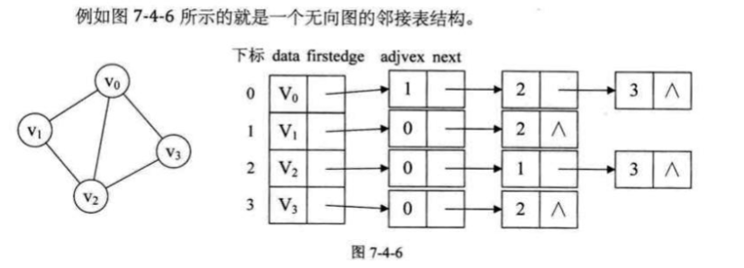

#### 十字链表

Orthogonal List

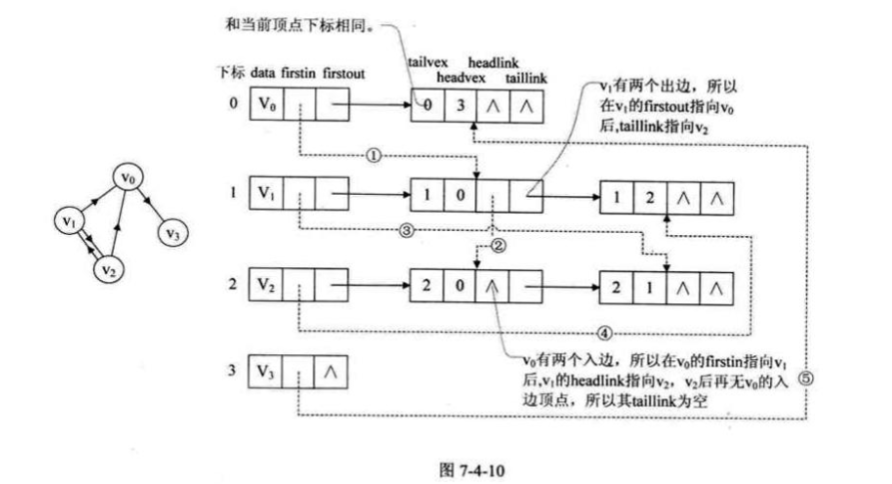

#### 邻接多重表

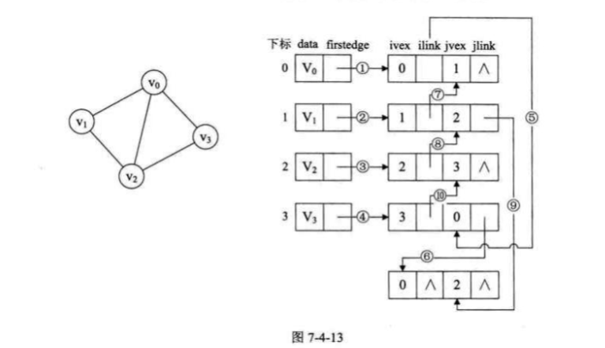

#### 边集数组

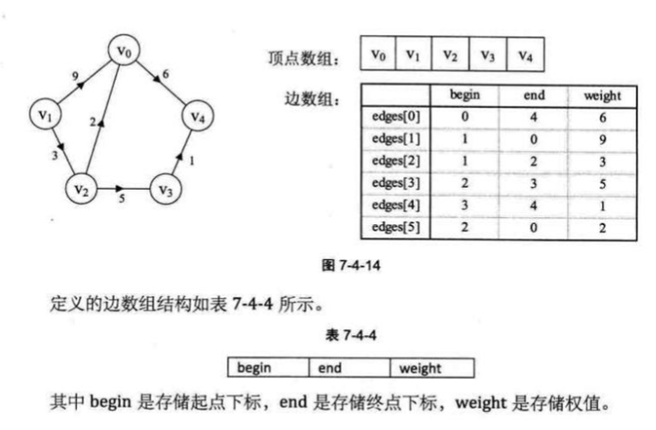

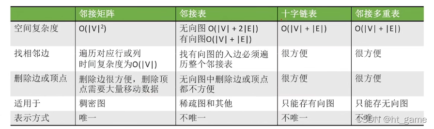

### 图的遍历

traveling graph

#### 深度优先遍历 

DFS depth first search

从图中 某个顶点v出发 然后从v的未被访问的邻接点出发深度优先遍历图 
直至所有和v有路径相通的顶点都被访问到

##### 邻接矩阵 DFS

- 遍历点数组
- 查询点A 查询该点的边矩阵 访问该点的第一个邻接点B 然后标记已访问
- 访问该邻接点B 查询该点的边矩阵 访问该点的第一个邻接点C 然后标记已访问
- 访问C 。。。同理 直到该 分支点 全被访问结束
- 回溯C 查询该点的其余未访问邻接点 全被访问结束
- 回溯B ... 直到回溯A 

##### 邻接表

- 遍历点数组
- 对点A 访问该点的邻接链表 访问第一分支邻接点B 然后标记已访问
- 查询B ... 查询C
- 回溯 C 回溯B 回溯A

深度遍历 类似前序遍历 选一分支往深度查询然后回溯 直到所有分支结束


#### 广度优先搜索

BFS breadth first search

[图文详解两种算法：深度优先遍历（DFS）和广度优先遍历（BFS](https://blog.csdn.net/qq_44918331/article/details/115542177)


### 最小生成树

MST minimum cost spanning tree

#### prim 算法

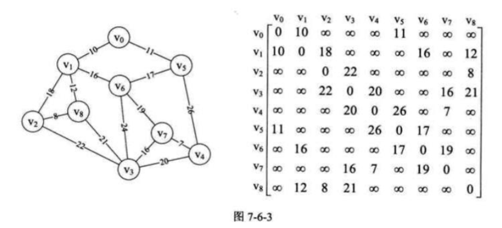

##### adjvex数组 
在 Prim算法 中用于存储 lowcost数组 每项权值对应的范围内顶点下标，主要用于输出最小生成树的边信息‌
在Prim算法中，adjvex数组记录了lowcost数组中每个最小权值对应的顶点下标，这样可以在生成最小生成树的过程中，通过adjvex数组确定每条边的起点和终点，从而输出最小生成树的边信息‌

具体来说，adjvex数组的作用包括：

-‌ 存储顶点下标‌：adjvex数组用于保存lowcost数组中每个最小权值对应的顶点下标。这样可以在生成最小生成树的过程中，通过adjvex数组确定每条边的起点。
‌- 输出边信息‌：在Prim算法中，通过遍历adjvex数组，可以输出构成最小生成树的边信息。
例如，当找到一个顶点的lowcost值最小且不为0时，可以通过adjvex数组确定该顶点的下标，从而输出对应的边信息‌

通过使用adjvex数组，Prim算法能够有效地构建连通网的最小代价生成树，确保生成的树是最小生成树。

##### prim 算法原理

- 从 $v_0$ 开始 根据邻接矩阵 遍历 $v_0$ 的邻接边
- 记录📝$v_0$ 到每个点(注意不是其邻接点是每个点)的最小边权值 lowcost
- 取最小边权点 k 根据邻接矩阵 扫描该点 k 邻接边权值 并记录 lowcost
- 再次取最小边权点 k ... 重复 n-1次

适合用于稠密图

#### prim 算法源码

```c
#include <stdio.h>
#include <stdlib.h>

#define MAXVEX 100
#define INFINITY 65535

typedef struct {
    int numVertexes;
    int arc[MAXVEX][MAXVEX];
} MGraph;

// Prim算法
void MiniSpanTree_Prim(MGraph G) {
    int min, i, j, k;
    int adjvex[MAXVEX];   // 保存相关顶点下标
    int lowcost[MAXVEX];  // 保存相关顶点间边的权值

    lowcost[0] = 0;       // 第一个顶点加入生成树
    adjvex[0] = 0;
    for (i = 1; i < G.numVertexes; i++) {
        lowcost[i] = G.arc[0][i];
        adjvex[i] = 0;
    }

    for (i = 1; i < G.numVertexes; i++) {
        min = INFINITY;
        k = 0;
        for (j = 1; j < G.numVertexes; j++) {
            if (lowcost[j] != 0 && lowcost[j] < min) {
                min = lowcost[j];
                k = j;
            }
        }
        printf("(%d, %d) 权值: %d\n", adjvex[k], k, min);
        lowcost[k] = 0;
        for (j = 1; j < G.numVertexes; j++) {
            if (lowcost[j] != 0 && G.arc[k][j] < lowcost[j]) {
                lowcost[j] = G.arc[k][j];
                adjvex[j] = k;
            }
        }
    }
}

// 示例主函数
int main() {
    MGraph G;
    int i, j;
    G.numVertexes = 6;
    int arc[6][6] = {
        {0, 6, 1, 5, INFINITY, INFINITY},
        {6, 0, 5, INFINITY, 3, INFINITY},
        {1, 5, 0, 5, 6, 4},
        {5, INFINITY, 5, 0, INFINITY, 2},
        {INFINITY, 3, 6, INFINITY, 0, 6},
        {INFINITY, INFINITY, 4, 2, 6, 0}
    };
    for (i = 0; i < G.numVertexes; i++)
        for (j = 0; j < G.numVertexes; j++)
            G.arc[i][j] = arc[i][j];

    printf("最小生成树的边如下：\n");
    MiniSpanTree_Prim(G);
    return 0;
}
```

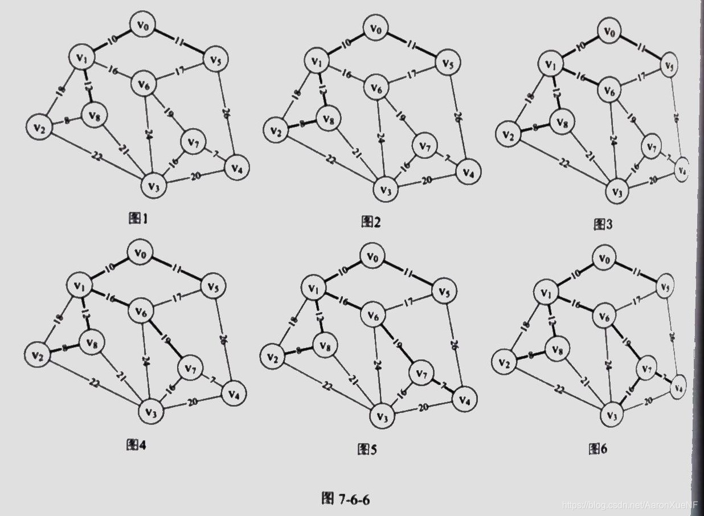

##### 辅助理解的参考资料

[数据结构与算法 - 图 最小生成树（一）Prim算法](https://blog.csdn.net/shengdaVolleyball/article/details/106484094)


#### kruskal 算法

- 边集数组 存 边头尾边权
- 按边权从小到大排序 边集数组
- 遍历每条边 查询 并集/(有环)
- 遍历完所有边就结束🔚

适用于稀疏图

```C
#include <stdio.h>
#include <stdlib.h>

#define MAXVEX 100
#define MAXEDGE 100

typedef struct {
    int begin;
    int end;
    int weight;
} Edge;

typedef struct {
    int numVertexes, numEdges;
    int vexs[MAXVEX];
    int arc[MAXVEX][MAXVEX];
} MGraph;

typedef struct {
    int parent[MAXVEX];
    int n;
} DisjointSet;

// 查找根节点
int Find(DisjointSet *ds, int f) {
    while (ds->parent[f] > 0)
        f = ds->parent[f];
    return f;
}

// 合并集合
void Union(DisjointSet *ds, int i, int j) {
    int root1 = Find(ds, i);
    int root2 = Find(ds, j);
    if (root1 != root2)
        ds->parent[root2] = root1;
}

// 边排序
void SortEdges(Edge edges[], int numEdges) {
    int i, j;
    Edge temp;
    for (i = 0; i < numEdges - 1; i++) {
        for (j = 0; j < numEdges - 1 - i; j++) {
            if (edges[j].weight > edges[j + 1].weight) {
                temp = edges[j];
                edges[j] = edges[j + 1];
                edges[j + 1] = temp;
            }
        }
    }
}

// Kruskal 算法
void Kruskal(MGraph G) {
    int i, n, m;
    Edge edges[MAXEDGE];
    int k = 0;
    DisjointSet ds;
    int sum = 0;

    // 初始化并查集
    for (i = 0; i < G.numVertexes; i++)
        ds.parent[i] = 0;

    // 提取所有边
    for (i = 0; i < G.numVertexes; i++) {
        for (int j = i + 1; j < G.numVertexes; j++) {
            if (G.arc[i][j] != 0 && G.arc[i][j] < 65535) {
                edges[k].begin = i;
                edges[k].end = j;
                edges[k].weight = G.arc[i][j];
                k++;
            }
        }
    }

    // 边排序
    SortEdges(edges, G.numEdges);

    printf("最小生成树的边如下：\n");
    for (i = 0; i < G.numEdges; i++) {
        n = Find(&ds, edges[i].begin);
        m = Find(&ds, edges[i].end);
        if (n != m) {
            printf("(%d, %d) 权值: %d\n", edges[i].begin, edges[i].end, edges[i].weight);
            sum += edges[i].weight;
            Union(&ds, n, m);
        }
    }
    printf("最小生成树的总权值为: %d\n", sum);
}

// 示例主函数
int main() {
    MGraph G;
    int i, j;
    G.numVertexes = 6;
    G.numEdges = 9;
    int arc[6][6] = {
        {0, 6, 1, 5, 65535, 65535},
        {6, 0, 5, 65535, 3, 65535},
        {1, 5, 0, 5, 6, 4},
        {5, 65535, 5, 0, 65535, 2},
        {65535, 3, 6, 65535, 0, 6},
        {65535, 65535, 4, 2, 6, 0}
    };
    for (i = 0; i < G.numVertexes; i++)
        for (j = 0; j < G.numVertexes; j++)
            G.arc[i][j] = arc[i][j];

    Kruskal(G);
    return 0;
}
```

### 最短路径

无向图 有向图都可以使用

#### dijkstra 算法 

贪心算法 

单源最短路径

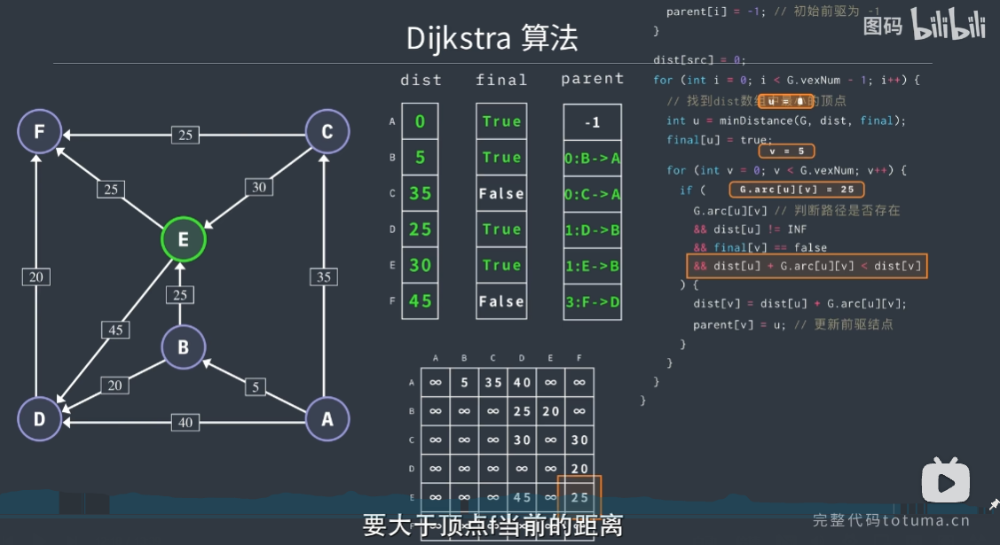

<iframe src="//player.bilibili.com/player.html?isOutside=true&aid=113418124133881&bvid=BV1QESyYGE55&cid=26597720238&p=1&autoplay=0" scrolling="no" border="0" frameborder="no" framespacing="0" allowfullscreen="true"></iframe>

#### floyd 算法 

动态规划思路

全源最短路径

支持负权边
检测负权环

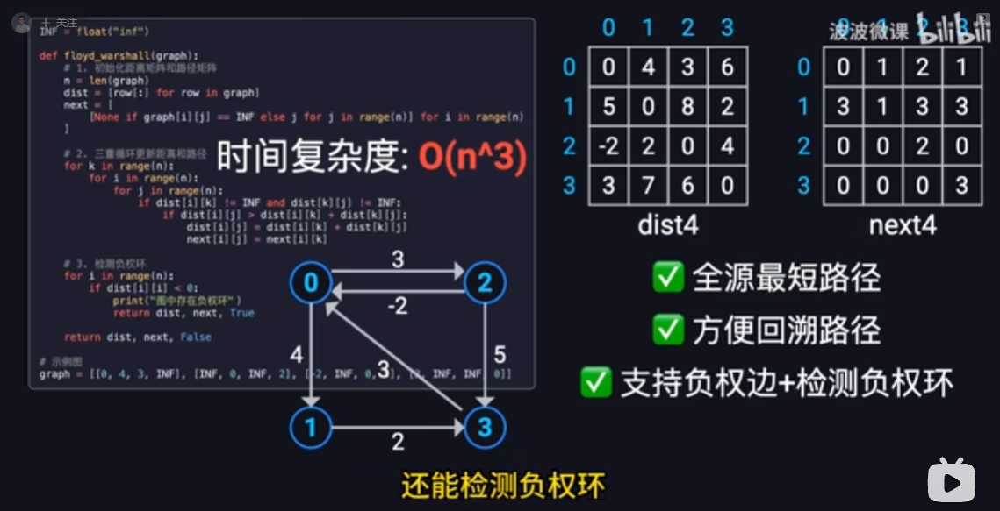

<iframe src="//player.bilibili.com/player.html?isOutside=true&aid=114357698564223&bvid=BV1aZ5rzRE4b&cid=29479076773&p=1&autoplay=0" scrolling="no" border="0" frameborder="no" framespacing="0" allowfullscreen="true"></iframe>

### 拓扑排序 topological sorting

AOV 网 activity on vertex network：用顶点表示活动的网，有向边用来表示活动之间的先后顺序

拓扑排序：对AOV网工程活动的流程排序

DAG 有向无环图 Directed Acyclic Graph

> 拓扑排序可以用来检测有向图中是否有环路

拓扑排序序列不唯一

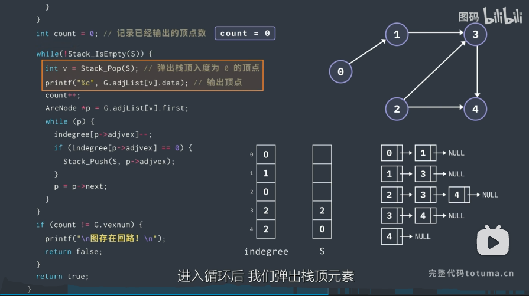

<iframe src="//player.bilibili.com/player.html?isOutside=true&aid=114356238942264&bvid=BV1Vh56zsE37&cid=29473769945&p=1&autoplay=0" scrolling="no" border="0" frameborder="no" framespacing="0" allowfullscreen="true"></iframe>

### 关键路径

AOE网：在一个表示工程带权有向图中，用顶点表示事件，用有向边表示活动，用边上的权值表示活动的持续时间，这种有向图的边表示活动的网

我们 把 路径上 各个 活动所持续 的 时 间之和 称 为路径 长 度 ,
从 源 点 到 汇点具有 最 大长 度 的 路 径叫 关键 路 径 ,
在 关键 路径上 的 活动叫 关键 活动

逆拓扑排序

1. 事件 的 最 早 发 生 时间 etv (earliest time of vertex): 即 顶 点 w 的 最 早 发 生 时
间 。
1. 事件 的 最 晚 发生时间 Itv (latest time of vertex): 即 项 点 w 的 最 晚 发生时间 ,也 就 是 每个顶点 对 应 的 事件 最 晚 需要 开始 的 时 间,超出此 时间 将 会延误 整个工
期。
1. 活动 的最早开工时间 ete (earliest time of edge): 即 弧 ax 的 最 早 发生时间 。
2. 活动 的最晚开工时间 Ite (latest time of edge): 即 弧 ax 的 最 晚 发生时间, 也 就是 不 推迟 工期 的 最 晚 开工 时 间 

$etv[k] = \max(etv[i] + len<v_i,v_k>)$
$ltv[k] = \min(ltv[j] -  len<v_k,v_j>)$

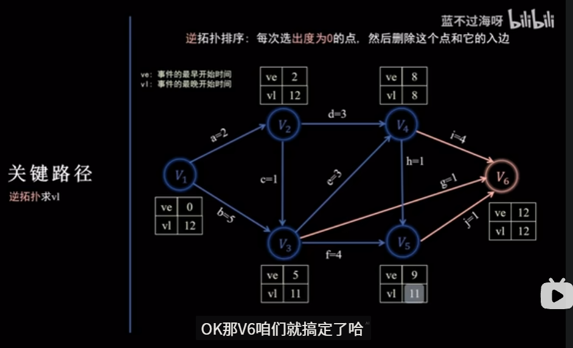

$ete<v_i,v_j> = etv[i]$
$lte<v_i,v_j> = etv[j] - len<v_i,v_j>$


## 8. 查找

### 概念

查找表
关键字
次关键字
静态查找表
动态查找表

### 顺序表查找

顺序查找 sequential search 线性查找

优化 哨兵顺序查找 少了一个越界判断

常用记录放前面 提高效率

### 有序表查找

折半查找 binary search 二分查找

对于频繁执行插入删除 维护有序排序带来不小工作量 不建议使用

#### 插值查找

插值公式： $mid = low + \frac{key-a[low]}{a[high]-a[low]}(high-low)$

适合关键字分布均匀的查找表

#### 斐波拉契查找 

Fibonacci search 黄金分割原理

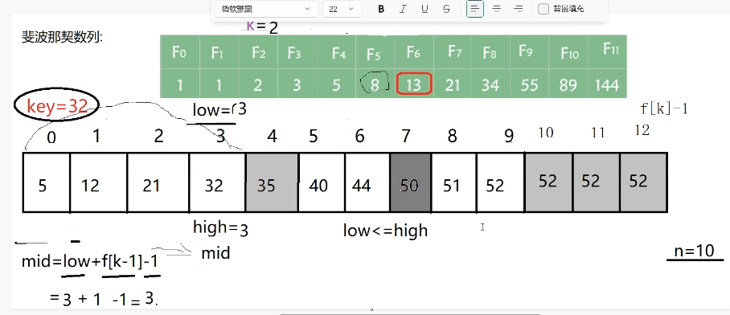

平均性能优于折半查找
折半查找 mid 运算 +-法
插值查找 四则运算
斐波拉契查找 mid 运算 +-法

### 线性索引查找

数据集增长非常快 数据按先后顺序存储

大型数据库 磁盘文件 重要技术

一个索引 由若干个索引项构成 
每个索引项至少包含：

- 关键字
- 记录在存储器中的位置

按结构分为： 线性索引 树形索引 多级索引

线性索引：索引项集合组织 为线性结构 —— 索引表

- 稠密索引
- 分块索引
- 倒排索引
  
#### 稠密索引

线性索引中 将数据集中的每个记录对应一个索引项

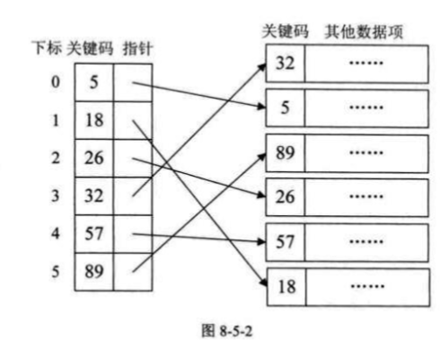
稠密索引索引表的索引项 一定是按照关键码有序排列

#### 分块索引

- 块内无序
- 块间有序

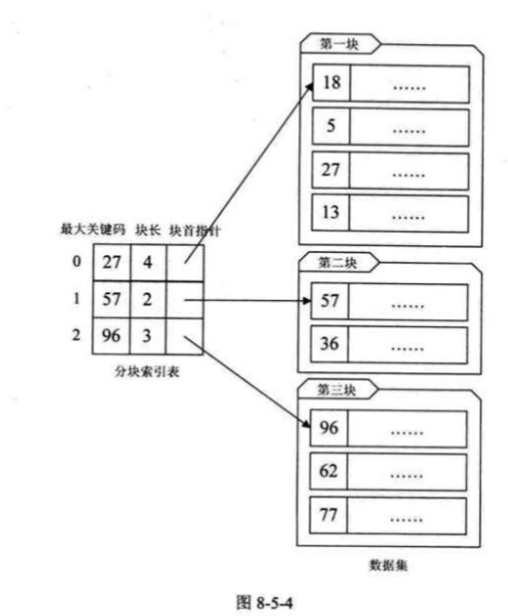

#### 倒排索引

索引项通用结构:

- 次关键码
- 记录号表

倒排索引:不是由记录来确定属性值 而是由属性值来确定记录的位置


### 二叉排序树

binary sort tree 二叉查找树

非线性结构

中序遍历 {62,88,58,47,35,73,51,99,37,93}
=> {35,37,47,51,58,62,73,88,93,99}

提高查找 插入 删除关键字 的速度

#### 二叉排序树查找操作
#### 二叉排序树插入操作
#### 二叉排序树查找操作
#### 二叉排序树删除操作

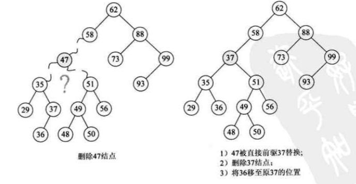

二叉排序树 查找性能取决于 树的深度
所以 我们希望 二叉排序树是平衡的 希望其深度与完全二叉树相同: $⌊log_2n⌋ + 1$

### 平衡二叉树

俄罗斯数学家 G.M.Adelson-Velskii 和 E.M.Landis AVL树 
self-balancing binary search tree
height-balanced binary search tree
平衡因子 BF balance factor: -1 0 1, BF = 左子树高度 - 右子树高度

节点的高度 Height 从节点到其最远叶子节点的最长路径上的边数（或节点数，取决于定义，这里使用边数） 空节点（null）的高度为 -1。 没有子节点高度为 0

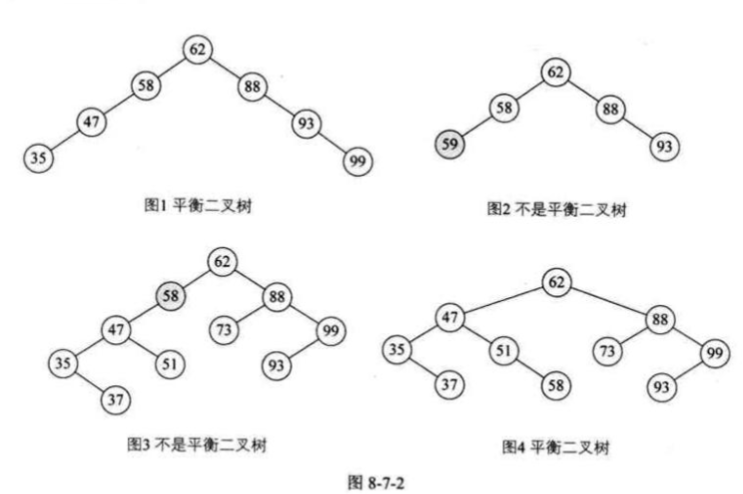

最小不平衡子树: 
距离插入结点最近的,且平衡因子的绝对值大于1的结点为根的子树
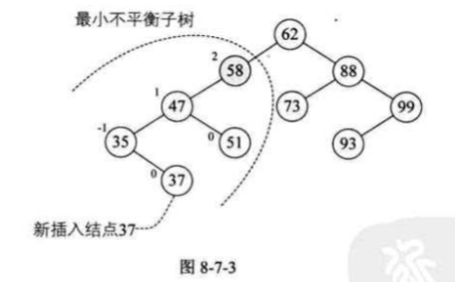

-当最小不平衡子树根结点的平衡因子BF是大于1时,就右旋,小于一1时就左旋
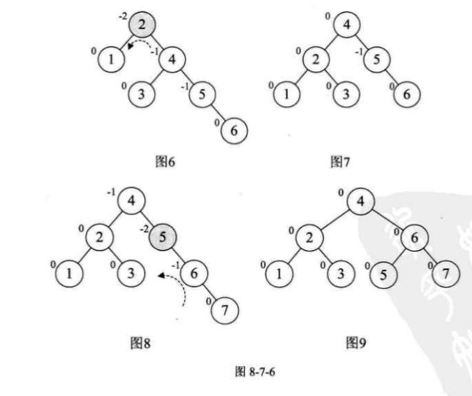

-插入结点后,最小不平衡子树的BF与它的子树的BF符号相反时,就需要对结点先进行一次旋转以使得符号相同后,再反向旋转一次才能够完成平衡操作
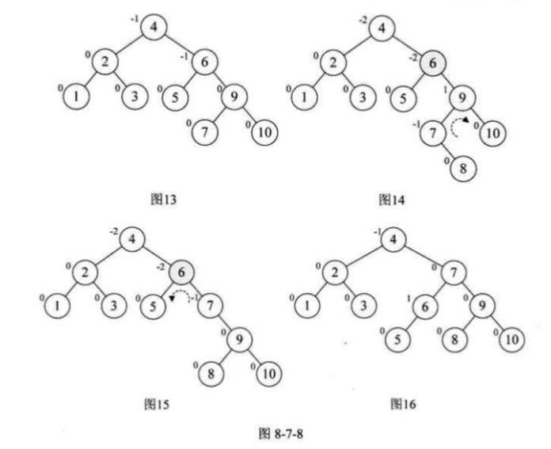

```c
#include <stdio.h>
#include <stdlib.h>

typedef int ElemType;

// AVL树节点结构体
typedef struct AVLNode {
    ElemType data;
    int height;
    struct AVLNode *lchild, *rchild;
} AVLNode, *AVLTree;

// 获取节点高度
int Height(AVLTree T) {
    if (T == NULL) return -1;
    return T->height;
}

// 计算最大值
int Max(int a, int b) {
    return a > b ? a : b;
}

// 右旋
AVLTree RightRotate(AVLTree y) {
    AVLTree x = y->lchild;
    y->lchild = x->rchild;
    x->rchild = y;
    y->height = Max(Height(y->lchild), Height(y->rchild)) + 1;
    x->height = Max(Height(x->lchild), Height(x->rchild)) + 1;
    return x;
}

// 左旋
AVLTree LeftRotate(AVLTree x) {
    AVLTree y = x->rchild;
    x->rchild = y->lchild;
    y->lchild = x;
    x->height = Max(Height(x->lchild), Height(x->rchild)) + 1;
    y->height = Max(Height(y->lchild), Height(y->rchild)) + 1;
    return y;
}

// 获取平衡因子
int GetBalance(AVLTree T) {
    if (T == NULL) return 0;
    return Height(T->lchild) - Height(T->rchild);
}

// 查找最小节点
AVLTree FindMin(AVLTree T) {
    while (T && T->lchild)
        T = T->lchild;
    return T;
}

// 插入操作
AVLTree Insert(AVLTree T, ElemType key) {
    if (T == NULL) {
        T = (AVLTree)malloc(sizeof(AVLNode));
        T->data = key;
        T->height = 0;
        T->lchild = T->rchild = NULL;
        return T;
    }
    if (key < T->data) {
        T->lchild = Insert(T->lchild, key);
    } else if (key > T->data) {
        T->rchild = Insert(T->rchild, key);
    } else {
        return T;
    }

    T->height = Max(Height(T->lchild), Height(T->rchild)) + 1;
    int balance = GetBalance(T);

    // LL型
    if (balance > 1 && key < T->lchild->data)
        return RightRotate(T);
    // RR型
    if (balance < -1 && key > T->rchild->data)
        return LeftRotate(T);
    // LR型
    if (balance > 1 && key > T->lchild->data) {
        T->lchild = LeftRotate(T->lchild);
        return RightRotate(T);
    }
    // RL型
    if (balance < -1 && key < T->rchild->data) {
        T->rchild = RightRotate(T->rchild);
        return LeftRotate(T);
    }
    return T;
}

// 删除操作
AVLTree Delete(AVLTree T, ElemType key) {
    if (T == NULL) return NULL;
    if (key < T->data) {
        T->lchild = Delete(T->lchild, key);
    } else if (key > T->data) {
        T->rchild = Delete(T->rchild, key);
    } else {
        // 找到要删除的节点
        if (T->lchild == NULL || T->rchild == NULL) {
            AVLTree temp = T->lchild ? T->lchild : T->rchild;
            if (temp == NULL) {
                temp = T;
                T = NULL;
            } else {
                *T = *temp;
            }
            free(temp);
        } else {
            AVLTree temp = FindMin(T->rchild);
            T->data = temp->data;
            T->rchild = Delete(T->rchild, temp->data);
        }
    }
    if (T == NULL) return NULL;

    T->height = Max(Height(T->lchild), Height(T->rchild)) + 1;
    int balance = GetBalance(T);

    // LL型
    if (balance > 1 && GetBalance(T->lchild) >= 0)
        return RightRotate(T);
    // LR型
    if (balance > 1 && GetBalance(T->lchild) < 0) {
        T->lchild = LeftRotate(T->lchild);
        return RightRotate(T);
    }
    // RR型
    if (balance < -1 && GetBalance(T->rchild) <= 0)
        return LeftRotate(T);
    // RL型
    if (balance < -1 && GetBalance(T->rchild) > 0) {
        T->rchild = RightRotate(T->rchild);
        return LeftRotate(T);
    }
    return T;
}

// 中序遍历
void InOrder(AVLTree T) {
    if (T) {
        InOrder(T->lchild);
        printf("%d ", T->data);
        InOrder(T->rchild);
    }
}

// 测试主函数
int main() {
    AVLTree T = NULL;
    int arr[] = {62,88,58,47,35,73,51,99,37,93};
    int n = sizeof(arr)/sizeof(arr[0]);
    for (int i = 0; i < n; i++) {
        T = Insert(T, arr[i]);
    }
    printf("中序遍历(有序): ");
    InOrder(T);
    printf("\n");

    // 删除测试
    T = Delete(T, 58);
    printf("删除58后中序遍历: ");
    InOrder(T);
    printf("\n");

    T = Delete(T, 62);
    printf("删除62后中序遍历: ");
    InOrder(T);
    printf("\n");

    return 0;
}
```
构建二叉排序树 $O(log_n)$ 动态查找表算法

- 查找集合本身没有顺序
- 频繁查找同时 需要经常插入删除

[数据结构 —— 图解AVL树(平衡二叉树)](https://blog.csdn.net/xiaojin21cen/article/details/97602146)

<iframe src="//player.bilibili.com/player.html?isOutside=true&aid=1152419847&bvid=BV1tZ421q72h&cid=1485667940&p=1&autoplay=0" scrolling="no" border="0" frameborder="no" framespacing="0" allowfullscreen="true"></iframe>


记忆方法：
LL RR LR RL 
L -> +
R -> -

LL 处理 R rotate
RR 处理 L rotate
LR 处理 L rotate, R rotate
RL 处理 R rotate, L rotate

### 红黑树

<iframe src="//player.bilibili.com/player.html?isOutside=true&aid=1603419103&bvid=BV1Xm421x7Lg&cid=1558012637&p=1&autoplay=0" scrolling="no" border="0" frameborder="no" framespacing="0" allowfullscreen="true"></iframe>

- 根叶黑
- 不红红
- 黑路同

Red-Black Tree
AVL树查询更高效
红黑树插入，删除更高效
自平衡二叉查找树

[红黑树探索](http://manistein.club/post/program/c/%E7%BA%A2%E9%BB%91%E6%A0%91%E6%8E%A2%E7%B4%A2/)

[目前最详细的红黑树原理分析（大量图片+过程推导！！！）](https://www.cnblogs.com/yinbiao/p/10732600.htm)

C++ stl map set

```c
// ...existing code...

#include <stdio.h>
#include <stdlib.h>

typedef enum { RED, BLACK } Color;

typedef int ElemType;

typedef struct RBNode {
    ElemType data;
    Color color;
    struct RBNode *left, *right, *parent;
} RBNode, *RBTree;

// 左旋
void LeftRotate(RBTree *root, RBNode *x) {
    RBNode *y = x->right;
    x->right = y->left;
    if (y->left) y->left->parent = x;
    y->parent = x->parent;
    if (!x->parent)
        *root = y;
    else if (x == x->parent->left)
        x->parent->left = y;
    else
        x->parent->right = y;
    y->left = x;
    x->parent = y;
}

// 右旋
void RightRotate(RBTree *root, RBNode *y) {
    RBNode *x = y->left;
    y->left = x->right;
    if (x->right) x->right->parent = y;
    x->parent = y->parent;
    if (!y->parent)
        *root = x;
    else if (y == y->parent->left)
        y->parent->left = x;
    else
        y->parent->right = x;
    x->right = y;
    y->parent = x;
}

// 插入修正
void InsertFixup(RBTree *root, RBNode *z) {
    while (z->parent && z->parent->color == RED) {
        if (z->parent == z->parent->parent->left) {
            RBNode *y = z->parent->parent->right;
            if (y && y->color == RED) {
                z->parent->color = BLACK;
                y->color = BLACK;
                z->parent->parent->color = RED;
                z = z->parent->parent;
            } else {
                if (z == z->parent->right) {
                    z = z->parent;
                    LeftRotate(root, z);
                }
                z->parent->color = BLACK;
                z->parent->parent->color = RED;
                RightRotate(root, z->parent->parent);
            }
        } else {
            RBNode *y = z->parent->parent->left;
            if (y && y->color == RED) {
                z->parent->color = BLACK;
                y->color = BLACK;
                z->parent->parent->color = RED;
                z = z->parent->parent;
            } else {
                if (z == z->parent->left) {
                    z = z->parent;
                    RightRotate(root, z);
                }
                z->parent->color = BLACK;
                z->parent->parent->color = RED;
                LeftRotate(root, z->parent->parent);
            }
        }
    }
    (*root)->color = BLACK;
}

// 插入节点
void RBInsert(RBTree *root, ElemType key) {
    RBNode *z = (RBNode *)malloc(sizeof(RBNode));
    z->data = key;
    z->color = RED;
    z->left = z->right = z->parent = NULL;

    RBNode *y = NULL;
    RBNode *x = *root;
    while (x) {
        y = x;
        if (key < x->data)
            x = x->left;
        else
            x = x->right;
    }
    z->parent = y;
    if (!y)
        *root = z;
    else if (key < y->data)
        y->left = z;
    else
        y->right = z;

    InsertFixup(root, z);
}

// 中序遍历
void InOrder(RBNode *root) {
    if (root) {
        InOrder(root->left);
        printf("%d(%s) ", root->data, root->color == RED ? "R" : "B");
        InOrder(root->right);
    }
}

// 测试主函数
int main() {
    RBTree root = NULL;
    int arr[] = {10, 20, 30, 15, 25, 5, 1};
    int n = sizeof(arr)/sizeof(arr[0]);
    for (int i = 0; i < n; i++) {
        RBInsert(&root, arr[i]);
    }
    printf("红黑树中序遍历: ");
    InOrder(root);
    printf("\n");
    return 0;
}
// ...existing code...
```

### 多路查找树 B树🌳

muti-way search tree

每个结点孩子树 多于两个 每个结点存储多个元素

#### 2-3树🌳

2结点: 2孩子 + 1元素
3结点: 3孩子 + 2元素

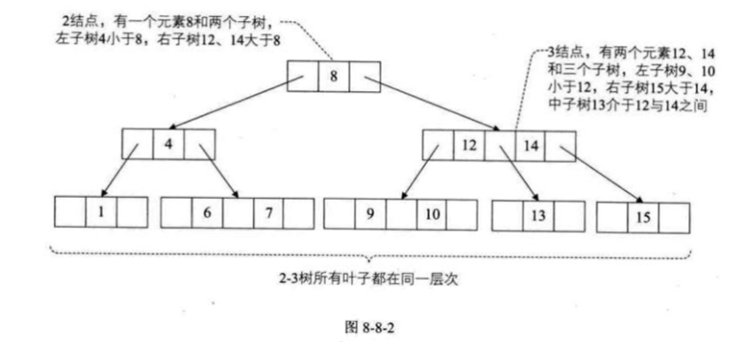

#### 2-3-4树🌳

4结点: 4孩子 + 3元素

#### B树🌳

平衡多路查找树

B树的阶:结点最大的孩子数目

2-3树是3阶B树

2-3-4树是4阶B树

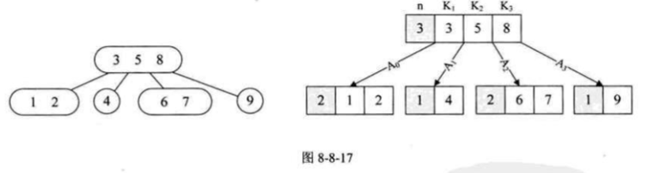

<iframe src="//player.bilibili.com/player.html?isOutside=true&aid=1255010724&bvid=BV1tJ4m1w7yR&cid=1561833169&p=1&autoplay=0" scrolling="no" border="0" frameborder="no" framespacing="0" allowfullscreen="true"></iframe>

#### B+树🌳

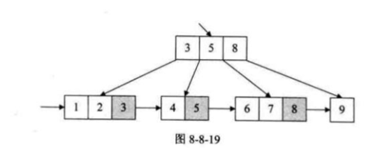

### trie结构 和 patricia 树

字典树
retrieval 检索

<iframe src="//player.bilibili.com/player.html?isOutside=true&aid=113722546721533&bvid=BV1wsCJY6ESK&cid=27553433647&p=1&autoplay=0" scrolling="no" border="0" frameborder="no" framespacing="0" allowfullscreen="true"></iframe>

```c
// ...existing code...

#include <stdio.h>
#include <stdlib.h>
#include <string.h>

#define ALPHABET_SIZE 26 // 只处理小写字母a-z
#define MAX_WORD_LEN 100

typedef struct TrieNode {
    struct TrieNode *children[ALPHABET_SIZE];
    int isEnd; // 是否为单词结尾
} TrieNode;

// 创建新节点
TrieNode* createNode() {
    TrieNode *node = (TrieNode*)malloc(sizeof(TrieNode));
    node->isEnd = 0;
    for (int i = 0; i < ALPHABET_SIZE; i++)
        node->children[i] = NULL;
    return node;
}

// 插入单词
void insert(TrieNode *root, const char *word) {
    TrieNode *p = root;
    while (*word) {
        int idx = *word - 'a';
        if (!p->children[idx])
            p->children[idx] = createNode();
        p = p->children[idx];
        word++;
    }
    p->isEnd = 1;
}

// 查找单词
int search(TrieNode *root, const char *word) {
    TrieNode *p = root;
    while (*word) {
        int idx = *word - 'a';
        if (!p->children[idx])
            return 0;
        p = p->children[idx];
        word++;
    }
    return p->isEnd;
}

// 判断是否存在以prefix为前缀的单词
int startswith(TrieNode *root, const char *prefix) {
    TrieNode *p = root;
    while (*prefix) {
        int idx = *prefix - 'a';
        if (!p->children[idx])
            return 0;
        p = p->children[idx];
        prefix++;
    }
    return 1;
}

// 递归输出所有以start为前缀的单词
void dfs(TrieNode *root, char *buffer, int depth, const char *start) {
    if (root->isEnd) {
        buffer[depth] = '\0';
        printf("%s%s\n", start, buffer);
    }
    for (int i = 0; i < ALPHABET_SIZE; i++) {
        if (root->children[i]) {
            buffer[depth] = 'a' + i;
            dfs(root->children[i], buffer, depth + 1, start);
        }
    }
}

// 自动补全：输出所有以start为前缀的单词
void autocomplete_startswith(TrieNode *root, const char *start) {
    TrieNode *p = root;
    const char *prefix = start;
    while (*start) {
        int idx = *start - 'a';
        if (!p->children[idx]) {
            printf("无匹配项\n");
            return;
        }
        p = p->children[idx];
        start++;
    }
    char buffer[MAX_WORD_LEN];
    dfs(p, buffer, 0, prefix);
}

// 释放Trie
void freeTrie(TrieNode *root) {
    for (int i = 0; i < ALPHABET_SIZE; i++)
        if (root->children[i])
            freeTrie(root->children[i]);
    free(root);
}

// 测试
int main() {
    TrieNode *root = createNode();
    insert(root, "hello");
    insert(root, "hell");
    insert(root, "he");
    insert(root, "world");
    insert(root, "word");
    insert(root, "trie");
    insert(root, "tree");

    printf("自动补全 startswith he:\n");
    autocomplete_startswith(root, "he");

    printf("自动补全 startswith wo:\n");
    autocomplete_startswith(root, "wo");

    printf("自动补全 startswith tr:\n");
    autocomplete_startswith(root, "tr");

    printf("是否存在以abc为前缀的单词: %d\n", startswith(root, "abc")); // 0

    freeTrie(root);
    return 0;
}
// ...existing code...
```

patricia树 对于稀疏分支 直接压缩为一个节点

### 动态规划 最佳二叉搜索树 伸展树 正态分布

splay tree

<iframe src="//player.bilibili.com/player.html?isOutside=true&aid=821137198&bvid=BV1BG4y1M7dB&cid=989930148&p=1&autoplay=0" scrolling="no" border="0" frameborder="no" framespacing="0" allowfullscreen="true"></iframe>

<iframe src="//player.bilibili.com/player.html?isOutside=true&aid=475764260&bvid=BV1ZK411R7k2&cid=910183138&p=1&autoplay=0" scrolling="no" border="0" frameborder="no" framespacing="0" allowfullscreen="true"></iframe>

### 散列表查找 哈希表

散列函数 哈希函数

散列表 哈希表 hash table

<iframe src="//player.bilibili.com/player.html?isOutside=true&aid=113867149742150&bvid=BV13NwveLE1D&cid=28000781558&p=1&autoplay=0" scrolling="no" border="0" frameborder="no" framespacing="0" allowfullscreen="true"></iframe>

## 9. 排序


----

Here is a footnote reference,[^1] and another.[^longnote]

## Endnotes

[^1]: Here is the footnote.
[^longnote]: Here's one with multiple blocks.

[label]: <https://> "website title"
