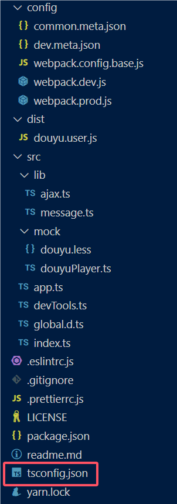

# 油猴脚本学习笔记

## 基础资料

[Tampermonkey中文文档][]
[世界通用版本号规则](https://semver.org/lang/zh-CN/)
[Tampermonkey菜单][menu]
[油猴脚本开发进阶 VSCode + Webpack + TypeScript 油猴开发环境搭建，本地调试、实时热刷新、自动构建和发布][油猴webpack脚手架]
[Webpack 配置的改进][]
[webpack使用html-loader加载js中引入的html资源][html-loader]

## [油猴webpack脚手架][]框架介绍

### 项目结构


```text
│
│─package.json
│   (- yarn start/dev/build 自定义命令 
│       建议参照 yarn build 自定义增加编译 douyu.dev.user.js 的命令 如: yarn builddev 
│        注意：自定义参数不能有空格
│   - 项目名字 版本 描述 作者 主页 开源协议 依赖 脚本
│   )
├─config
│      common.meta.json
│        (生产环境油猴脚本banner元数据 json文件)
│      dev.meta.json
│        (调试环境油猴脚本banner元数据 json文件 "require"键对应的修改为本地文件 douyu.dev.user.js 的路径) 
│      webpack.config.base.js
│        (webpack项目基础配置)   
│      webpack.dev.js
│        (webpack项目开发环境 生成目标文件的配置)
│      webpack.prod.js
│        (webpack项目生产环境 生成目标文件的配置)
│
├─dist
│      douyu.user.js
│        (yarn build 生成的脚本 生产环境脚本)
│      douyu.dev.user.js
│        (yarn start 跟 yarn dev 生成的脚本 开发环境脚本)
│
├─public
│      index.html
│        (本地调试目标页面 执行 yarn start 启动页面)
│
└─src
    │  app.ts
    │    (油猴脚本源码入口)
    │  devTools.ts
    │   (框架调试工具接口)
    │  global.d.ts
    │  index.ts
    │   (项目入口文件)
    ├─lib
    │      ajax.ts
    │      message.ts
    └─mock
            douyu.less
            douyuPlayer.ts
            (本地调试目标页面 ts部分)
```

### 项目初始化

- yarn install 安装依赖
- 执行 yarn start 或者 yarn dev 或者 (自定义的)yarn builddev 目的是编译生成 douyu.dev.user.js

- 如果运行 yarn start 
    项目 `devTools.ts` 的函数 `autoInstall` 文件会 弹出油猴脚本安装网页提示安装脚本 安装脚本成功后 
    修改 脚本内容 就是你磁盘文件 `douyu.dev.user.js` 的路径
    `// @require    file://D://xxxxx//dist//douyu.dev.user.js`

- 如果你没安装脚本 则手动 打开油猴脚本控制面板 新建空白脚本 然后 把 生成的 `douyu.dev.user.js` 的 `banner` 拷贝到油猴面板空白脚本当中 
    特别注意 不要拷贝整个文件内容 只需要拷贝 `banner` 部分 如下格式 不然 下次再次运行 `yarn start` 的时候 会疯狂刷新调试页面
    ```js
    // ==UserScript== 
    ··· 
    // ==/UserScript==
    ```
- 修改 `config/dev.meta.json` 文件 require键对应的本地文件 douyu.dev.user.js 的路径
- 至此 项目基本运行调试是没问题了 接下来就是修改 项目信息
- 具体需要编辑的 文件 就是 `common.meta.json` `dev.meta.json` `package.json`

### 编码注意事项

- index.js 是项目入口
    - 项目调试页面代码 在于 `mock` 文件夹的的源文件 可随意修改定制
    - 项目油猴 入口在于 `app.ts` 
    - `index.ts` 是通过 `import app` `app()` 进入油猴源码入口的
    - 所以一切的逻辑代码 都必须编辑在 `app.ts` 的 `const app = () => {};` 中
    - 比如 `GM_registerMenuCommand('test', () => console.log('test'));` 
        `GM_registerMenuCommand` 只能在 `const app = () => {};` 中解析调用 
        否则 无法识别 `GM_registerMenuCommand` 函数
- 菜单栏 少量HTML标签元素 导入
    - 依赖 `core-js` `html-loader`
        ```powershell
        npm install --safe-dev core-js
        npm install --safe-dev html-loader

        或者

        yarn add core-js --dev
        yarn add html-loader --dev
        ```
    - 配置文件 `webpack.config.base.js`
    ```js
      module: {
        rules: [
        {
            test: /\.html$/i,
            use: {
            loader: 'html-loader',
            options: {
                sources: {
                list: [
                    '...', // 所有默认支持的标签和属性，这个一定要加上，不然就只会检测a标签了
                    {
                    tag: 'a',
                    attribute: 'href',
                    tags: 'src',
                    },
                ],
                },
                minimize: true,
            },
            },
        },]}
    ```
    - 逻辑代码
    ```js
    // 其中 import 出来的 menu 是字符串
    import menu from './menu.html';
    let menuWrapper = document.getElementById('menuWrapper');
    menuWrapper.innerHTML = menu;
    ```

Here is a footnote reference,[^1] and another.[^longnote]

### 调试编译打包指令

- `package.json` 可自行定义

````json
  "scripts": {
    "start": "webpack serve --config ./config/webpack.dev.js --env filename=douyu.dev.user.js",
    "dev": "webpack --watch --config ./config/webpack.dev.js --env filename=douyu.dev.user.js",
    "build": "yarn lint:fix && webpack --config ./config/webpack.prod.js --env filename=douyu.user.js --stats-error-details",
    "builddev": "yarn lint:fix && webpack --config ./config/webpack.dev.js --env filename=douyu.dev.user.js --stats-error-details",
    "lint": "eslint \"src/**/*.{ts,tsx}\"",
    "lint:fix": "yarn lint --fix"
  },
````


## Endnotes

[^1]: Here is the footnote.
[^longnote]: Here's one with multiple blocks.

[Webpack 配置的改进]: <https://iknow.fun/2022/08/01/webpack-typescript-kai-fa-you-hou-jiao-ben-dou-yu-zhi-bo-zi-dong-qie-huan-hua-zhi-2-0/>
[html-loader]: <https://blog.csdn.net/weixin_45047039/article/details/110262176> "webpack使用html-loader加载js中引入的html资源"
[油猴webpack脚手架]: <https://iknow.fun/2022/08/03/vscode-webpack-typescript-you-hou-kai-fa-huan-jing-da-jian-ben-di-diao-shi-shi-shi-re-shua-xin-zi-dong-gou-jian-he-fa-bu/> "油猴脚本开发进阶】VSCode + Webpack + TypeScript 油猴开发环境搭建，本地调试、实时热刷新、自动构建和发布"
[Tampermonkey中文文档]: <https://bbs.tampermonkey.net.cn/forum.php?mod=viewthread&tid=1909> "website title"
[menu]: <https://bbs.tampermonkey.net.cn/forum.php?mod=viewthread&tid=271>
