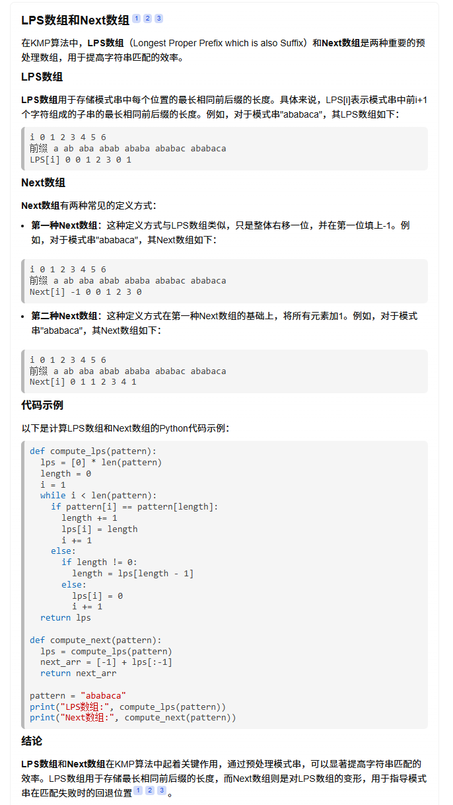

# 算法笔记

## 游戏排名算法

- [Elo][]

Here is a footnote reference,[^1] and another.[^longnote]

## 经典算法

- [bfprt][]
- [贪心算法][]
- [排序算法][]
- [算法可视化网站](https://visualgo.net/zh)
- [算法可视化网站s](https://xie.infoq.cn/article/a6612973e6e6a80134f166eba)
### KMP算法 Knuth-Morris-Pratt

#### 引用资料

- [bilibili搬运】油管阿三哥讲KMP查找算法，中英文字幕，人工翻译，简单易懂](https://www.bilibili.com/video/BV18k4y1m7Ar/?spm_id_from=333.337.search-card.all.click&vd_source=b48342a630f5cc1a5c86649a37c0db89)
- [视频github源码地址](https://github.com/mission-peace/interview/blob/master/src/com/interview/string/SubstringSearch.java) 
- [已下载源码文件 SubstringSearch](../img/算法笔记/SubstringSearch.java)
- [最浅显易懂的 KMP 算法讲解](https://www.bilibili.com/video/BV1AY4y157yL/?share_source=copy_web&vd_source=8481a329c330537a5873f8525ac82207)
- [绝对能看懂的kmp算法，超清晰多图，一步步详解！](https://www.cnblogs.com/fswly/p/17959786)
- [next->nextval，kmp算法的改良理解]
- [真正把kmp算法中的next数组含义和求法讲明白]



#### KMP算法中的前缀和后缀

- 前缀是指以串第一个字符开头且不包含最后一个元素的连续的子串
- 后缀是指以串最后一个字符结尾且不包含第一个元素的连续的子串

在KMP算法中，前缀和后缀的概念被用来构建部分匹配表（Partial Match Table），以提高字符串匹配的效率

##### 部分匹配表的构建 lps数组

部分匹配表的核心是计算每个位置的前缀和后缀的最长共有元素的长度。以下是一个示例：

对于字符串 "ABCDABD"： 
- lps数组穷举
"A" 的前缀和后缀都为空集，共有元素的长度为0； 
"AB" 的前缀为 [A]，后缀为 [B]，共有元素的长度为0； 
"ABC" 的前缀为 [A, AB]，后缀为 [BC, C]，共有元素的长度为0； 
"ABCD" 的前缀为 [A, AB, ABC]，后缀为 [BCD, CD, D]，共有元素的长度为0； 
"ABCDA" 的前缀为 [A, AB, ABC, ABCD]，后缀为 [BCDA, CDA, DA, A]，共有元素为 "A"，长度为1； 
"ABCDAB" 的前缀为 [A, AB, ABC, ABCD, ABCDA]，后缀为 [BCDAB, CDAB, DAB, AB, B]，共有元素为 "AB"，长度为2； 
"ABCDABD" 的前缀为 [A, AB, ABC, ABCD, ABCDA, ABCDAB]，后缀为 [BCDABD, CDABD, DABD, ABD, BD, D]，共有元素的长度为0。

- next数组穷举 [真正把kmp算法中的next数组含义和求法讲明白]
`next数组我是这样定义的：该位置前面字符串的最长相同的真前缀和真后缀长度。`
"A" 前面没字符，前缀和后缀都为空集，共有元素的长度为0； 
"AB" 的前面是字符串A，前缀和后缀都为空集，共有元素的长度为0； 
"ABC" 的前面是字符串AB，前缀为 [A]，后缀为 [B]，共有元素的长度为0； 
"ABCD" 的前面是字符串ABC，前缀为 [A, AB]，后缀为 [BC, C]，共有元素的长度为0； 
"ABCDA" 的前面是字符串ABCD，前缀为 [A, AB, ABC]，后缀为 [BCD, CD, D]，共有元素的长度为0； 
"ABCDAB" 的前面是字符串ABCDA，前缀为 [A, AB, ABC, ABCD]，后缀为 [BCDA, CDA, DA, A]，共有元素为 "A"，长度为1； 
"ABCDABD" 的前面是字符串ABCDAB，前缀为 [A, AB, ABC, ABCD, ABCDA]，后缀为 [BCDAB, CDAB, DAB, AB, B]，共有元素为 "AB"，长度为2；

> next[0]=0，继续嵌套还是next[0],所以将next[0]=-1；

lps数组为：[0,0,0,1,2,0]
next数组为: [-1,0,0,0,1,2]
lps数组 -> next数组: LPS数组整体右移一位, lps[0] = -1即可

> 注：本节构建数组的方法是基于代码第一个元素下标从0开始的 考试解题从1开始的串 数组每个元素+1即可

#### nextval数组 改进原理 [next->nextval，kmp算法的改良理解]

> 核心思想：若跳转后的字符与原字符相同，则继续向前跳转

```c++
if pattern[i] == pattern[next[i]]:
     nextval[i] = nextval[next[i]]  # 递归向前查找 
else:
     nextval[i] = next[i]
```

| 索引 |	字符 | 	next数组（方法1）|	nextval计算逻辑 |	nextval值 |
| :---: | :---: | :---: | :---: | :---: |
| 0 | A | -1 | 初始值 | -1 | 
| 1 | B | 0 | B ≠ A → 保留next值 | 0 |
| 2 | A | 0 | A == A → 取nextval[0] | -1 |
| 3 | B | 1 | B == B → 取nextval[1] | 0 |

最终nextval数组：[-1,0,-1,0]

##### 优化效果对比
- 原next跳转路径：3 → 1 → 0 → -1（需要3次跳转）
- nextval跳转路径：3 → 0 → -1（仅需2次跳转）

#### lps数组kmp函数 vs next数组KMP函数 while循环的区别
- [lps数组kmp函数while循环](../img/算法笔记/SubstringSearch.java)
```java
while(i < text.length && j < pattern.length){
    if(text[i] == pattern[j]){
        i++;
        j++;
    }else{
        if(j!=0){
            j = lps[j-1];
        }else{
            i++;
        }
    }
}
```
- [next数组KMP函数while循环](../img/算法笔记/KMP.cs)
```cs
while(i < s.Length && j < p.Length){
    if(j == -1 || s[i] == p[j]){
        i ++;
        j ++;
    }else{
        j = next[j];  // 根据next数组的指引对p进行回溯
    }
}
```

#### todo
- ACM kmp 求border数组 《歌唱王国》
- sunday和bm
- Aho–Corasick 自动机是指一种多模式字符串匹配算法，它结合了Trie树的前缀匹配能力和KMP算法的失败跳转思想，能够在单次文本扫描中高效匹配多个模式串
- 刘汝佳的《算法竞赛入门经典（训练指南）》

## 实用算法
- [缓存算法][]
- [知无涯之std::sort源码剖析](https://feihu.me/blog/2014/sgi-std-sort/)
- [编程珠玑(The Programming Pearls)](https://dirtysalt.github.io/html/programming-pearls.html)
## Endnotes

[^1]: Here is the footnote.
[^longnote]: Here's one with multiple blocks.

[Elo]: <https://itindex.net/detail/61665-%E6%B8%B8%E6%88%8F%E6%8E%92%E5%90%8D-%E7%AE%97%E6%B3%95-elo> "游戏排名算法：Elo、Glicko、TrueSkill"
[bfprt]: <https://itindex.net/detail/9511-bfprt-%E7%AE%97%E6%B3%95>
[缓存算法]: <https://itindex.net/detail/7746-%E7%BC%93%E5%AD%98-%E7%AE%97%E6%B3%95>
[贪心算法]: <https://itindex.net/detail/11732-%E8%B4%AA%E5%BF%83%E7%AE%97%E6%B3%95>
[排序算法]: <https://itindex.net/detail/46419-%E6%8E%92%E5%BA%8F%E7%AE%97%E6%B3%95>
[next->nextval，kmp算法的改良理解]: <https://zhuanlan.zhihu.com/p/28815377037>
[真正把kmp算法中的next数组含义和求法讲明白]: <https://www.cnblogs.com/aninock/p/13796006.html>
