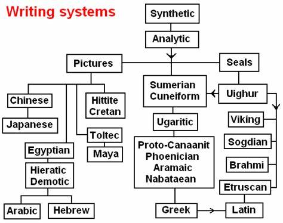

# 世界文字系统学习：英文 日文 阿拉伯文

## 英文名

```
cheung zipung
cheung zepung
cheung zeepung
cheung zeapung
cheung zeapung
チャン ゼプン
تشيونغ زيبونغ
```

## 英语e的发音：

### reference

- [ ] [e 的发音 1](https://zhidao.baidu.com/question/505929543901517964.html)
- [ ] [e 的发音 2][e_pronunciation_2]

### 发音有6种，列举如下

1. 在重读开音节中，e一般读做/i:/。单词举例：she、these。/

2. 在重读闭音节中，e一般读/e/。单词举例：set、bed。

3. 在单字母非重读音节中，e一般读做/i:/或/ə/。在重读音节前的非重读音节里，e一般读做/i/, 但不完全是这样。单词举例：eleven、excuse。

4. 在单字母非重读音节中，e一般读做/i:/或//。在重读音节之后的非重读音节里，e一般读做//，但不完全是这样。单词举例：enemy、student。

5. 在单字母非重读音节中，e一般读/i:/或/ə/。词缀结尾发/i/或/ə/，例：business、 kindness。

6. 相对开音节最后一个e不发音，单词举例：bike，nice。

## 音节与音节划分知识

### 1. 音节

以元音为主体构成的发音单位，一般说来元音发音响亮，可以构成音节，辅音发音不响亮，不能单独构成音节([m] [n] [ ] [l]例外)。
从单词拼写形式上看，有几个元音字母就有几个音节。

### 2. 音节的划分

- 在重读音节和非重读音节的相邻处有两个辅音字母时，一个辅音字母组属于前面的音节，一个属于后面的音节。

例如：let-ter，mem-ber，chil-dren，daugh-ter

- 在重读和非重读音节的相邻处只有一个辅音字母时，如果前面重读音节里的元音是长音则辅字组属于后面一个音节，如果重读音节里的元音是短音，则辅音字母属于重读音节。

例如：长音 pa-per，stu-dent，fa-ther，ze-ro，mo-tor，far-ther

短音 sev-en，stud-y，moth-er，ver-y，mod-le ，weath-er

### 3. 重读音节

单词中读音特别响亮的音节。用音标标记双音节、多音节词的读音时，应使用重读符号。单音节词多数是重读音节，标记读音时不需要使用重读符号。

### 4. 开音节

- 绝对开音节：单个元音字母后面没有辅音字母的重读音节。

例如：no，blue，ba-by，stu-dent，se-cret

- 相对开音节：单个元音字母后面加单个辅音字母，再加一个不发音字母e构成的重读音节。

例如：name，these，bike，home，excuse

### 5. 闭音节

单个元音字母后面有辅音字母(r、w、y 除外)且以辅音字母结尾的重读音节。

例如：bag，egg，fish，not，cup

### 6. 双音节词重读规则

- 双音节词的第一个音节通常是重读音节。

例如：stu-dent，Chi-na，sec-ond，au-tumn

- 含有a- be- de- re- in- ex- 等前缀的双音节词往往是在第二个音节上重读。双音节词的重读位置不会因增加前缀或后缀而发生改变。

例如：a-bout，be-fore，ex-cuse，re-pair，for-get-ful，in-ven-tor

### 7. 多音节词重读规则

多音节词通常在倒数第三个音节重读。

例如：el-e-phant

词尾有-ic 或-tion,-sion 的词，在-ic或-sion,-tion前的一个音节上重读。

例如：scien-tific，im-pression，na-tion

## 世界文字分类

### reference 

- [write_sys]
- [writing](http://languagesindanger.eu/book-of-knowledge/writing/)
- [世界文字系统官网](https://www.worldswritingsystems.org/)
- [世界文字B站up主空间](https://space.bilibili.com/1931761492/video)





> 全世界的文字都可以分为五大类/

### 1. 表意文字Morphographic
文字字符不直接表示文字读音

例：埃及象形文字、中国汉字

### 2. 表音文字Phonographic
可以从文字得出读音

### 2.1 表音节Syllabic
一个单独的字符代表一个音节，不能从音节字符里拆分元音字符和辅音字符

例：日文平、片假名

### 2.2 表音素Phonemic
音节可拆分成元音辅音

### 2.2.1 不写元音Abjad
不写元音，脑补元音

例：阿拉伯文、希伯来文

### 2.2.2 写元音

### 2.2.2.1 元音字母作为附加符号Abugida
元音=勾勾圈圈点点。在基字上添加符号表示元音（的音节）

例：印度天成体、中国藏文

### 2.2.2.2 元音作为单独符号Alphabet

例：希腊字母、拉丁字母、西里尔字母

> 总结：

- Alphabet（单独元音，单独辅音）
- Abgida（附着元音，单独辅音）
- Abjad（不写元音，只写辅音）
- Syllabic（单独音节，元音辅音合并）
- Morphographic（表意）

## 阿拉伯文 字母表

[白野老师阿拉伯语教学视频](https://space.bilibili.com/39020403/channel/seriesdetail?sid=3930706)


[奇妙的闪语构词法](https://www.bilibili.com/video/BV1oL411y7qW/?spm_id_from=trigger_reload&vd_source=b48342a630f5cc1a5c86649a37c0db89)
[从汉语的“尖团合流”到各语言中的“腭化”](https://www.bilibili.com/video/BV1wN4y1j7TJ/?spm_id_from=333.999.0.0&vd_source=b48342a630f5cc1a5c86649a37c0db89)

Here is a footnote reference,[^1] and another.[^longnote]

## Endnotes
[^1]: Here is the footnote.
[^longnote]: Here's one with multiple blocks.

[e_pronunciation_2]: <https://m.hujiang.com/en/p1352385/#:~:text=e%E5%9C%A8%E8%8B%B1%E8%AF%AD%E5%8D%95%E8%AF%8D%E4%B8%AD%E6%9C%89%E5%87%A0%E7%A7%8D%E5%8F%91%E9%9F%B3%20%E4%B9%9D%E7%A7%8D%EF%BC%8C%E5%88%86%E5%88%AB%E4%B8%BA%E2%88%B6%E5%9C%A8%E5%BC%80%E9%9F%B3%E8%8A%82%E4%B8%AD%EF%BC%8C%E5%8F%91%E5%AD%97%E6%AF%8D%E9%9F%B3%EF%BC%8C%E8%AF%BB%E4%BD%9C%E2%88%B6%E3%80%90%E2%88%B6%E3%80%91%3B%E5%9C%A8%E9%97%AD%E9%9F%B3%E8%8A%82%E4%B8%AD%EF%BC%8C%E8%AF%BB%E4%BD%9C%E2%88%B6%20%E3%80%90e%E3%80%91%3B%E5%9C%A8ea%E7%BB%84%E5%90%88%E7%9A%84%E4%B8%AD%EF%BC%8C%E8%AF%BB%E4%BD%9C%E2%88%B6,%E3%80%90i%E3%80%91%EF%BC%8C%E8%BF%98%E5%8F%AF%E4%BB%A5%E8%AF%BB%E4%BD%9C%E2%88%B6%20%E3%80%90e%E3%80%91%E6%88%96%E8%80%85%E3%80%90i%E3%80%91%3B%E5%9C%A8ear%E7%BB%84%E5%90%88%EF%BC%8C%E8%AF%BB%E4%BD%9C%E2%88%B6%20%E3%80%90i%E2%91%A7%E3%80%91%E7%AD%89%E3%80%82> "泸江英语：e在英语单词中有几种发音"
[write_sys]: <https://neography.info/writing-systems/#:~:text=Writing%20Systems%201%201.%20Segmental%20Segmental%20writing%20systems,building%20blocks.%20Syllabary%20...%203%203.%20Segmental-Syllabic%20> "书写系统"