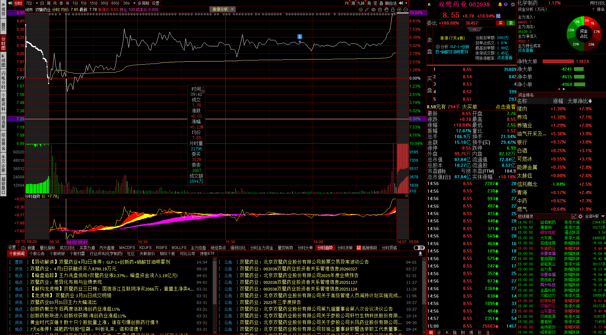
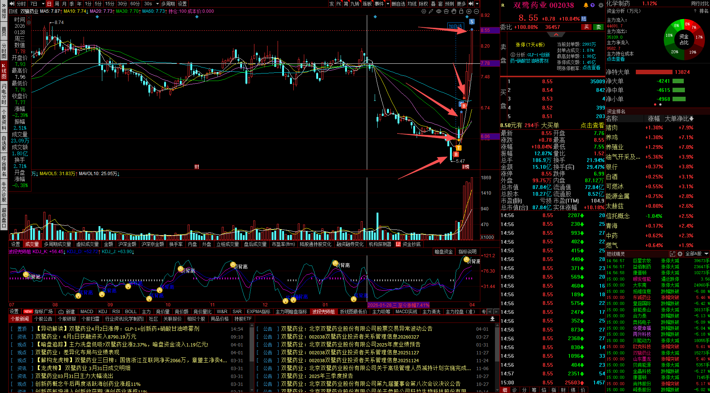

# A股笔记 测试

## 经验教训+学习笔记

### 波段兜师姐 技巧学习

涨幅 3%-5%
量比 < 1 不要 成交不活跃第二天涨不动
换手率 小于 5 %  没人气 高于 10 % 太情绪化
流通市值 50 亿以下 小盘冷门股 200 亿 以上的 大盘股 不要
K线 持续放量 台阶式温和放大的
均线形态 5 10 20 日均线多头排列 向上发散留下 股价在20日线 下方
 
#### macd + kdj
 
- macd 水下金叉 和 kdj 低位金叉
- macd 水下死叉 和 kdj 低位死叉
- macd 水上金叉 和 kdj 高位金叉
- macd 水上死叉 和 kdj 高位死叉

#### 集合竞价

##### 早盘

- 9:15 开始集合竞价
- 9:25 定开盘价 以成交量最大的价格为最终竞价结果
- 9:20 之前可以撤单 
- 15 ~ 20 可能会有人操纵开盘价 5 分钟
- 20 ~ 25 是开盘价的 缓冲时间 5 分钟 这段时间不能撤单
- 25 ~ 30 的单子在开盘后统一提交 5 分钟 休息时间

##### 应用技巧

- 竞价涨幅 1% ~ 6%
- TTM市盈率 筛 亏损
- 主净量为 绿 筛
- 量比 绿 筛
- 5日涨幅和10日涨幅，涨幅 < 10 % 筛

##### 尾盘

- 14:57 ~ 15:00 3 分钟

#### 关于做 trade

【股票“做T”降成本的四大核心准则】
视频主讲人“龙哥”指出，许多投资者对“做T”（T+0交易）的理解存在误区。他强调，做T的核心目的是在正确的初始买点之上，通过波段操作来不断降低持仓成本，从而吃满整个主升浪，而不是为了纠正一个错误的追高买点。 如果初次买入就错了，首要原则是认错出局。
基于此，龙哥分享了盘中做T的四大核心准则：
一、准则一：关键点位
这是所有交易的基础。首先要确定股票运行的支撑位与压力位区间。例如，通过分析前期走势，确定股价的底部支撑和顶部压力。操作原则是：当股价回落至接近支撑位时，是理想的买入（B点）时机；当股价上涨至接近压力位时，是合理的卖出（S点）时机。在区间的中间位置随意操作是缺乏逻辑的。
二、准则二：分时图乖离
观察分时图中的价格线（白线）与均价线（黄线）。
• 卖出信号：当价格线在短时间内快速拉升，远远偏离下方的均价线时，形成“乖离”。这表明拉升并未得到成交量的充分支持，价格容易回落，是一个极佳的减仓点。
• 买入信号：反之，当价格线快速下跌，远远低于均价线时，同样形成乖离，表明市场出现非理性抛售，是低吸的好机会。
三、准则三：量价背离
股价的上涨需要成交量的支撑。
• 卖出信号：当股价创出新高或持续上涨，但对应的成交量却未能同步放大，甚至出现萎缩时，形成“量价背离”。这说明上涨动力不足，价格虚高，后续承接盘乏力，是明确的减仓信号。
• 买入信号：反之，在股价下跌过程中，如果成交量非但没有萎缩，反而出现连续放大，这说明有资金在底部积极接盘，是下跌动能衰竭、可能见底的信号。
四、准则四：结合大盘环境
做T需要结合对整体市场环境的判断。
• 低吸机会：当大盘指数早盘因恐慌大幅低开，但有修复预期时，人气股若跟随下杀，反而是基于环境的低吸良机，因为一旦指数企稳，人气股最容易吸引资金关注。
• 高抛机会：当个股冲高，但同时大盘指数开始走平或显露疲态时，应果断减仓，锁定利润。
总结而言，成功的做T是一套建立在正确入场前提下，结合关键位置、乖离、量价关系和宏观环境的综合纪律性操作，其目标是让成本越来越低，利润垫越来越厚，从而在市场震荡中保持优势。

#### 涨停
- [ ] 20 个交易日内出现过涨停 涨停后股价横盘（小幅震荡）而不是立刻暴跌 
- [ ] 涨停 当天的成交量 > 前一天 1.5 倍  才是真正的
- [ ] 缩量涨停 高位缩量涨停 直接划掉 
- [ ] 缺口 3 天不回补 是底线 是强势确认 向上跳空缺口 是主力最强烈的做多信号
- [ ] 缺口发生在涨停之后 涨停加缺口 双保险
- [ ] 阶梯式上涨才是真的 连续 4 天以上的阳线 配合成交量的温和放大 主力建仓 高度控盘
- [ ] 优质连阳的判断标准 每天收盘价创了新高 每天的最低价不跌破前一天的收盘价
- [ ] 放量 关键位置的倍量才是启动的信号 成交量突然放大到近期日均量的两倍以上 关键位置就是突破的平台 突破的前高 突破了缺口 以后 股价还能稳稳地站在放量区间上面 才是主力启动信号
- [ ] 放量下跌 放量后直接破位 纯纯的出货
- [ ] 10:15 ~ 10:55 | 13:00 ~ 13:25 | 14:34 ~ 14:48
		
#### 委比

- 委比 100% 所有人都在买 没有卖单的涨停板 -100% 跌停板 
- 上涨时的红委比 主力要走 委比上涨 +30% -> +70% 主力要出货 赶紧高抛 卖出1/3仓位锁定利润 回到 +30% 买回来 高抛低吸
- 下跌时的绿委比 主力悄悄抄底 委比上涨 -70% -> -30% 卖盘减少 主力抄底 低吸 委比涨到 0%或者以上 卖出
- 委比的极端值 是主力的信号弹 +70%以上 买盘太多 -70%以下 卖盘太多 主力抄底

### 操作笔记

- 以后昨天大盘全面猛涨的 今天的集合竞价要等到 9:20 再出手
- 对 涨幅没有概念 002506 协鑫集成 昨天 5.06 收市 集合竞价高到 5.41 你也敢出手 属实笨蛋 目前 5.23 心累😩 亏了 40块
- 以后有点概念 个股 单日涨幅 0.2 以内入手 不然 高位入了 可能要等 3~4天 甚至一周 才涨到 成本💰
- 市值低于净营运资本价值
- 涨幅3~5% 20天内有涨停 不要量比小于1 总市值200亿以上排除 盘子太大 换手率 5%~10% 分时股价稳定站在均价线上
- A股开市时间 9:30 ~ 11:30 | 13:00 ~ 15:00
- 跌破五日均线容易收不回来
- 有相关股票行业新闻的时候 点入股票 设置预设 买卖点 就不用经常关注 因为不知道新闻真实性
- 不用每次都拉太远的 K线图 观察 ma60 就好 你想看历史参考历史战绩 可以拉一拉 
- 但是 基本上 日涨跌幅都是10% 所以 ma60 就差不多了
- 看不懂分时图 蜻蜓点水的触顶 注定不会触发 一字横版涨停 这种分歧过大的 制高点 必须提前挂单
- 而且不能是最贪的位置 记曰 2026.4.1 双鹭药业 8.0 不敢挂单 挂了 涨停贪心涨停单 8.35 怕吃亏 7.27 买的
- 尾盘竞价 金浦钛业 3.20 收盘价 没成交 
- 14:59 后面下单 好像太极限 都无法成交 下次要提前到 14:57 ~ 14:59 之前了

### 上证指数研究 每年2月-5月 10月 是个分水岭 

- 2020年2月 下跌 到 2020年5月 📉然后 持续上涨到💹 2021年2月  ↘️↗️
- 2021年2月 波动式维持 💹 到 2022年2月 
- 2022年2月~ 5月 下跌📉
- 2022年5月 ~ 2022年7月 💹 7月 ~ 10月📉
- 2022年10月开始 ~ 2023年5月 上证指数 持续上涨
- 2023年5月开始 直到2024年2月 上证指数一直下跌
- 2024年 2月~5月 上证指数上涨 
- 2024年 后半年 5月~9月 持续下跌
- 从 2024年 10月初开始 到 2025年 一整年 都在涨 到目前 高位

## 布局 一级行业细分 板块序号

- [ ] 农业 住房 生育 养老保险 民生保障类
- [ ] 银行
- [ ] 手机 内存 芯片 半导体 存储芯片 硬盘内存 赶紧布局
- [ ] 黄金
- [ ] 电力主线 电池
- [ ] 软件
- [ ] 加密货币怎么买
- [ ] 半导体ETF还不是最佳的时候 可以看是不是明天
- [ ] MLPos 板块
- [ ] 自动化设备 有没有ETF
- [ ] 房地产 游戏 赶紧布局 

- [ ] 存储板块 找个爆炸股
- [ ] ETF 找个翻倍指数
- [ ] 佰维存储 长江储存 北方华创中微公司
- [ ] 拓荆科技 长鑫长存 雅克科技 华特气体
- [ ] AI 风口 HBM 相关企业 长电科技 通富微电
- [ ] 半导体只能买ETF 存储芯片ETF
- [ ] 新能车 快底背离了 估计差一天
- [ ] 一周是看盘调整的时间 周六日就得提前布局
- [ ] 脑机接口的ETF在哪
- [ ] 29 板块 石油加工贸易 
- [ ] 中芯国际概念 17 中国AI50 19
- [ ] 422 电网设备
- [ ] 49 元件
- [ ] 布局 房地产 407 机器人 
- [ ] 420 电子竞技 54 游戏
- [ ] 55 油气开采及服务
- [ ] 影视院线 57
- [ ] 卫星导航 无人机 污水处理 芯片概念 
- [ ] 71 液冷服务器 42 在线教育 43 云游戏 45 云计算
- [ ] 60 银行
- [ ] 医药 医疗 62

## todolist

- [ ] 每日收盘 前一小时 扫描全自选股 看有没有底背离 程序设计
- [ ] 下周要买机器人指数跟ETF了 底背离了
- [ ] 需要一个进60天最低价的曲线
- [ ] 我想要一个分时图指标公式 用于抄底买入
- [ ] 安装open claw 用模型claude分析股市
- [ ] 今天 石油 下跌 等跌停 明天抄底
- [ ] 油价上涨 国内加桶油多付27块 电车需求增加
- [ ] 给分组自选股上标记
- [ ] 怎么扫描全部股票找到当天机构建仓的股票
- [ ] 主力建仓的特征：股票低位 大量对量上涨 调整的K线 伴随涨停 阳量多于阴量 第二轮洗盘的低点必须高于前一轮洗盘的低点 缩量达到了极致 洗盘即将结束 机构建仓的细节 堆量判断
- [ ] 内外盘
- [ ] 今天房地产都猛涨 好像都在资产转移还是怎么滴
- [ ] 复盘下今天涨停的 个股 有不同板块的
- [ ] 什么是暗盘资金 明盘资金 指标是什么 怎么看这个数据
- [ ] 感觉ETF得买在他最低点 不要着急 不要追高 因为ETF一篮子股票 🉐看跌得最厉害的 还有没有跌 而不是看 涨的那几个 涨的有多厉害 除非是超级重仓跟持仓占比至少20%以上才算 所以普通的ETF都是要在最低的时候 入场
- [ ] 主力净量是什么指标 量比是什么指标
- [ ] 对于 ETF 来说 你的股数越少 要求他涨幅越高才能回本 因为一买一卖手续费就 +10 块 而且ETF的短期涨幅也不会很大 放长线 才能打 所以根本不适合 资金不多的 玩家 那ETF适合什么 适合新兴的行业 不了解 行业内的个股参差不齐 有涨有跌 直到行业趋向于稳定 龙头股崭露头角 ETF的指数也就基本定型了 说到底 还是那句话 只要ETF 你买的是 最低价 并且 成本金额至少过万 过千 才不会亏 所以不要着急

- [ ] 小鹏智能电车 有动作 关注下电车 智能驾驶板块
- [ ] 研究下宏景科技 南亚新材为什么 一年之内翻了10倍
- [ ] 奥瑞德 的情况感觉就是机构出完货 布局下一个 AI股票了 玩完了 复盘一下为什么奥瑞德被机构选中涨停 看一看今天机构把资金转移到哪个AI股里面 下周 哪个就应该就是涨停热点
- [ ] 复权是什么意思
- [ ] 低空经济 智能驾驶 龙头
- [ ] macd 白线diff 黄线dea 数学公式上的含义
- [ ] 自由流通市值 20亿以内 随便 1000W就能控制几个点的上升或者回撤 甚至涨停 跌停
- [ ] 强势打板 毫无漏单 是什么意思 竞价卡点撤单
- [ ] 布局 农业 医疗 手机 内存 芯片 半导体 存储芯片 黄金 电池

- [ ] 4月板块 电力 医药生物 电子 通信 
- [ ] 有色金属 机械设备 基础化工 社会服务 银行 非银金融
- [ ] 光通信 线缆 高铁 卫星导航 大飞机 算力 国资云
- [ ] 国际医学 复盘神州高铁

### urgent 每日任务 今天的任务

- [ ] 今天看跌 特别关注 黄金 白银
- [ ] 早盘 减仓 半导体ETF 
- [ ] 加仓存储芯片ETF 加仓储能电池ETF
- [ ] 盯盘 白银 做T 或者 直接出 3 以上
- [ ] 这两天是黄金最好的入场时机 可是我没有足够的资金啊 至少要1000
- [ ] 持仓做 T 特别是半导体
- [x] 建仓永泰能源 我的宝宝👶
- [ ] 新里程
- [ ] 你还是没搞懂 你不是要参与每一波的上涨趋势 你的目的是先滚大资本 因为你永远都有入场的机会 只要你有子弹 不要怕丢了
- [ ] 盈新发展 做下T
- [ ] ETF 跟 LOF的区别

- [ ] 今天卖出半导体
- [ ] 储能电池ETF 买入
- [ ] 复盘中南文化 今天涨停的逻辑
- [x] 双鹭药业 我想清仓 不知道下周情况 下周低吸
- [ ] 黄金在上涨
- [ ] 美股跌了好多 想清仓美股基金
- [ ] 这周创新药 的基金 可能可以清仓 等一个上涨高位
- [ ] 创新药的 ETF 也有机会清仓 等高位
- [ ] st京蓝 抄底
- [ ] 听说光伏 这周融资很多 关注一下
- [ ] 想进场电池 但是目前是 追涨停股 增加资金
- [ ] 低吸永泰能源 降低持仓成本
- [ ] 今天给持仓股 做做T 看看绿色动力

科技

券商

核心AI 科技

半导体设备

人形机器人

存储芯片

元件

有机硅 拿住

商业航天 要走

消费电子 要走

人工智能 要等

IT科技 ETF 是时候 买了 掉好多了

## 复盘

#### 双鹭药业



- 2026-04-02 这天是周四 第二天是周五害怕抛售来不及 持股不敢过一周 等不到周一
- 急得卵痛 8.19 被吓跑 结果尾盘 涨停💹 哭死😭了
- 难受得要死 这一整天被机构洗盘 全给他低吸走了 尾盘一个大拉
- 我也有想过 8.32 都有人大手入场 要不要等等
- 我当天的目标售出价格是 8.35 是前一天的涨停价 本来想着 8.35 知足了
- 一直被他洗盘 低吸拿不住 期间我一直降价 从8.35 降到 8.30 降到 8.25
- 最后 8.22 8.20 8.19 期间非常煎熬难受 一直盯盘 想着为什么！
- 为什么 8.20 都那么多 绿色负委比 要卖出 一直被人吓 被市场唬住了
- 很难受 被机构玩弄了 对于持股目标 不够坚定



- 从 6块买的 期间不停做T 因为害怕崩盘 拿不住
- 其实我成本价是很低很低的 已经吃了 20个点了的 但是 没迟到涨停还是很难受的
- 我难受的是 我没做到最完美 被市场机构 唬住了 
- 虽然我赚了 就好像打DOTA2 赢了游戏🎮 但是队友不配赢 被队友恶心到了一样🤮


#### 永泰能源

1.65 - 1.73 = 0.08

3000 只能买 1800 股

1800 x 0.08 = 144

所以 要找涨幅大的 至少 涨 一点多的 主线

比如 光伏 半导体 ETF 

假如 1.65 - 2.3 = 0.65

0.65 x 1800 = 1170

这样 半个月就赚 一千了

也就是 本金 3000  赚 1170

你分散投资到 涨幅低的 累加的打法 
还不如投 债券稳定

#### 盈新发展 3.17号

- 成本: 3.31 x 100 = 331 + 5 = 336 
- 期望回本价: 3.41

- 止损: 2.99 x 100 = 299 -5 = 294 - 0.25 = 293.75 
- 总资金亏损 336 - 293.75 = 42.5
- 下跌 继续补仓成本 2.86 x 100 = 286 + 5 = 291
- 期望回本价 286 + 42.5 + 5 + 5 + 0.25 = 338.75 -> ➗ 100 = 3.3875 ≈ 3.39

- 回本期望值 少了 0.02
- 但是 这个止损的过程中 把现金流抽出来了 如果你不选择补仓做T 而是转移到其他标的上面 比如石油ETF 

#### 中南文化

4.77 x 100 + 5 = 482

4.13 x 100 - 5 = 408
亏损 74

4.06 x 100 + 5 = 411
4.29 x 100 - 5 = 424
4.44 x 100 - 5 = 439 (+28)
盈利 13

总亏损 61


##### 假如 3.19 号
 
- 止损: 3.08 x 100 = 308 - 5 - 0.25 = 302.75
- 总资金亏损 336 - 302.75 = 33.25
- 抽出来 转移到 石油ETF 
- 石油ETF成本: 1.392 x 200 = 278.4 + 5 = 283.4
- 3.23 号 卖出 1.564 x 200 = 312.8 - 5 - 0.19 = 307.61
- 盈利: 307.61 - 283.4 = 24.21

##### 总结: 所以 以后买完 不要放着不管 设置一个价 比如  跌幅达到 6% 并且当日持续在跌 就卖掉

#### 股价-份额-涨幅

3000 234.375 股
 12.8 - 18 = 5.2
 
 1218.75 
 
 所以说
 跟 股数 没关系
 跟 股价 没关系 但是至少100股 门槛 所以 有上限股价
 
 跟涨幅 有关 
 
 5.2 ➗ 12.8 = 40 %
 0.65 ➗ 1.65 = 39 %
 
 你让一个 12.8 的股 涨 5.2 的点? 容易?
 还是 让 一个 1.65 的股 涨 0.65 点 容易? 
 看 行业吧 板块吧 就没几个股 能涨 40 % 的
 一天最高 也就 10 % 了 你要连涨 4 天 涨停?
 
 短期找 涨幅大 主线板块


## 基金持仓

- 永赢高端装备智选混合C 1.5970
- 泰信优势领航混合A 1.2528
- 德邦稳盈增长灵活配置混合C 1.2725

- 金鹰改革红利灵活配置混合 2.7770 
- 招商中证白酒指数(LOF)A 0.9648

- [x] 鹏华创新医药混合A 1.3321

## 胡思乱想

- 机器人有利 物流 搬运 外卖 废品回收处理 建筑 等人工繁重易伤的传统行业
- 未来可能外卖机器人满大街跑 机器人偷窃报警 恶意破坏云录像 外卖送达识别门牌
- 无人驾驶机器人轮轴 上电梯 路人 障碍物检测 过桥 过马路 红绿灯 避让车辆 实时监控 
- 做任务 给机器人添加功能 为机器人进化🧬打工 游戏

## A股买入策略 笔记

```
- 600892 ST大晟 3.20 买入 长线

- 300027 华谊兄弟 1.8 买入 长线

- 002086 东方海洋 估计会一直跌 财报不好 1.8 的时候 看看买入 长线

- 000793 ST华闻 目前 2.73 持续在跌 看看会不会 掉到 2.0 半年持续稳定在 2.5

- 002445 中南文化 波动上升 目前高位 2.99 半年持续2.5徘徊 2.3 可出手 融资 1500万 没肉吃

- 300370 安控科技 整年在 2.6 徘徊 2.6 以下可入手 目前处于中等偏上位置 输入入手没肉吃 吃了也塞牙缝的那种

- 002495 佳隆股份 整年徘徊在 2.5 2.5 以下可入手

- 600653 申华控股 获融资 300万 常年 徘徊在 1.90 低于 1.7 可入手

- 000619 海螺新材 6.63 常年徘徊在 6.28 偶尔蹦到 8.0 低于 5.6 可入手

- 000615 ST美谷 常年徘徊在 3.0 低于 2.8 可入手 ∈危险牌 ⚠️ 用于短线

- 600981 苏豪汇鸿 增长比较慢 低于 2.83 可入

- 000882 华联股份 持续稳定在 1.90 低于 1.90 可入手 目前就可入手 潜力股 但是业绩是下滑亏损的 靠大盘带动 升到高位 2.45 就赶紧抛

- 600743 华远控股 目前 2.02 低于 1.85 可入手 业绩稳定 潜力股 升到 2.40 高点 赶紧抛 融资 290万

- 600255 鑫科材料 获融资 1700万 目前处于高位 3.85 波动较大 低于 3.5 可入手 潜力股

- 002482 广田集团 经营不利 持续半年下滑 目前处于低位 1.85 低于 1.70 可入 等大盘带飞 高于 2.22 就抛

- 601992 金隅集团 目前处于高位 2.10 但是融资 3100万 潜力股 低于 1.65 必入手 目前可能也可以入手 也可观望

- 600337 美克家居 目前处于高位 2.71 低于 2.00 可入 长线 获融资 464万

- 002528 ST英飞拓 疯狂的英飞拓 波动很大 目前处于高位 2.66 低于 1.99 可入

- 300110 华仁药业 获融资 717万 目前 3.37 处于高位 史低 2.71 波动性大 波动幅度 不大 低于 2.90 可入 有潜力

- 002024 ST易购 目前处于低位 1.6 史低 1.5 无脑入 资金充裕的话现在也可以入手

- 002716 湖南白银 目前 14.20 当时看着他 10.0 涨到 20.0 心好痛 目前持续下跌 等到 10.0 再观望 还有机会 但是价格不适合我

- 300301 ST长方 目前 2.53 处于高位 是个⚠️股 但是 半年来 持续波动式上涨 低于 2.0 可以试探性入手

- 600537 亿晶光电 目前 3.58 处于高位 业绩不好 全靠光伏设备行业带动 正常 2.7 低于此价可入

- 002501 利源股份 目前 2.25 处于 偏低位 低于 2.0 可入 融资 160万 目前也可入 但是没肉吃

- 600815 厦工股份 半年来持续上涨 目前下滑 3.23 低于 2.83 可入

- 600666 奥瑞德 3.87 处于高位 3.24 可入 没肉吃

- 002309 中利集团 3.44 处于高位 3.0 可入 潜力股 没肉吃

- 002374 中锐股份 3.66 融资 2600万 波动稳定 3.3 以下可入 有潜力

- 002191 劲嘉股份 4.03 融资 900万 持续下滑 目前低位 有潜力 但是没肉吃

- 600076 康欣新材 4.21 整年持续上涨 目前低价 融资3300万 感觉会涨得很厉害 可入 为什么 印刷业也融资了这么多 不懂

- 000016 深康佳A 4.02 融资 2600万 感觉会涨 白色家电 目前低位

- 002421 达实智能 3.01 处于低位 融资800万 可能会涨 史高 4.76 没肉吃

---

- 600871 石化油服 2.20 买入 长线

- 601518 吉林高速 目前 2.94 低于 2.6 可入

- 000552 甘肃能化 波动较大 低于 2.3 可入 融资1900万

- 600221 海航控股 融资 6000万 目前 持续波动 1.74 似乎可入手 一年以来 从 1.2 涨到 1.7 目前似乎处于高位 低于 1.6 可入

- 600370 三房巷 这个股很叼 半年来 波动式上升 虽然幅度不大 目前处于高位 2.57 低于 2.0 无脑入

- 600527 江南高纤 常年价格平稳 目前 2.32 低于 2.02 可入 但是也吃不了多少肉 曾蹭大盘蹦到 3.5

- 601880 辽港股份 半年来振幅很小 波动上升 目前 1.64 低于 1.55 可入但是没肉吃 史高 1.94 近日融资 2100万 有潜力

- 300185 通裕重工 3.04 价格缓慢上涨 低于 2.66 可入 融资 1800万

- 600448 华纺股份 3.44 低于 3.22 可入 融资450万 看到最近 纺织业 融资很多 

- 002042 华孚时尚 4.46 处于高位 但是融资1800万 感觉会涨 但是不适合我

- 000850 华茂股份 5.62 处于高位 持续下跌 融资 781万 感觉会涨 但是不适合我 最近 纺织业 融资很多

- 002146 荣盛发展 1.67 处于低位 波动 融资 1400万 感觉会涨 适合我 明天竞价看情况

- 600816 建元信托 2.84 处于低位 融资 800万 感觉会涨 

- 002607 中公教育 获融资 4700万 目前价格合适 2.95 潜力股 要买趁现在 低于 2.6 无脑入

- 601005 重庆钢铁 波动性上升 目前 1.49 半年均价 1.34 低于 1.35 可入 史高 1.9 没肉吃 融资 1500万 有点潜力 布局

- 600400 红豆股份 2.43 持续下滑 2.20 可入 融资 790万

- 600157 永泰能源 1.63 处于低位 融资 1.4亿 可入

- 002269 美邦服饰 1.8 买入 长线

- 600518 康美药业 1.8 买入 长线

- 600567 山鹰国际 1.60 买入 长线

- 002219 新里程 最低 2.13 目前 2.43 获融资 1900万 感觉潜力股 现在要买入吗 等等 过几天看看 过年后 会不会掉到 2.2 掉不到就买 掉了持续观看

- 000008 神州高铁 价格平稳 3.00 浮动 有987万融资 低于 2.9 无脑入 潜力股

```